# GeoAudit — algebraic and geometric cryptic-pocket detection on CryptoBench

`clinical_grade=false`

Repository specification. This document defines scope, execution, data provenance,
telemetry schema, and CI gates. It is not a paper and makes no comparative or
clinical claim.

**Scope (single claim).** Evaluating counting-only cryptic-pocket detectors on the
official CryptoBench receptor-only benchmark.

- Task: recover cryptic binding-site residues from **apo receptors only**.
- What is compiled on the training fold, stated exactly, because the detectors are
  not all training-free and an earlier version of this paragraph said they were:
  `geometric_foundation`, `fstar_pocket`, `sstar_pocket` and
  `ultrametric_shear_oracle` have no fitted quantity at all; `quaternary_lut`,
  `quaternary_lut_seq`, `algebraic_field` and `table_field` compile integer cell
  counts and integer fan-out weights from the cluster-disjoint training fold;
  `algebraic_field_linear` additionally fits a real-valued readout by one
  closed-form solve. None of them sees a test residue, and the quantisation is
  per-chain rank order, so no threshold crosses the fold boundary. `make verify`
  fails if any detector holding a compiled artifact is missing from this list.
- Benchmark: the official CryptoBench test fold (MMseqs2 clustering at 10 % sequence
  identity, cluster-disjoint), loaded fail-closed with per-file SHA-256 verification.
- Primary metrics: per-residue `residue_auc`, `residue_pr_auc`, `residue_mcc`,
  `residue_f1`, each with a 95 % paired-bootstrap CI over the structures where both
  compared methods are defined.
- **Less accurate than the benchmark's own supervised baseline.** pLM-NN
  (ESM2-3B embeddings under a trained head, CryptoBench's own baseline, rebuilt
  and run here) reaches 0.8235 mean per-unit ROC-AUC against our 0.7992 — a paired
  difference of −0.0243 [−0.0465, −0.0033], losing on 111 of 192 chains. The F1
  and MCC deficits at a common budget (−0.0522 and −0.0561) survive Bonferroni,
  and pLM-NN is ahead at all 39 calling fractions swept, so the deficit is not a
  threshold convention. The sentence saying so was written into the plan before
  the fold was read under it. See §4.13.
- **Confirmatory: ahead of P2Rank on a set that has never been read.** 57
  apo–holo units built from depositions released after CryptoBench's newest
  structure (2024-05-08), one unit per UniRef50 cluster, no cluster shared with
  either CryptoBench fold, labelled by a rule recovered from the benchmark's own
  training records. The set was frozen and hashed, the plan naming three
  co-primary comparisons and the sentence to write under each of six outcomes was
  committed, and only then was anything scored; `git` checks that order. Mean
  paired per-unit ROC-AUC against P2Rank is **+0.0443 [+0.0162, +0.0724]**, ahead
  on 42 of 57 chains, surviving Bonferroni over the three comparisons
  ([+0.0102, +0.0792]). Being a ranking statistic it cannot be an artefact of the
  two methods' calling conventions. On the official fold the same comparison gave
  +0.0058 and crossed zero, after 12 reads of that fold. The pLM-NN deficit
  replicates (−0.0340 [−0.0701, −0.0006] against −0.0243 internally), and no
  architecture, threshold or feature changed in response to any of it. See §4.14
  and `results/external/EXTERNAL_READ.json`.
- Against us on the same set, reported because the plan fixed these sentences
  before the read: at a matched top-9 % budget the F1 advantage over P2Rank does
  not resolve externally either (+0.0246 [−0.0224, +0.0708]); P2Rank predicts no
  pocket at all on 1 of 57 units, which leaves its precision and MCC undefined
  there and removes its own worst case from two of its own averages; the pLM-NN
  deficit does not survive Bonferroni, which is a statement about power at 57
  units and not about parity; and the set is easier than CryptoBench in three
  declared respects, the largest a guard band that leaves pairs whose pocket moves
  between 1.5 and 2.5 Å unlabelled.
- Claimed on the official fold: parity with P2Rank 2.5.1 on predictive accuracy,
  exact decomposability of every score, and a detector that is 1.79 MB of integers
  (0.39 MB gzipped) with no floating-point model evaluated at inference. The
  **primary endpoint is the mean paired per-residue ROC-AUC**, which is the summary
  this comparison has been reported under since its first reading, and on that fold
  it does not resolve: +0.0058 [−0.0163, +0.0271]. See §4.5b.
- Exploratory, not claimed: under a 20 % trimmed mean fixed on the training
  partition and committed before the fold was read for it, the table field is
  separable from P2Rank (+0.0281, 95 % CI [+0.0117, +0.0427], p=0.002), as are
  the median, the 10 % trimmed mean and the win rate. The preregistration is real
  and checked by commit ancestry, but 4 indexed readings of the held-out fold
  precede that commit, 3 of them by this architecture's own lineage, the last at
  0.8010 mean AUC. Fixing the statistic in advance rules out choosing a functional
  to fit the answer; it does not rule out the fold having shaped the architecture
  the functional is applied to. `make endpoint` recomputes that ordering from the
  commit graph and fails if it no longer holds. See §4.5 and
  `results/official_fold/ENDPOINT_STATUS.json`.
- The per-chain distribution behind the disagreement, reported rather than
  summarised away: the field is ahead on 115 of 192 chains and behind on 77, with
  a median difference of +0.0412, worst losses averaging −0.2319 against best wins
  of +0.1757. It wins more often and loses harder, which is why the mean and the
  trimmed mean disagree.
- Withdrawn: the F1 advantage. It is +0.032 [+0.009, +0.054] with each detector at
  its own operating point, and +0.014 [−0.009, +0.036] once both are binarised by
  one rule at the *q* an identical grid search selects for each on the training
  fold. The F1 ordering is reported as depending on the operating-point
  convention. See §4.8, whose retraction branch was written before the read.
- Parity elsewhere: on PR-AUC and on MCC the point estimates favour the field and
  the intervals contain zero. The mean ROC-AUC margin is 0.36 of one standard
  error of a fold mean and is the maximum over 12 of our architectures scored on
  this fold, so even its sign carries no ordering.
- Also not an advantage of the architecture: on the same 645 wires and the same
  split, the counting field is not separable from a plain logistic regression
  (+0.0038, CI crosses zero). Whatever accuracy there is belongs to the
  invariants, not to the table machinery. See §4.7b.
- Ahead of PocketMiner, and that margin is the least informative number here:
  +0.0468 [+0.0251, +0.0682], surviving Bonferroni, and unchanged (+0.0463) after
  removing the six CryptoBench entries that appear in PocketMiner's own data. But
  P2Rank is ahead of PocketMiner too (+0.0410 [+0.0211, +0.0614]), so a gap that
  both a general-purpose pocket finder and a table of counted invariants open on
  the same baseline is evidence about transfer between two label definitions —
  PocketMiner predicts pocket opening in simulation, CryptoBench labels ligand
  contact in a holo structure — rather than a ranking of methods. See §4.12.
- The ordering on this fold, stated plainly: pLM-NN, then the counting field and
  P2Rank within a few thousandths of each other, then PocketMiner. A reader
  choosing on accuracy alone should run pLM-NN. What this method offers instead is
  1.79 MB against a 3-billion-parameter encoder, no floating-point model at
  inference, and a score that decomposes exactly.
- Not claimed: superiority on PR-AUC or MCC, on ROC-AUC in the mean, or on F1
  under any matched threshold; superiority over pLM-NN on anything; being faster
  than P2Rank in a served deployment
  (§4.7c withdraws that); binding affinity; candidate efficacy; global novelty.
  See `contracts/GEOAUDIT_PAPER_SCOPE.json`.
- The architecture was chosen on one half of the training fold, and that choice is
  cross-validated on 29 other splits, none of which reads the test fold:
  CryptoBench's own four training folds, which are cluster-disjoint under its
  MMseqs2 10 % clustering, and 25 redraws of the accession-disjoint half-split. It
  ranks first on all 29, by a mean of +0.0043 ROC-AUC over the runner-up on the
  four folds. Read that as the ordering being stable, not as the lead being large:
  the runner-up is the same table bank under the other fusion rule, and what
  separates the top two from the rest is the multi-scale spatial gate. See
  `results/architecture_sweep/REPEATED_TRAIN_SELECTION.json` and `make crossval`.
- One wording correction that this cross-validation forced: the within-training
  half-split is disjoint by **UniProt accession**, not by MMseqs2 cluster.
  `tools/build_training_fold.py` writes the accession into `cluster_id`, and a 10 %
  cluster can span several accessions. The train/test separation is unaffected —
  it comes from CryptoBench's own fold construction — but the docstring and the
  manuscript both used to call the internal split cluster-disjoint, and it is not.

<!-- BEGIN AUTOGENERATED: figures -->

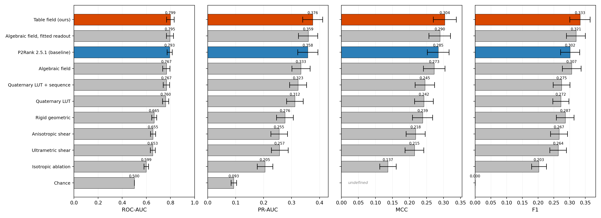

**Figure 1.** Per-residue detection on the official CryptoBench apo test fold (192 single-chain units, MMseqs2 10% cluster-disjoint). Bars are means over structures, ordered by ROC-AUC; whiskers are 95% bootstrap intervals (10,000 resamples, seed 20260725). The table field is drawn in orange and P2Rank 2.5.1, the baseline, in blue. MCC is undefined for a detector that calls nothing positive; those entries are marked rather than left blank.

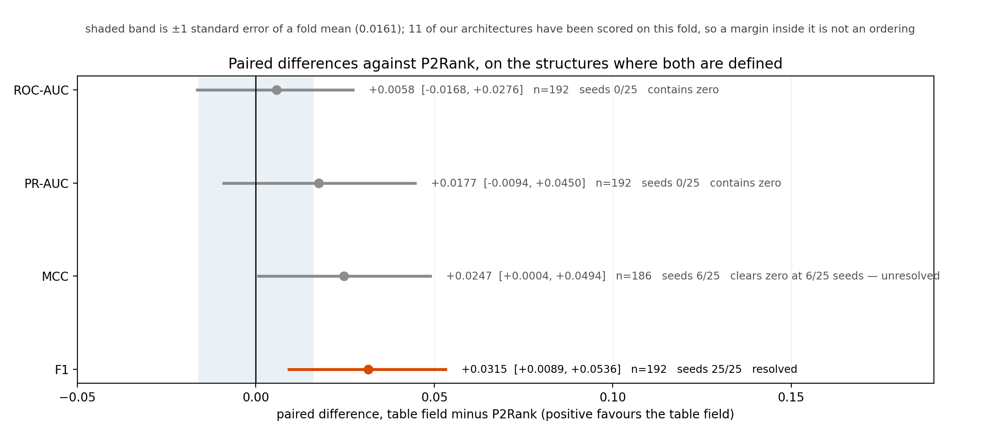

**Figure 2.** Paired differences against P2Rank, on the structures where both are defined: one row per metric, showing the point estimate, the 95% bootstrap interval and the number of shared structures. The shaded band is ±1 standard error of a fold mean (0.0161); 12 of our architectures have been scored on this fold, so a margin inside that band is not an ordering. A row is called resolved only where the interval clears zero and the verdict survives every resampling seed, which is why three of the four are not.

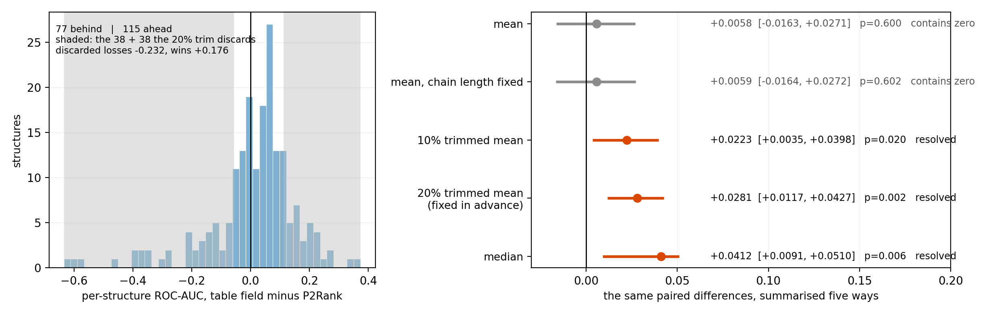

**Figure 3.** One set of 192 paired differences, and what follows from how it is summarised. Left, the differences themselves: the field is ahead on 115 structures and behind on 77, a win rate +0.0990 above one half (p=0.004), and the shaded tails are what a 20% trim discards — losses averaging -0.2319 against wins of +0.1757. That asymmetry is why the mean sits at +0.0058 while the middle 60% sits at +0.0281. Right, five location summaries of those same numbers with 95% bootstrap intervals. The 20% trimmed mean was chosen on the training partition and committed in 39e70d4 before this fold was read for it; the others are shown because reporting only the chosen one would hide whether the choice landed on the flattering summary. The mean is unresolved and stays in the paper: it is the functional that speaks to the discarded tail, where the field's failures are worse than P2Rank's.

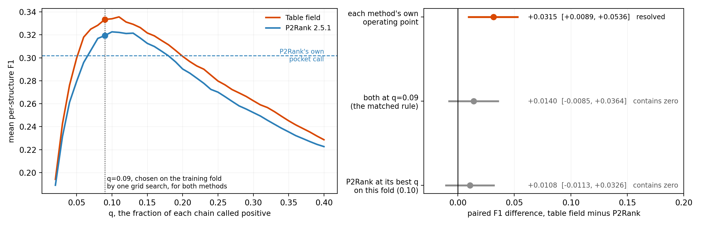

**Figure 4.** The F1 margin over P2Rank, before and after holding the operating point in common, on all 192 held-out structures. Left, mean per-structure F1 as a function of the fraction q of each chain called positive, for both methods. The dashed level is P2Rank's own pocket assignment, which is not a point on the curve because it is not a fraction of the chain; the published comparison is that level against our curve at q=0.09. Running the grid search that chose our q on P2Rank's training scores returns the same q=0.09, so the two matched rules a reader might ask for coincide. Right, the paired difference under each convention with 95% bootstrap intervals: +0.0315 at the shipped operating points, +0.0140 [-0.0085, +0.0364] once both are binarised the same way, and +0.0108 against P2Rank at the best q this fold admits — an upper bound it could not have known. Our own F1 is identical in the first two columns: our shipped call already is the matched rule at this q. The rules and the sentence to be written under each outcome were committed in c5911a3 before the fold was read for them.

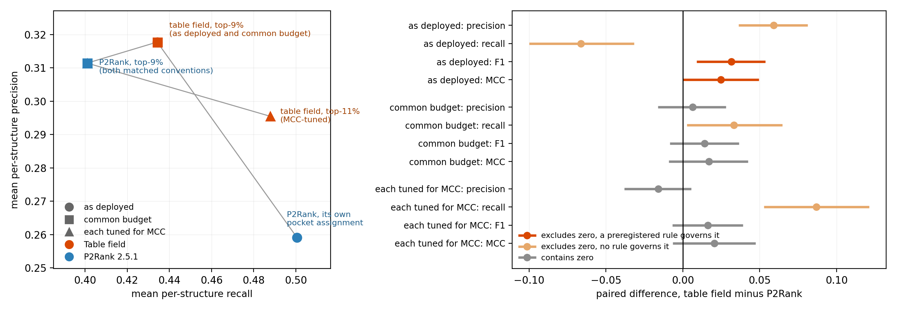

**Figure 5.** Where the reported margin came from, on all 192 held-out structures. Left, the two detectors in the precision--recall plane under three conventions, each pair joined by a line. Run as delivered, P2Rank calls 1.65 times as many residues as our rule does (8564 against 5202), which buys recall and costs precision: our precision is higher by +0.0590 and our recall lower by -0.0662, both intervals excluding zero. At a common budget both call 5202 residues and the trade is gone. Right, every paired difference with a 95% bootstrap interval over structures. The F1 and MCC differences remain positive and contain zero under every matched convention. The matched recall difference, +0.0332 [+0.0027, +0.0646], excludes zero at p=0.033, which does not survive a Bonferroni threshold of 0.0125 over the four metrics of one convention and carried no preregistered decision rule; it is an observation about this fold and is drawn as one. Resampling PDB entries or MMseqs2 clusters instead of chains changes no interval here by more than a factor of 1.006.

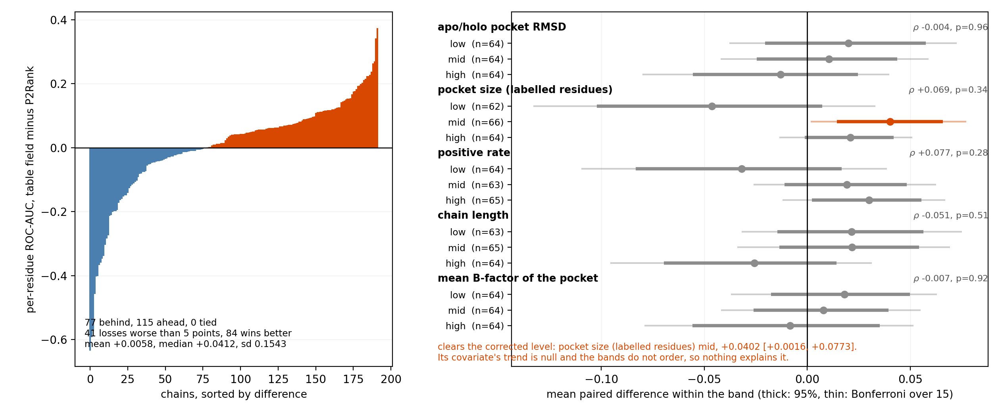

**Figure 6.** Where the two detectors differ on the 192 chains of the fold, and what survives asking. Left, one bar per chain, sorted: the field is ahead on 115, behind on 77 and ties on 0, but its losses reach further than its wins — 41 chains lose by more than five ROC-AUC points against 84 that win by more — which is why the mean (+0.0058) sits below the median (+0.0412). Right, the fold cut into thirds by five covariates fixed before the read from the CryptoBench deposit, the labels and the coordinates, with no score opened. Thick bars are 95% intervals, thin bars Bonferroni over the 15 bands, and ρ is the Spearman correlation between the covariate and the per-chain difference, tested by permutation. 1 band clears the corrected level and 0 of five trends do; the surviving band sits between two that do not order around it, so nothing here identifies a kind of protein on which one detector is better. The analysis was preregistered as exploratory and no result from it is claimed.

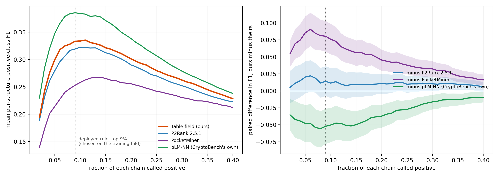

**Figure 7.** The same frozen scores binarised at all 39 calling fractions from 2% to 40%, on 192 held-out structures. Left, the level each method reaches. Right, the paired difference against the counting field with a pointwise 95% bootstrap band. Against P2Rank the field is ahead at 39 of 39 cut points with 0 sign changes, so the F1 advantage reported at the deployed rule is not an artefact of where the two methods were cut; the pointwise interval excludes zero at 10 of them, all at calling fractions well above anything one would deploy, so this is a statement about the sign of the difference rather than its significance. pLM-NN (CryptoBench's own) is ahead of the field at every cut point as well, and by margins whose pointwise intervals exclude zero throughout, so that deficit is no more a threshold artefact than the advantage over P2Rank is. No point on any curve was selected: the deployed fraction was fixed on the training fold and this read feeds no configuration, which is what keeps 39 cut points from being 39 chances to find a favourable one.

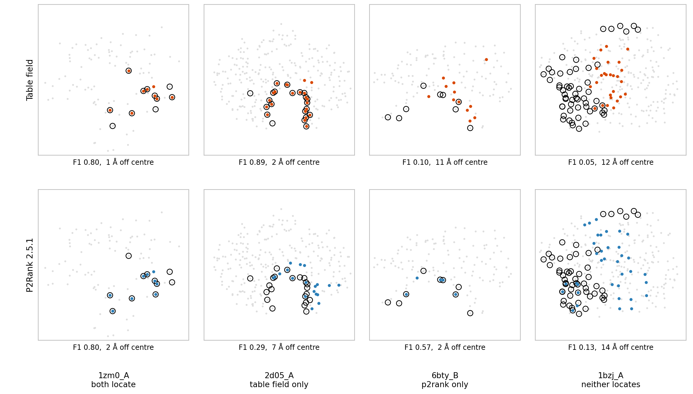

**Figure 8.** Four evaluation units, projected onto each chain's two longest principal axes: grey is the chain, black rings are the labelled cryptic residues, filled points are the residues each method called positive. The cases are chosen by rule and not by eye -- the clearest joint success, the largest margin each way, and the largest labelled pocket among the units neither method locates -- where locating means per-residue F1 at least 0.5. That last case is the commonest outcome: of 192 units, 25 are located by both methods, 24 by the table field only, 13 by P2Rank only, and 130 by neither.

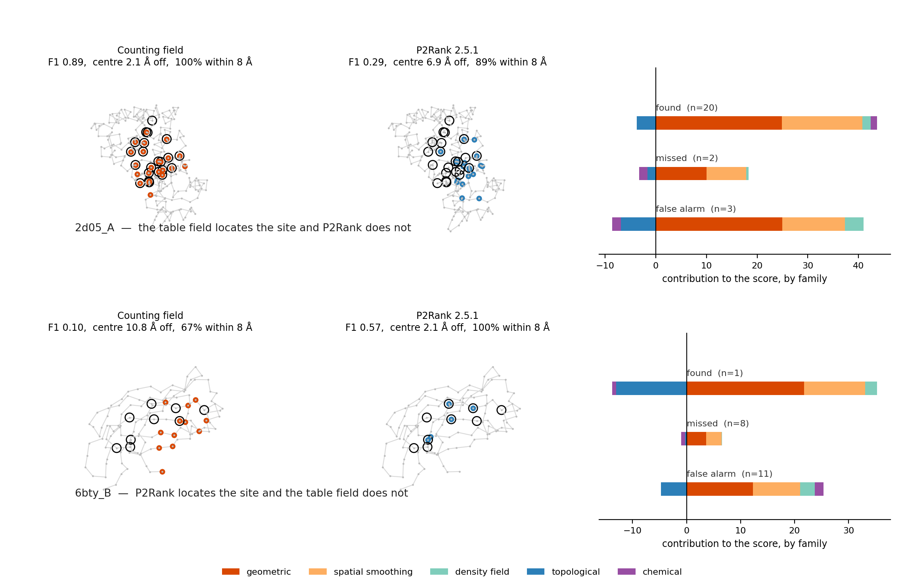

**Figure 9.** The two chains on which the methods disagree, 2d05_A and 6bty_B, chosen by the rule in CASE_STUDIES.json rather than by eye. Black rings are the labelled cryptic residues; filled points are what each method called. The camera looks from the chain's centroid towards the labelled pocket, so the view is fixed by the coordinates and not by the author. The right-hand panels decompose our own score on that chain into the five coarse families, separately for the labelled residues we found, the labelled residues we missed, and the residues we called that are not labelled, read from AUDIT_DECOMPOSITION.json.

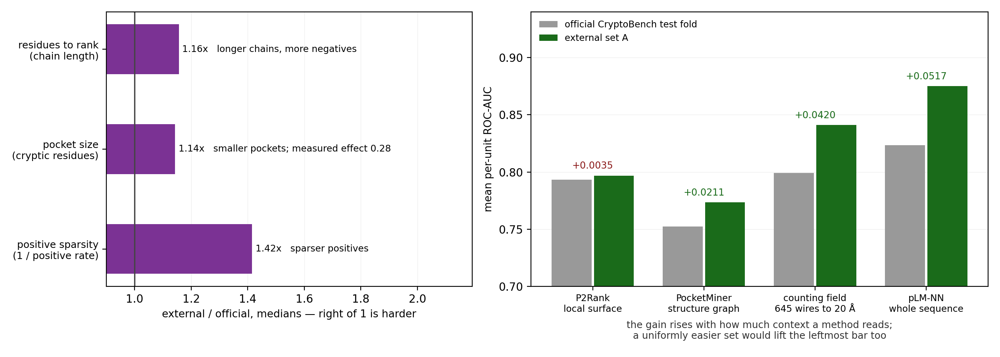

**Figure 10.** Whether the external set is easier than the benchmark, asked two ways that disagree. Left: the three quantities controlling how hard a per-unit ranking problem is, as external-over-official ratios of medians; the external set has longer chains, smaller pockets and sparser positives, so by label geometry it is harder on all three. Pocket size is not a guess about difficulty — FAILURE_TAIL.json measures the deployed field at 0.5991 on units with under ten cryptic residues against 0.8766 above twenty-two. Right: what each method scored on each set, from reads already indexed and not recomputed. Three of four score higher externally, which is the reviewer's reading and has support; the discriminating case is that P2Rank, which reads local surface geometry, moves +0.0035 while pLM-NN, which reads the whole sequence, moves +0.0517. A uniformly easier set lifts a local detector too. The honest statement is that the set is not uniformly easier but rewards context, that any method compared on it inherits that, and that 57 positive units is small whichever way the difficulty goes.

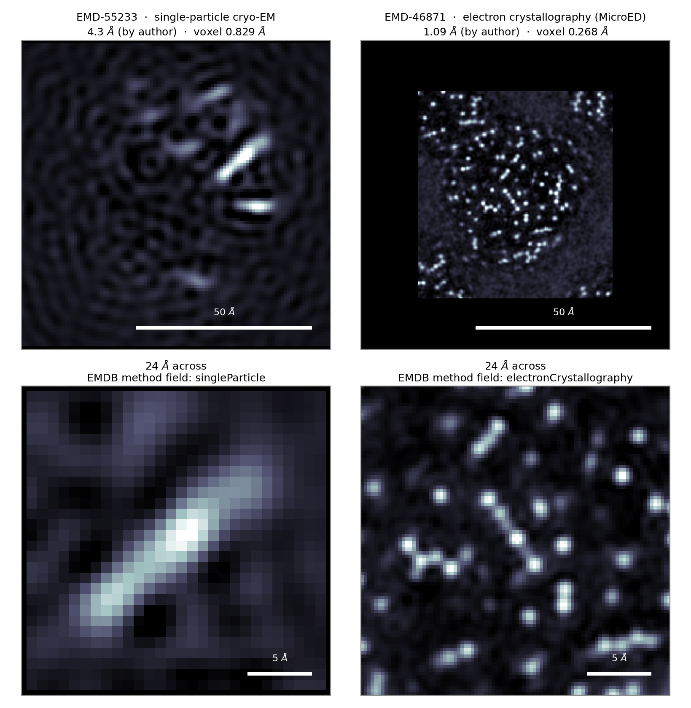

**Figure 11.** How far the word resolution stretches across two entries that a single RCSB query returns together, both carrying the experimental method EM. Left, EMD-55233: single-particle cryo-EM at 4.3 A, a VHL-recruiting PROTAC ternary complex containing ERa. Right, EMD-46871: electron crystallography (MicroED) at 1.09 A, proteinase K -- not cryo-EM, and included because it is the entry this repository first mistook for one by ordering candidates on resolution. Top row, the densest slice of each map at a common physical scale; bottom row, 24 A across each, the scale at which a claim about how a ligand sits would have to be made. At 4.3 A there is no atom to point at, which is why the ESR1 appendix declines to assert a binding pose. No number in the benchmark reads a density map; the detector consumes apo coordinates. Volumes are gitignored, and results/external/EMDB_MAPS.json carries the URL, the asserted method and the sha256 of each.

<!-- END AUTOGENERATED: figures -->

None of the three carries a title, and none is meant to: the descriptive text is
a caption, it sits under the figure, and it is generated from the same frozen
artifacts as the plot rather than typed. Every figure and every caption is
regenerated by `make figures`.
`make artifacts` rejects any image in `figures/` that the generator does not
produce, rejects a caption in this README that does not match the one the
generator emitted, and `results/official_fold/FIGURE_PROVENANCE.json` records
the SHA-256 of each image together with the digests of the five artifacts it was
drawn from, so a plot whose inputs have moved fails CI instead of quietly
showing last week's numbers. Checking that needs no plotting library, which is
why CI verifies the images without redrawing them. They are the first images
this README has ever carried. The
six that `figures/` held before them are gone from the tree and kept in
`_local/figures_superseded`: one plotted the 14-structure ESR1 pilot on a split
its own summary records as not cluster-disjoint, and the other five plotted
candidate counts, diversity, clash severity, toxicity alerts and a cryo-EM
pocket — campaign material that the scope contract no longer admits.

Appendices are excluded from the primary claim and from every generalization
statement: **Appendix A** is a retrospective ESR1 receptor-only pilot (invalidated
pending label regeneration) alongside a decomposability showcase that carries no
accuracy number; **Appendix B** is a finite-field allele-conditioning ablation
retained as future work (algebraic negative control only).

---

## What is new here, and what each claim rests on

Five things in this repository are not in the literature it is measured against.
Each is stated with the artifact that carries it, and none of them is an accuracy
claim — the accuracy position is stated plainly above and is behind the
benchmark's own supervised baseline.

**1. A score that decomposes exactly, and a measurement of how exactly.** Every
prediction is a sum of integer table contributions and can be taken apart residue
by residue and by descriptor family. The parts add back to the score with a worst
relative error of **5.4 × 10⁻¹⁶** over four case units a committed tool had
already selected (`results/official_fold/AUDIT_DECOMPOSITION.json`). This is not
an attribution method applied after the fact and it is not a saliency estimate: it
is the identity the score is defined by. A sequence encoder's prediction is not a
sum over interpretable parts and cannot be decomposed this way at any accuracy,
which is a difference in what the two constructions *are* rather than in how well
they score.

**2. No floating-point model at inference.** The deployed detector is **1.79 MB of
integers**, 0.39 MB gzipped: cell counts and integer multiplicities, addressed by
rank-quantised descriptors. Nothing is evaluated in floating point when a
structure is scored.

**3. Exactness turns out to be free, and that was measured rather than assumed.**
The integer multiplicities are the rounded solution of one real-valued system, so
the obvious worry is that rounding costs accuracy. The cosine between the real
solution and its integer rounding onto [−32, 32] is **0.9992** on every bank
tried (`results/architecture_sweep/GRAM_CONDITIONING.json`). Whatever limits this
architecture, quantising its weights is not it.

**4. A confirmatory result whose ordering a machine checks.** 57 apo–holo units
were built from depositions released after CryptoBench's newest structure, frozen
and hashed; the preregistration naming three co-primary comparisons and the
sentence to write under each of six outcomes was committed next; only then was
anything scored. `make extorder` recomputes that ordering from the commit graph
and fails if it no longer holds. On that set the margin over P2Rank is **+0.0443
[+0.0162, +0.0724]** (`results/external/EXTERNAL_READ.json`). The set is now spent
and the repository says so.

**5. A saturation result, which is a contribution in its own right.** Eight
training-fold sweeps varied every parameter the readout has and found each at or
past its optimum: the quantisation ladder, the pairing draw, the attachment of
appended columns, the integer rounding, the table count, whether the multiplicity
assignment is global at all, whether the spatial gate's weight is, and how wide a
table is. Three of those sweeps refuted hypotheses raised by the sweeps before
them, and each refutation is recorded with the measurement that killed it.

Two of the eight are worth stating in full because they are two-sided rather than
merely null. The tables are **interchangeable** — random subsets match subsets
ranked by importance — so the bank is a saturated exchangeable ensemble. And the
table width is an **interior optimum**: widening to three-wire tables, which makes
three-way interactions expressible for the first time, costs **−0.0036 to −0.0066
and wins on 0 of 12 splits** under either way of holding the budget fixed, while
narrowing to one-wire tables with no interaction at all costs **−0.0053**. The
median residues behind an addressed cell runs 29,673 / 7,385 / 1,763 / 401 across
widths one to four, so what widening buys in expressiveness it loses four times
over in counting evidence (`results/architecture_sweep/TABLE_WIDTH.json`).

The one thing the construction is *not* indifferent to is regional structure, and
that is stated against the baseline it was measured on: chain-level routing beats
a **random per-chain router** by **+0.0029 to +0.0054 on 11–12 of 12 splits**,
while against the deployed detector the best routed arm is **+0.0005 on 6 of 12**,
under the reseed noise floor and therefore not a lift
(`results/architecture_sweep/HIERARCHICAL_MULTIPLICITIES.json`,
`GATE_WEIGHT_ROUTING.json`). The heterogeneity is real; converting it into
accuracy did not happen at either price tried, three orders of magnitude apart.

Taken together the eight say something sharper than eight nulls: anything further
has to change **what a table reads**, not how tables are built, addressed, chosen,
weighted, subdivided or shaped. Negative and saturation results are usually
unpublished; here they are the map of which roads are shut, and each names the
artifact that shut it.

Two habits make the above checkable rather than assertable, and they are part of
what is new. Every number in the manuscript is a macro generated from a frozen
JSON — no literal is typed, so a figure in the prose cannot survive a change in
the artifact it came from. And each of the 26 CI gates was verified by planting a
violation and watching it fail, because a gate that has never failed is
indistinguishable from one that cannot.

---

## 1. Repository scope & execution

### 1.1 Environment

```bash
python3.12 -m venv .venv && . .venv/bin/activate
pip install -r requirements.txt          # the exact stack behind every number
pip install -e ".[test,spectral,chem]"
```

`requirements.txt` and `ENVIRONMENT.json` are generated by
`tools/emit_environment.py`, which measures the running stack rather than
declaring one, and `make verify` fails if the two disagree. Install from them to
reproduce the tables bit for bit; `pyproject.toml` states only floors. An
earlier revision pinned `numpy==1.26.4` in both places, which segfaults on
import under this interpreter and had to be removed from the machine, so the
declared environment was one a reader could not start.

| Extra | Package | Used by |
|---|---|---|
| (core) | `numpy>=2.0` | detectors, metrics, GF(4) ablation |
| `spectral` | `scipy>=1.11` | anisotropic- and ultrametric-shear modes |
| `chem` | `rdkit>=2023.9` | chemistry dictionary / alert screen |
| `test` | `pytest>=8`, `jsonschema>=4.20` | test suite |

External baselines (not pip-installable): `fpocket 4.0`, `p2rank 2.5.1`
(+ OpenJDK 17). The P2Rank version and JVM banner are captured per structure at
run time into `results/cryptobench_official/p2rank_raw/<unit>/run.json`, beside
its raw `*_residues.csv` and `*_predictions.csv` and their SHA-256, so the
strongest baseline in the table can be audited without a JVM.
`deeppocket` is declared `TOOL_UNAVAILABLE`.

### 1.2 Commands

| Command | Action | Output |
|---|---|---|
| `make verify` | run `tools/verify_claims.py` scope/science gates | stdout JSON, exit≠0 on fail |
| `make test` | `unittest discover -s tests` | test report |
| `bash tools/build_native.sh` | optional Rust geometry kernels (arm64 / amd64; bit-identical to NumPy) | `native/geoaudit_kernels/target/release/libgeoaudit_kernels.{dylib,so}` |
| `PYTHONPATH=src python3.12 tools/run_cryptobench_apo.py --dataset official --jobs 6` | **primary**: official CryptoBench test fold (fail-closed; never falls back to the pilot; `--jobs` = structure-parallel workers) | `results/cryptobench_official/{APO_BENCHMARK,TELEMETRY}.json` |
| `PYTHONPATH=src python3.12 tools/run_cryptobench_apo.py --dataset pilot` | apo pilot (n=15, Appendix only) | `results/cryptobench_apo/{APO_BENCHMARK,TELEMETRY}.json` |
| `PYTHONPATH=src python3.12 -m pocket_bench.metrics_bootstrap --dataset official` | paired bootstrap CIs on the official fold | `results/cryptobench_official/BOOTSTRAP_CI.json` (frozen copy: `results/official_fold/OFFICIAL_MULTI_METHOD_BOOTSTRAP.json`) |
| `PYTHONPATH=src python3.12 tools/fetch_official_data.py --build-manifest --fold-file data/cryptobench_apo/_osf/test.json` | materialize official test fold from OSF (hash-verified) | `data/cryptobench_apo/official_manifest.json` (+ receptors/labels, gitignored) |
| `PYTHONPATH=src python3.12 tools/run_official_fold.py` | official test-fold residue metrics + bootstrap CIs | `results/official_fold/{OFFICIAL_FOLD_METRICS,PER_STRUCTURE}.json` |
| `PYTHONPATH=src python3.12 tools/gf4_allele_shuffle_ablation.py` | GF(4) wrong-allele control | `results/gf4_ablation/GF4_ALLELE_ABLATION.json` |
| `PYTHONPATH=src python3.12 tools/build_split_ledger.py` | rebuild split ledger | `data/manifests/SPLIT_LEDGER.json` |
| `PYTHONPATH=src python3.12 tools/build_labels.py --download` | ESR1 labels (Appendix A) | `data/labels/*_labels.json` |
| `PYTHONPATH=src python3.12 tools/run_pilot.py --split all` | ESR1 retrospective pilot | `results/pilot/REGENERATED_PILOT_REPORT.json` |

### 1.3 Fail-closed external inputs (`src/pocket_bench/adapters.py`)

| Adapter | Requires | On absence |
|---|---|---|
| `load_official_test_fold()` | `data/cryptobench_apo/official_manifest.json` (schema `cryptobench.official_test_fold.v1`) | raises `DataUnavailable` with fetch instructions; a stride pilot is never substituted |
| `load_pocketminer_scores(pdb,chain)` | `data/baselines/pocketminer/<pdb>_<chain>.{json,csv}` | raises `DataUnavailable`; never scored as zeros |

Availability probes (non-raising): `official_fold_available()`, `pocketminer_available()`.

---

## 2. Data provenance

All external inputs are pinned by SHA-256. RCSB re-versions coordinate files; a
later fetch that mismatches means RCSB re-released the entry.

### 2.1 CryptoBench apo pilot (`data/cryptobench_apo/`, n=15)

- Selection: deterministic stride (`stride=36`) over sorted keys of the label set;
  full record in `data/cryptobench_apo/PREDICTION_INPUT_MANIFEST.json`
  (`schema=gf4cc.cryptobench_apo.manifest.v1`), per-structure `raw_sha256`,
  `receptor_sha256`, `receptor_atoms`, `n_cryptic_residues`, `n_label_atoms`.
- Labels source: `https://raw.githubusercontent.com/skrhakv/CryptoBench/master/src/F-statistics/conservation/label_dataset.json`
  — `sha256=effd00f26af1cc614771321697e7ca6dbc9fb1d851c46c54e652b115d5f3c221`,
  358013 bytes. Citation: Skrhak et al., Bioinformatics 2025,
  doi:10.1093/bioinformatics/btae745; dataset `https://osf.io/pz4a9/`.
- Structures: `https://files.rcsb.org/download/<PDBID>.pdb`.
- Status: this is **not** the official cluster-disjoint test fold
  (`SPLIT_LEDGER.json` → `cryptobench_apo.is_official_cryptobench_test_fold=false`;
  `BOOTSTRAP_CI.json` → `is_official_mmseqs2_10pct_test_fold=false`).

### 2.2 Official CryptoBench MMseqs2 10% test fold (ingested)

- Source: OSF node `https://osf.io/pz4a9/` (Skrhak et al., Bioinformatics 2025,
  doi:10.1093/bioinformatics/btae745). Split construction: MMseqs2 @ 10% sequence
  identity, 80:20 train:test, test = 222 apo structures.
- Verified OSF files (SHA-256 checked against OSF-reported digests; pinned in
  `data/cryptobench_apo/PROVENANCE.json`):
  - `cryptobench-dataset/folds.json` — `sha256=ced97a50…3c6ac67d`, 17826 bytes
    (fold membership).
  - `cryptobench-dataset/folds/test.json` — `sha256=28f5630e…09a7560838`, 1705224
    bytes (test membership + `apo_pocket_selection` cryptic labels).
- Materialization: `tools/fetch_official_data.py` builds
  `data/cryptobench_apo/official_manifest.json` (schema
  `cryptobench.official_test_fold.v1`; `fold=="test"`, `clustering.method=="mmseqs2"`,
  `sequence_identity_threshold==0.10`). Each entry
  `{pdb, chain, cluster_id, receptor_path, receptor_sha256, label_path, label_sha256}`;
  receptors fetched chain-scoped and ligand-stripped from
  `https://files.rcsb.org/download/<PDBID>.pdb`; `cluster_id` = `uniprot_id`
  sequence-cluster surrogate. Loader `adapters.load_official_test_fold()` verifies
  every SHA-256 and rejects any `cluster_id` crossing splits.
- Evaluable scope: 222 test apo PDBs → 193 single-chain units; 38 multi-chain
  (compound `apo_chain`) units excluded (chain-agnostic `resseq` indexing would be
  ambiguous — recorded in the manifest, not silently dropped); `7nbc` skipped (RCSB
  serves mmCIF only) → **192 manifest entries**.
- The 35 MB materialized receptor set is git-ignored; it is regenerated from the
  hash-pinned fetcher on demand.

### 2.3 PocketMiner baseline (executed locally)

- Source: `https://github.com/Mickdub/gvp/tree/pocket_pred` (Meller et al.,
  Nat. Commun. 2023, doi:10.1038/s41467-023-36699-3), sparse-cloned at commit
  `187062df3c94127e991669768009141a08fd5d8b`; the two weight files are pinned by
  SHA-256 in `tools/pocketminer_run.py`.
- Written to `data/baselines/pocketminer/<pdb>_<chain>.json`
  (`{residue_scores:{resseq:prob}}`); probabilities in [0,1]. The repository, its
  virtualenv (TensorFlow, 1.5 GB) and the training-fold scores are git-ignored and
  regenerated by `tools/pocketminer_run.py --predict`.
- `tools/pocketminer_run.py --selftest` reproduces the published test set before
  anything else runs: ROC-AUC 0.86772 against the published 0.87, with the 563
  positive and 1283 negative residues reproduced **exactly**. The counts are the
  load-bearing check; an AUC can agree across a mis-aligned label vector.
- Six CryptoBench test entries (`1kx9`, `1rtc`, `3nx1`, `3rwv`, `3ugk`, `5uxa`)
  appear in PocketMiner's own train/validation/test data. They are removed in a
  second arm of read 11 rather than left in.

### 2.3b pLM-NN baseline (CryptoBench's own, executed locally)

- The benchmark's own supervised baseline: ESM2-3B per-residue embeddings under a
  small trained network. Weights are read out of the authors' TensorFlow
  checkpoint by `tools/export_plmnn_weights.py`, which parses the checkpoint
  format directly and needs no deep-learning runtime.
- The encoder layer is not documented in the deposit. It was recovered by matching
  the authors' one published example embedding across all 34 computed layers:
  layer 33 agrees at mean cosine 0.9987, the next-best layer at 0.9662.
- Running their network on their published embedding and on ours agrees to a rank
  correlation of 0.9975 — the quantity a per-unit ROC-AUC depends on. The largest
  absolute probability disagreement is 0.129, which is why this is reported as
  *our reproduction of their baseline* and not as a comparison against a number
  they published.
- float16 throughout: the published checkpoint is stored in float16, and float32
  is 10.8 GB resident and was OOM-killed twice partway through the fold on a
  16 GB machine. float32 agrees with the authors' example to cosine 0.998745
  against float16's 0.998728, so the residual is not precision.
- **This baseline is more accurate than ours.** See §3 below.

### 2.4 Probe structures — Appendix only (`data/manifests/STRUCTURE_PROVENANCE.json`)

Neither structure enters the CryptoBench evaluation, the training fold or any
number in the paper. They are retained solely so the appendix material is
reproducible, and are listed here rather than deleted because their SHA-256 is
what makes that material checkable.

| PDB | Role | SHA-256 (prefix) | bytes |
|---|---|---|---|
| `9BL0` | KRAS G12D docking geometry — Appendix B ablation only | `719c4a6c…b508fe0` | 289737 |
| `5VA1` | hERG cryo-EM compatibility probe — Appendix B only | `946f89bb…3fc7f472` | 402732 |

### 2.5 ESR1 pilot structures (Appendix A) — `data/manifests/SOURCE_URLS.json`

UniProt `P03372`; RCSB `3ERT, 3OS8, 1UOM, 5U2B, 6CHW, 4Q50, 4Q13`. Baseline tools
`fpocket` (`https://github.com/Discngine/fpocket`), `p2rank`
(`https://github.com/rdk/p2rank`).

### 2.6 Fetch / manifest scripts

`tools/mirror_cryptobench_to_icloud.py` (raw PDB mirror + hashes),
`tools/refresh_manifests.py` (rebuild manifests), `tools/build_labels.py --download`
(ESR1 labels). Companion evidence SHA/pointers: `data/manifests/COMPANION_EVIDENCE.json`.

### 2.7 Reproducing the official fold from nothing

Every artifact behind the frozen table is regenerated by these four commands, in
order. Nothing else is required, and no step consumes a file that is not either
fetched here or hash-pinned in `data/cryptobench_apo/PROVENANCE.json`.

```bash
# 1. Pull the two OSF fold files (SHA-256 verified against PROVENANCE.json).
#    `--list` enumerates the OSF node if the names ever move.
PYTHONPATH=src python3.12 tools/fetch_official_data.py \
    --fetch cryptobench-dataset/folds.json cryptobench-dataset/folds/test.json

# 2. Materialize receptors + labels and write the manifest (192 entries).
#    Resumable: existing receptor files are re-hashed, not re-downloaded.
PYTHONPATH=src python3.12 tools/fetch_official_data.py \
    --build-manifest --fold-file data/cryptobench_apo/_osf/test.json
#    -> data/cryptobench_apo/official_manifest.json
#       data/cryptobench_apo/official_receptors/<pdb>_<chain>_receptor.pdb
#       data/cryptobench_apo/official_labels/<pdb>_<chain>_labels.json

# 3. Predict with every method and emit per-(method,unit) telemetry.
#    --jobs is the structure-parallel worker count; results are identical to --jobs 1.
PYTHONPATH=src python3.12 tools/run_cryptobench_apo.py --dataset official --jobs 8
#    -> results/cryptobench_official/TELEMETRY.json   (one row per method x unit)
#       results/cryptobench_official/APO_BENCHMARK.json

# 4. Paired bootstrap CIs over units, keyed on unit_id.
PYTHONPATH=src python3.12 -m pocket_bench.metrics_bootstrap \
    --dataset official --baseline geometric_foundation
#    -> results/cryptobench_official/BOOTSTRAP_CI.json
```

Determinism and reproducibility notes a reviewer needs:

- Step 2 is the only network step. It is fail-closed: a SHA-256 mismatch aborts
  rather than proceeding on unverified bytes, and `adapters.load_official_test_fold()`
  re-verifies every hash at load time in step 3.
- Step 3 requires `scipy>=1.11` (ANM modes) and, for the `p2rank` row, P2Rank on
  `PATH` or `P2RANK_HOME` plus a JDK. Absent P2Rank the row is `TOOL_UNAVAILABLE`
  and is excluded from denominators — never scored as a miss.
- The geometric detectors carry no trained weights, no RNG, and no fitted
  hyperparameter, so step 3 is bit-reproducible across runs and across `--jobs`.
  `random_bbox` is seeded per structure for the same reason.
- Step 4 uses `n_boot=10000`, `seed=20260725`, 95% CI. Non-finite values are
  serialized as JSON `null`, never as a bare `NaN` token.

---

## 3. Telemetry & metrics schema

### 3.1 Per-(method,structure) row — `results/cryptobench_apo/TELEMETRY.json` (`geoaudit.telemetry.v1`)

| Field | Type | Definition |
|---|---|---|
| `method` | str | detector id (`geometric_foundation`,`sstar_pocket`,`fstar_pocket`,`p2rank`,`random_bbox`) |
| `pdb`,`split` | str | structure id; split label |
| `status` | enum | `OK` \| `EMPTY` \| `CRASH` \| `TOOL_UNAVAILABLE` |
| `tool`,`tool_version` | str | external tool name/version (empty for internal) |
| `seed`,`env_sha`,`runtime_s` | int/str/float | reproducibility |
| `top1_dca`,`best_dca` | float | Å from Top-1 centre to nearest cryptic-residue atom (localization proxy) |
| `top1_success` | bool | `best_dca ≤ 4.0` and `status==OK` |
| `dcc_top1` | float | centre-to-centre distance |
| `n_pockets` | int | pockets returned |
| `residue_auc` | float\|null | CryptoBench-faithful per-residue ROC-AUC |
| `residue_pr_auc` | float\|null | per-residue average precision |
| `residue_mcc` | float\|null | per-residue MCC (null when the confusion matrix is degenerate) |
| `residue_f1` | float\|null | per-residue F1 (null when threshold not defined) |
| `residue_metrics_available` | bool | whether label∩universe join produced metrics |
| `chain`,`unit_id` | str | evaluation unit `(pdb, chain)`; the bootstrap key |

### 3.2 Aggregate — same file, `per_method`

`intention_to_evaluate_denominator` (every structure attempted),
`ok`/`crash`/`empty`/`tool_unavailable`, `available_denominator = intention −
tool_unavailable`, `top1_hits`, `hits_over_intention`, `hits_over_available`.
Primary metric `top1_dca_le_4A`; faithful metrics
`[residue_auc, residue_pr_auc, residue_mcc, residue_f1]`.

### 3.3 Bootstrap — `results/cryptobench_apo/BOOTSTRAP_CI.json` (`geoaudit.bootstrap_report.v1`)

Per metric (`residue_auc`, `residue_pr_auc`, `residue_mcc`, `residue_f1`):
`per_method{point, ci_low, ci_high, n_structures_scored}` and
`paired_vs_baseline{delta_point, delta_ci_low, delta_ci_high,
p_two_sided_bootstrap, crosses_zero}`. Params `{n_boot=10000, seed, ci_level,
baseline}`. Paired resampling over units keyed on `unit_id`. Where a method has no
scored unit for a metric, every Δ field is `null` (an unestimated difference is never
rendered as an excluded-zero result).

### 3.4 Official test-fold freeze — `results/official_fold/OFFICIAL_MULTI_METHOD_BOOTSTRAP.json`

Produced by `tools/run_cryptobench_apo.py --dataset official --jobs 8` followed by
`python -m pocket_bench.metrics_bootstrap --dataset official --baseline geometric_foundation`
(`n_boot=10000`, seed `20260725`, 95 % CI, paired resampling over units).

The block below is **generated** from the frozen JSON by
`tools/render_results_section.py`; `make readme` fails the build if this file and the
artifacts disagree, so the table cannot drift from the data it summarises. Everything
outside the markers is hand-written interpretation.

<!-- BEGIN AUTOGENERATED: official fold results -->

**Execution guarantee.** The official evaluation emits **2112/2112** telemetry rows = **192 evaluation units x 11 methods**, with `residue_metrics_available=true` on 2112/2112, `status=OK` on 2112/2112, and zero silent drops. The evaluation unit is a `(pdb, chain)` pair (`unit_id`), not a PDB entry: 192 units span 190 distinct entries because `3lnz` and `3pfp` contribute two chains each. All four metrics resample over n=192; `per_structure_values` raises on a colliding `unit_id` rather than overwriting a row. Summed cost recorded in telemetry: 2312 s over the 2112 `runtime_s` fields.

Point estimates [95 % CI] over units, `n_boot=10000`, seed `20260725`:

| method | ROC-AUC | PR-AUC | MCC | F1 |
|---|---|---|---|---|
| `table_field` | 0.799 [0.766, 0.830] | 0.376 [0.339, 0.411] | 0.304 [0.270, 0.338] | 0.333 [0.301, 0.365] |
| `algebraic_field_linear` | 0.795 [0.765, 0.824] | 0.359 [0.324, 0.393] | 0.290 [0.257, 0.321] | 0.321 [0.290, 0.350] |
| `p2rank` | 0.793 [0.772, 0.814] | 0.358 [0.322, 0.394] | 0.285 [0.252, 0.316] | 0.302 [0.271, 0.332] |
| `algebraic_field` | 0.767 [0.736, 0.796] | 0.333 [0.301, 0.366] | 0.273 [0.241, 0.304] | 0.307 [0.277, 0.337] |
| `quaternary_lut_seq` | 0.767 [0.740, 0.792] | 0.323 [0.293, 0.353] | 0.245 [0.216, 0.274] | 0.275 [0.248, 0.301] |
| `quaternary_lut` | 0.760 [0.733, 0.785] | 0.312 [0.282, 0.341] | 0.242 [0.215, 0.270] | 0.272 [0.247, 0.298] |
| `geometric_foundation` | 0.665 [0.644, 0.685] | 0.276 [0.246, 0.306] | 0.239 [0.209, 0.268] | 0.287 [0.258, 0.314] |
| `sstar_pocket` | 0.655 [0.634, 0.676] | 0.255 [0.226, 0.285] | 0.218 [0.190, 0.246] | 0.267 [0.239, 0.293] |
| `ultrametric_shear_oracle` | 0.653 [0.632, 0.673] | 0.257 [0.227, 0.287] | 0.215 [0.187, 0.242] | 0.264 [0.237, 0.290] |
| `fstar_pocket` | 0.599 [0.579, 0.618] | 0.205 [0.177, 0.232] | 0.137 [0.112, 0.161] | 0.203 [0.179, 0.226] |
| `random_bbox` | 0.500 [0.500, 0.500] | 0.093 [0.084, 0.103] | null | 0.000 [0.000, 0.000] |

Paired difference against `p2rank` (same resample indices, so the comparison is within-unit):

| method | ROC-AUC delta [95 % CI] | PR-AUC delta [95 % CI] | MCC delta [95 % CI] | F1 delta [95 % CI] |
|---|---|---|---|---|
| `table_field` | +0.0058 [-0.0168, +0.0276] ns | +0.0177 [-0.0094, +0.0450] ns | +0.0247 [+0.0004, +0.0494] **sig** | +0.0315 [+0.0089, +0.0536] **sig** |
| `algebraic_field_linear` | +0.0020 [-0.0190, +0.0221] ns | +0.0014 [-0.0273, +0.0300] ns | +0.0071 [-0.0200, +0.0340] ns | +0.0186 [-0.0066, +0.0430] ns |
| `algebraic_field` | -0.0266 [-0.0487, -0.0055] **sig** | -0.0247 [-0.0520, +0.0028] ns | -0.0078 [-0.0331, +0.0171] ns | +0.0048 [-0.0179, +0.0269] ns |
| `quaternary_lut_seq` | -0.0268 [-0.0442, -0.0099] **sig** | -0.0348 [-0.0622, -0.0079] **sig** | -0.0399 [-0.0647, -0.0147] **sig** | -0.0270 [-0.0507, -0.0033] **sig** |
| `quaternary_lut` | -0.0334 [-0.0517, -0.0160] **sig** | -0.0461 [-0.0740, -0.0187] **sig** | -0.0426 [-0.0662, -0.0187] **sig** | -0.0295 [-0.0521, -0.0073] **sig** |
| `geometric_foundation` | -0.1287 [-0.1461, -0.1111] **sig** | -0.0816 [-0.1087, -0.0549] **sig** | -0.0450 [-0.0695, -0.0213] **sig** | -0.0154 [-0.0381, +0.0073] ns |
| `sstar_pocket` | -0.1383 [-0.1570, -0.1194] **sig** | -0.1028 [-0.1309, -0.0742] **sig** | -0.0681 [-0.0944, -0.0417] **sig** | -0.0353 [-0.0597, -0.0100] **sig** |
| `ultrametric_shear_oracle` | -0.1408 [-0.1591, -0.1224] **sig** | -0.1011 [-0.1290, -0.0738] **sig** | -0.0709 [-0.0961, -0.0451] **sig** | -0.0378 [-0.0622, -0.0128] **sig** |
| `fstar_pocket` | -0.1946 [-0.2163, -0.1722] **sig** | -0.1534 [-0.1841, -0.1221] **sig** | -0.1528 [-0.1829, -0.1231] **sig** | -0.0993 [-0.1271, -0.0714] **sig** |
| `random_bbox` | -0.2933 [-0.3135, -0.2720] **sig** | -0.2647 [-0.2980, -0.2307] **sig** | null | -0.3019 [-0.3318, -0.2713] **sig** |

`ns` = the 95 % CI of the paired difference contains zero, i.e. the fold does not separate that method from P2Rank on that metric. `**sig**` = it does, in P2Rank's favour wherever the difference is negative.

<!-- END AUTOGENERATED: official fold results -->

A further 38 fold units are multi-chain assemblies, excluded at manifest build time and
recorded in `official_manifest.json` (`n_excluded_multichain=38`) — excluded before
evaluation, never dropped during it. `--jobs` changes only scheduling: results are
order-preserving and identical to `--jobs 1`, and the runner falls back to sequential
execution on hosts that deny the POSIX semaphore probe rather than refusing to run.

`residue_mcc` is `null` for `random_bbox` (no positive predictions at the operating
point); its point estimate, Δ, and `crosses_zero` are then all `null`, never 0.

**P2Rank scoring protocol.** P2Rank is natively a residue-level predictor, so it is
scored on its own `*_residues.csv` output: `probability` as the continuous per-residue
score and its own `pocket > 0` assignment as the binary operating point
(`residue_operating_point = predictor_native_binary_call`). An earlier revision instead
reconstructed a residue signal from pocket centres — top-5 pockets, a 6 Å ball, and a
`1/rank` weight — which scored a prediction P2Rank never made and measured
0.621 ROC-AUC. Removing that harness raised it to 0.793, consistent with the published
CryptoBench baseline (~0.81). The pocket-derived path remains only for detectors that
emit no residue table (`residue_in_any_predicted_pocket`).

**Baseline status.** `p2rank 2.5.1` is executed locally (JVM, version pinned in
`BASELINE_ENV.json`) and is a real scored baseline here — it is **not**
`DATA_UNAVAILABLE`. `pocketminer` and `plmnn` are also scored baselines now: both
publish trained models rather than per-residue predictions, so both were restored
from those weights and run on the 192 units, each validated against the authors'
own published output before the fold was read (§2.3, §2.3b). `deeppocket` is
declared `TOOL_UNAVAILABLE`.
A legacy null-only freeze (`OFFICIAL_FOLD_METRICS.json`, vs `random_residue`, keyed
on pdb) is retained for appendix comparison and is not the primary readout.

### 3.5 Appendix B artifact — allele-conditioning ablation (`results/gf4_ablation/GF4_ALLELE_ABLATION.json`, `geoaudit.gf4_allele_ablation.v1`)

Excluded from the primary claim; an algebraic negative control only, with no chemical,
binding or efficacy content. Schema:

`syndromes{allele:vector}`, `syndrome_nonzero_index`, `all_syndromes_distinct`,
`correct_allele_G12D_admissible`, `wrong_allele_fail_closed{allele:{admissible,
rejected,residual_weight}}`, `allele_shuffle{n_shuffles,seed,rejected,
passed_by_chance,rejection_rate}`.

---

## 4. Physical CI/CD gates

Enforced by `tools/verify_claims.py` (`make verify`) and `tests/` (`make test`);
all fail-closed.

| Gate | Enforcement | Fails if |
|---|---|---|
| Zero-leakage firewall | `ligand_leak_guard` on predictors; AST import-graph test | receptor has non-solvent HETATM / smuggled non-polymer ATOM, or a `methods.*` module imports the scorer |
| Cluster-disjoint splits | `SPLIT_LEDGER.json` + `test_split_cluster_disjoint.py` | a `cluster_disjoint_required` group shares a `cluster_id` across splits, or a non-disjoint group omits `split_integrity_passed=false`+reason |
| Denominator discipline | `telemetry.assert_denominator_discipline` + `test_denominator_discipline.py` | intention denominator ≠ attempts; `TOOL_UNAVAILABLE` used for a declared-present tool; internal method masked |
| Label integrity | `verify_claims` re-reads labels | any ligand label not 3–80 heavy atoms / missing centroid |
| ESR1 pilot boundary | `verify_claims` | Appendix A not marked `retrospective_pilot_only` / `comparative_claim_allowed=false` / not invalidated-pending-regeneration |
| Deterministic modes | eigenvector phase pin in `low_shear_modes` + `test_anisotropic_shear_oracle.py` | non-deterministic S\* mask |
| GF(4) wrong-allele ablation | `test_allele_ablation.py` | correct allele inadmissible, any wrong allele admitted, or shuffle rejection <0.90 |
| Provenance pinned | `verify_claims` | `9BL0`/`5VA1` SHA-256 or byte size unset |
| Scope hygiene | `verify_claims` regexes | out-of-scope terms, proprietary engine names, absolute local paths, or credential patterns in primary docs |
| Baseline faithfulness | `check_p2rank_archive` | any evaluated P2Rank score is not its own `probability` column, or any positive call is not its own pocket assignment |
| Independent recomputation | `make recompute` | a frozen per-unit metric, per-method mean or paired interval does not follow from the committed labels and raw scores |
| Published baseline | `make published` | recomputed under CryptoBench's pooled convention, P2Rank misses the published AUC/AUPRC/ACC/FPR/MCC by more than 0.03, or TPR by more than 0.10 |
| Residue identity | `make residues` | the number of labelled residues with no coordinates in their apo structure moves off its pin |
| Manuscript macros | `make macros` | a frozen number no longer matches its artifact, or the manuscript cites a macro the generator does not define |
| Environment pins | `make environment` | any committed dependency declaration names a version the measured stack contradicts |
| Case studies | `make cases` | the selected cases or the burial statistics stop following from the committed labels and raw predictions |
| Architecture selection | `make crossval` | the cross-validation summary does not follow from its own per-split rankings, or no longer names the architecture the frozen selection chose |
| Quotient counterattack | `make quotient` | the capacity arithmetic stops recomputing, the fourteen splits stop ranking one candidate pool, or the selection artifact starts claiming a test-fold read |
| Gap diagnosis | `make gap` | the 2×2 decomposition stops adding up, the fan-out price flips sign, or the diagnostic claims a test-fold read |
| Preregistered functional | `make prereg` | the named statistic stops being the one the recorded selection rule returns, a candidate's claim text drifts from what it licenses, or the forecast is dropped |
| Fifth fold read | `make read5` | the read stops citing a committed ancestor of `HEAD`, the statistic it calls preregistered drifts from the artifact, or the mean stops being reported beside it |
| Input contract | `make wires` | Appendix A stops describing the modules it was generated from: a quantity, its neighbourhood, its boundary value or the 43→645 expansion rule drifts from the code |
| Compile contract | `make compileapp` | Appendix C stops describing the compile: the recorded partition seed no longer redraws the shipped table bank pair for pair, the wire-coverage counts move, or a stated boundary case (isolated residue, constant wire, self-inclusion in the neighbourhood) stops being what the transform actually does when it is run |
| Generated banks | `make banks` | the recorded descriptor counts stop matching the two generator modules, or the reported ceiling lift does not follow from the artifact's own per-split numbers |
| Constant sensitivity | `make sens` | the sweep artifact is a checkpoint of an unfinished run, its row marked published disagrees with the shipped levels/cap/ridge, or it starts claiming a test-fold read |
| Baseline's own threshold | `make p2op` | the q recorded for P2Rank stops being the argmax of its own committed training curve, or the re-run that produced it disagreed with the training-fold summary the paper quotes |
| Matched-threshold plan | `make match` | a rule is added, removed or renamed, the forecast stops being the subtraction it claims, or the branch committing to weaken the F1 claim is deleted |
| Sixth fold read | `make read6` | the read stops reproducing the published per-method F1, its plan stops being a git ancestor of it, its stated conclusion stops being the sentence preregistered for the outcome it got, or the oracle q stops being its own curve's argmax |
| Training-fold thresholds | `make trainop` | a selected q stops being the argmax of its own committed curve, stops reproducing the shipped q, or the artifact starts claiming it touched the held-out fold |
| Seventh read's plan | `make match2` | the committed plan stops describing the thresholds it was written for, stops naming a sentence for an outcome the read can reach, or stops recording the code that wrote it |
| Seventh fold read | `make read7` | the deployment rules stop reproducing the frozen bootstrap, the matched F1 delta moves away from what reading 6 published, precision and recall deltas disagree in sign at a matched budget, or a verdict stops following from its own interval |
| Audit decomposition | `make audit` | the per-table terms stop summing to the score they claim to decompose, the cases drift from the committed selection, a residue's stated role disagrees with the committed calls, or the artifact starts declaring a test-fold read |
| Readout comparison | `make interp` | the published arm stops scoring what the sensitivity sweep says the same configuration scores on the same half, a reported mean stops being the mean of the per-chain vector stored beside it, an arm loses its paired interval, or the list of arms the field cannot be separated from stops following from those intervals |
| Controlled cost | `make cost` | the recorded verdict stops following from the ratios it was read off, the two ways of reading the steady state disagree without the artifact saying which one settles it, or the wall-clock conclusion favours whichever side was granted more cores than it asked for |
| Endpoint status | `make endpoint` | the commit graph stops putting any indexed fold read before the preregistration, so the demotion loses its reason; the primary endpoint stops being the mean or starts to resolve; or an exploratory endpoint acquires primary status. Recomputed from the live graph on every run, because a rebase can move the ordering the conclusion rests on |
| Subgroup covariates | `make cov` | a covariate stops following from the deposit, the labels and the coordinates, or a tertile cut moves, which would redraw every band of the eighth read |
| Subgroup plan | `make subplan` | the plan stops calling itself exploratory, stops forbidding a subgroup claim, stops pinning the covariate artifact by hash, or loses the sentence it preregistered for an outcome the read can reach |
| Eighth fold read | `make read8` | the partition stops reproducing read five's mean and win/loss counts, a band's size stops matching the preregistered one, band means stop reconstructing the overall mean, or a band that clears the corrected level stops carrying the trend test that qualifies it |
| Ninth fold read | `make read9` | the pocket stage stops following from the plan that fixed it before the fold was opened, the clustering cutoff stops being the descriptors' own pinch radius, or the per-unit hits stop reconstructing the summary rates |
| pLM-NN network | `make plmw` | the network stops being the one published on OSF, read at the offsets its own checkpoint index states, or the graph acquires an op that would make the forward pass here a different network |
| pLM-NN sequences | `make plmseq` | a sequence stops following from the receptors, or the resseq map stops reproducing the evaluation universe |
| pLM-NN scores | `make plmscore` | the scores stop being the pinned ones, the recovered encoder layer stops being the one the authors' worked example identifies, or a unit stops covering the frozen universe |
| pLM-NN plan | `make plmplan` | the plan stops calling itself exploratory, loses the sentence it preregistered for the baseline winning, or stops pinning the scores it will read |
| Tenth fold read | `make read10` | the comparison stops reproducing, our own AUC stops recomputing through the baseline's own call, or the read prints a sentence its outcome did not select |
| Figure/caption pairing | `make macros` | a figure carries the caption generated for a different image, or a `\ref` names a label that exists nowhere. Both used to be invisible: TeX renders a broken reference as `??` and exits zero, and a caption macro numbered by draw order slid onto the wrong plot when a figure was inserted ahead of it |

Current state: `verify_claims` all checks pass; `make test` runs 863 tests and
613 subtests, all passing. `unittest`'s discovery finds 735 of them, because it
collects only methods of `TestCase` subclasses; the other 85 are written as
plain functions and are reachable only through `pytest`.

That gap is why `make test` invokes `pytest` rather than `unittest`. This README
previously recorded the same failure and claimed it fixed: `tests/test_spatial.py`
was written against `pytest` while CI ran `unittest`, so the five checks guarding
the neighbour-search kernel were never executed. The sets were reconciled once
and drifted apart again, and by the time it was noticed the 85 unrun tests were
the ones guarding the external validation set, its preregistration, its
confirmatory read, the recovered labelling rule, the PocketMiner read and the
threshold curve — that is, every test standing behind the one confirmatory result
in the paper. `make counts` now fails if `pytest` stops covering what `unittest`
discovers, or if the numbers in this paragraph stop matching what the runners
collect, because the previous version of this claim was true when written and
rotted in silence.

### 4.1 Reproducing the published P2Rank row

The first objection this project received was that its P2Rank baseline was not
CryptoBench's. It now is, and `results/official_fold/PUBLISHED_P2RANK_REPRODUCTION.json`
is the evidence rather than the claim. Recomputed under the published
convention — pooled over all 57 836 residues rather than averaged over
structures, scored on P2Rank's own probability column, using its own pocket
assignment as the operating point — five of the seven published quantities come
back within 0.03: AUC 0.800 against 0.81, AUPRC 0.236 against 0.21, accuracy
0.857 against 0.85, FPR 0.124 against 0.14, MCC 0.275 against 0.27. TPR is 0.545
against 0.62, and the subsets are not identical: the published row is
CB-P2RANK-apo and this evaluates the 192 single-chain units of the fold's 222
apo structures, having excluded 38 multi-chain assemblies whose chain-agnostic
numbering is ambiguous. Recall is where that shows first.

The published F1 of 0.81 is reproduced by nothing: positive-class F1 is 0.303,
class-weighted 0.885, macro 0.612. With a 5.7 % positive rate a class-weighted
F1 is a statement about the negatives, so we neither match that column nor
compare to it. **Every F1 in this repository is positive-class F1.** The tables
here use per-structure means throughout, because the paired bootstrap needs one
value per structure; the pooled numbers exist only to line up with the
publication.

### 4.2 What a reader can recompute, and what the last three gates found

The gates above check that the artifacts agree with each other. That is not the
same as checking that they agree with the data, and the difference is not
academic: a mistake made before the artifacts are written is propagated
faithfully by every consistency check in this repository. So
`tools/recompute_from_raw.py` reads the committed labels and per-residue scores,
imports nothing from `pocket_bench`, re-derives ROC-AUC, PR-AUC, MCC, F1 and the
paired bootstrap from their definitions, and requires agreement to 1e-9. It
covers 4608 per-unit values across the six residue-level detectors, and the
result is `results/official_fold/INDEPENDENT_RECOMPUTATION.json`.

Writing it found a defect the self-consistency gates could not. Residue
identifiers were parsed by reading their trailing digits and dropping the minus
sign, so an expression-tag residue numbered −1 addressed the same dictionary
slot as residue 1 and the two exchanged scores — the tag residue took a real
residue's ranking, and the real residue, which can be a labelled cryptic-site
residue, took the tag's. Eleven of the 192 official structures carry such a tag
and `2pkf_A` has seven colliding pairs. Nothing raised, no count looked wrong,
and the error moved the numbers by about the size of the effect being reported.
A second copy of the same rule lived in the P2Rank adapter and failed the other
way: it called `int()` on P2Rank's `residue_label`, which raised on an
insertion-coded `132A` and skipped the row, discarding P2Rank's answer for that
residue. Residue identity is now defined once, in `pocket_bench/residue_id.py`,
and `tests/test_residue_numbering.py` fails if either behaviour returns.

Everything was rescored on the official fold after the fix. **The conclusions do
not change**: 80 per-unit values moved, the largest by 0.025 ROC-AUC on
`5o8b_A`, and no fold mean moved by more than 0.00016. That is worth stating
plainly rather than quietly re-freezing, because the useful fact is not that the
paper survived — it is that a real data-handling error was invisible to every
gate that compared artifacts to other artifacts, and visible immediately to the
one that compared them to the data.

The third gate makes the residue-identity rule explicit and measures its cost.
A residue is `(chain, resseq)`; the insertion code and the alternate-location
indicator are not part of its identity. That is forced, not preferred —
CryptoBench marks a site with bare integers, so no label can distinguish 132
from 132A, and a finer key would add residues to the universe that no label
could ever mark positive. `tools/audit_residue_identity.py` reports what follows
from it, into `results/official_fold/RESIDUE_IDENTITY_AUDIT.json`: 47 tag
residues across 15 units, five residues sharing a slot in the one structure with
insertion codes, 77 units carrying alternate locations, and five labelled
residues in four structures — 0.15 % of 3301 — that the apo crystal leaves
unresolved and no receptor-only method can see. Those five are outside every
universe, so they are neither hits nor misses, which means the recall reported
here is over **labelled residues present in the apo structure**. The count is
pinned, so a data refresh that starts deleting positives fails instead of
quietly shrinking the denominator.

Every frozen artifact under `results/` declares its role in
`results/ARTIFACT_MANIFEST.json`, and `make artifacts` fails on any file that
does not: 25 cited by the paper or this README, 20 training-fold sweeps, 5
evaluations on the official test fold, 4 superseded. The gate additionally
rejects any artifact filed as a sweep that in fact carries per-unit metrics over
the official units, which is the mechanical form of "no quiet test-set
evaluation filed under exploration". How often the held-out fold has been scored
is counted from the artifacts in
`results/official_fold/TEST_FOLD_ACCESS_LEDGER.json`, not asserted in prose.

### 4.3 A cross-validated gain that did not survive the held-out fold

The manuscript explains the counting field's deficit as capacity: a dense
quaternary table over `d` digits has `L**d` cells and is admissible only while
`L**d <= rN`, which at four levels confines it to `d <= 6.86`. That bound counts
cells the table is free to set independently, and a table required to be
invariant under a group has as many as the group has orbits. Under `S_d` an
orbit is a multiset, so the count is `C(d+L-1, d)` — polynomial where `L**d` is
exponential — and the admissible width at four levels moves from 6 to 41. Held
at `d = 6` the same exchange buys resolution instead: a dense table stops at
four levels, a quotient table reaches twelve.

`tools/counterattack_quotient_tables.py` compares 10 candidates on 14 splits —
CryptoBench's own four training folds held out in turn, plus ten
accession-disjoint half-splits — and none of them reads the test fold. A bank of
18 quotient tables at eight, six and four levels beats the dense bank it
replaces on **14 of 14 splits**, mean +0.0087, worst +0.0024.

`tools/counterattack_quotient_probe.py` then reads the official fold once, logged
as read 4. The construction scores 0.7647 against the dense counting field's
0.7667: a paired difference of **-0.0020, CI [-0.0103, +0.0065], p = 0.63**. The
gain is not reduced on the held-out fold, it is absent. The same code path
recompiles and rescores the frozen dense bank and returns 0.7667 against its
telemetry 0.7668, so the negative result is a property of the construction and
not of the harness; rescoring a frozen detector is recorded in the ledger and is
not a read.

Four negatives are recorded beside it rather than dropped: one `S_35` table over
the whole invariant word is the worst candidate tried (-0.1390), twelve-wide
blocks cost -0.0488, an anisotropic gate aligned with the local principal axes
moves the training pick half by +0.0005, and regrouping the invariants by
measured correlation rather than by what they measure costs 0.046. The
construction was also found on a single split, where it measured +0.0132 against
the +0.0087 it holds over fourteen; both numbers are in the selection artifact.

### 4.4 The capacity attribution does not survive being tested

`tools/gap_decomposition.py` asks whether the capacity bound is what binds, on
the same accession-disjoint pick half and with no test-fold read. Four
measurements say it is not. Raising the admissible width from 6 to 41 gains on
every training split and nothing on the fold. Removing the bound entirely with
35 one-digit tables at 64 levels scores 0.7001 against the interaction bank's
0.7446. Only 0.15 % of held-out residues address an empty cell.

What does bind is the fan-out. Replacing the integer Gini rank with the solved
integer fan-out `table_field` uses moves the dense bank from 0.7446 to 0.7598
(+0.0152) on that half — most of the same-invariant readout gap, bought by
changing six numbers. The quotient bank gets −0.0015 from the same substitution,
so the two devices buy the same statistical good and do not compose. Separately,
41 % of the published distance to the fitted linear readout is not a readout
difference at all: that readout is handed 172 wires, of which the counting field
sees 35.

The quotient's non-transfer also has a measured shape. Its gain lives on
structures the dense bank already fails (+0.0546 below 0.55 on the pick half,
+0.0277 on the fold) and is negative where the bank already succeeds. Reweighting
the fold to the training difficulty mix recovers 0.0000 of the shortfall:
composition is not the story. A structure held out under the benchmark's own
clustering is hard because it is unfamiliar, and pooling counts does not help
with unfamiliar. Any device whose benefit is statistical efficiency will be
over-credited by cross-validation here.

A harder bound sits above the fan-out. The Fisher discriminant of the same 35
invariants scores 0.783 on the official fold
(`results/architecture_sweep/FEATURE_CEILING_DIAGNOSIS.json`), below P2Rank at
0.793. So no linear readout of these invariants can overtake P2Rank here, and a
595-pair counting bank with solved fan-out reaches only 0.7725 on the training
pick half — matching the continuous linear form of the same ranks, not beating
it. Beating P2Rank with a counting field therefore requires new invariants, not
a better address or a better fan-out of the ones already in hand.

### 4.5 A robust functional was committed first, and it still does not make the result confirmatory

The headline paired difference against P2Rank is +0.0058 with an interval that
contains zero, and the paper draws the conservative conclusion from it. But the
mean of the paired per-unit differences is a poor summary here, for a reason the
case studies show before any statistics do: the two methods succeed on different
proteins, so the differences are heavy-tailed.

Changing functional after seeing the fold is not available. So the choice was
made on the training partition, which first required scoring P2Rank there — it
never had been, so the only place both methods had per-unit numbers was the fold
whose reading is budgeted. `tools/run_p2rank_on_train.py` puts it at 0.7714 over
the 770 training receptors, against 0.7933 on the fold.

`tools/preregister_statistic.py` then compares the two out of sample on the pick
half of a cluster-disjoint split, with the field compiled on the fit half alone:
0.8045 against 0.7700 over 384 structures. Six candidate functionals are
subsampled down to 192 units at the pick-half effect and at a half, a quarter
and an eighth of it, with type-I error checked by sign-flipping.

| functional | power at ¼ effect | type-I | what it would license |
| --- | --- | --- | --- |
| mean | 0.03 | 0.050 | on average, by how much |
| stratified by chain length | 0.03 | 0.045 | the same, holding length fixed |
| 10 % trimmed mean | 0.32 | 0.060 | discounting the tails, by how much |
| win rate | 0.43 | 0.035 | on what fraction of structures, at all |
| median | 0.49 | 0.040 | on a typical structure, by how much |
| **20 % trimmed mean** | **0.56** | 0.050 | discounting the tails, by how much |

Stratifying on chain length, the obvious label-free covariate, buys exactly
nothing. The 20 % trimmed mean was preregistered and committed in `39e70d4`,
along with a forecast: at the already-published margin it was expected to clear
zero only 39 % of the time.

`tools/preregistered_read.py` refuses to run unless that artifact is clean and
its commit is an ancestor of `HEAD`, so the ordering is checked, not asserted.
On read 5 of the fold the trimmed mean gives **+0.0281 [+0.0117, +0.0427],
p = 0.002**. The median (+0.0412, p = 0.006) and the win rate (+0.0990 above one
half, p = 0.004) agree; only the mean and the length-stratified mean fail to
resolve. Nothing was re-scored — the per-unit numbers were already frozen — but
a new summary of them is a new use of the fold, so the ledger indexes it.

What the trimmed statistic does not say is reported with it. The field is ahead
on 115 of 192 structures and behind on 77. The 38 discarded losses average
−0.2319 and the 38 discarded wins +0.1757. That asymmetry is exactly why the
mean sits at +0.0058 while the bulk sits at +0.0281, and it means two sentences
are true at once: on the typical structure the field beats P2Rank and the fold
now resolves that, and when the field fails it fails harder than P2Rank does,
which is what the mean speaks to and why the mean stays in the paper unresolved
beside the trimmed one.

### 4.5b The preregistration fixed the statistic, not the architecture

Everything in §4.5 is true and none of it makes that result confirmatory, and the
gate that says so is `make endpoint`.

A preregistration answers the question *was the functional chosen to fit the
answer*. It does not answer *was the thing being measured chosen with the fold in
the loop*. Here the second answer is no. `tools/endpoint_status.py` walks the
indexed read ledger, asks `git merge-base --is-ancestor` of each read artifact's
introducing commit against the preregistration commit `39e70d4`, and finds four
readings of the held-out fold that precede it:

| read | commit | what was read | mean AUC |
| --- | --- | --- | --- |
| 1 | `68194da5ff90` | table field variant | 0.7804 |
| 2 | `68194da5ff90` | table field variant | 0.7952 |
| 3 | `68194da5ff90` | table field variant | 0.8010 |
| 4 | `716653171384` | algebraic field, S₆ quotient bank | 0.7647 |

Three of the four are this architecture's own lineage, and each of them informed
the diagnosis that produced the architecture now being reported. So the
preregistered trimmed mean is a fixed functional applied to an object the fold
helped select, which is exploratory evidence however clean the commit order is.

The consequence, and it is a demotion rather than a retraction:

- **Primary endpoint: mean paired per-residue ROC-AUC, +0.0058 [−0.0163,
  +0.0271], unresolved.** It is the summary this comparison was reported under
  from read 1, before any statistic was chosen for it. Nothing had to be
  preregistered for it to be the default, which is what makes it the endpoint a
  reader can hold the paper to.
- **Exploratory: the 20 % trimmed mean, the median, the 10 % trimmed mean and the
  win rate.** Four of the five robust summaries clear zero and they agree with
  each other. That is a reason to run a locked external evaluation, not a reason
  to believe one already has been.

The ordering is recomputed on every CI run rather than recorded once: `check()`
rebuilds the partition from the live commit graph and fails if the count has
moved, if the primary endpoint stops being the mean, if the mean starts to
resolve, or if any exploratory endpoint acquires primary status. A rebase that
moved the preregistration earlier than the reads would change the conclusion, and
the gate would rather fail than let the paper keep the old one. Artifact:
`results/official_fold/ENDPOINT_STATUS.json`; 23 tests in
`tests/test_endpoint_status.py`, five of which mutate the artifact and assert the
gate rejects it.

This costs the paper its only resolved accuracy claim. What is left is parity on
the primary endpoint, exact decomposability (§4.10), and a 1.79 MB integer
artifact — which is the version of the claim the evidence actually supports.

### 4.5c Where the difference lives: nowhere in particular

Read 8, preregistered as exploratory before a number was seen. The obvious next
question is *which proteins*, and cutting a fold up after the overall comparison
came back unresolved is the standard way to manufacture a result — at 15
partitions, roughly one exclusion of zero is expected from noise alone.

What makes the question askable is that `tools/subgroup_covariates.py` opens no
prediction, no score and no metric. It builds five covariates from the CryptoBench
deposit, the committed labels and the receptor coordinates: apo/holo pocket RMSD
(the deposit's own `pRMSD`, maximum over a chain's holo partners), pocket size,
positive rate, chain length, and mean B-factor over the labelled residues. All
192 units have all five. A test in `tests/test_subgroups.py` greps the module and
fails if the string `residue_auc`, `TELEMETRY`, `p2rank` or `table_field` ever
appears in it. Cuts are tertiles by order statistic, so group sizes were fixed
before the read; the plan records the covariate artifact's SHA-256 so they cannot
be redrawn afterwards.

| covariate | ρ | perm. p | low | mid | high |
| --- | --- | --- | --- | --- | --- |
| apo/holo pRMSD | −0.004 | 0.96 | +0.0200 | +0.0105 | −0.0131 |
| pocket size | +0.069 | 0.34 | −0.0462 | **+0.0402** | +0.0209 |
| positive rate | +0.077 | 0.28 | −0.0318 | +0.0192 | +0.0300 |
| chain length | −0.051 | 0.51 | +0.0215 | +0.0217 | −0.0258 |
| mean B-factor | −0.007 | 0.92 | +0.0181 | +0.0078 | −0.0084 |

Zero of five trends survive. One of fifteen bands clears the Bonferroni level of
0.00333 — pocket size, mid third, n=66, +0.0402 [+0.0016, +0.0773] — and it
clears it by sixteen ten-thousandths while sitting between two thirds that do not
order around it, with its own covariate's trend at ρ=+0.069, p=0.34. A band with
no dose-response behind it is what a false positive looks like at 15 tests. The
artifact records `supported_by_a_trend: false` next to it and the macro emitter
refuses to regenerate if that ever flips without the manuscript being rewritten.

The useful reading is the negative one. If the difference were concentrated in
the highly cryptic structures, or the small pockets, or the poorly ordered ones,
there would be a mechanism to name and a subpopulation to recommend the method
for. There is not, which rules out the easiest explanations.

Per-chain distribution (P1.2), reported as counts rather than summarised: ahead
on 115, behind on 77, **0 ties** — on no chain do the two reach the same
per-residue ROC-AUC. Standard deviation 0.1543 against a mean of +0.0058; 5th
percentile −0.3200, 95th +0.2066; 41 chains lose by more than 5 ROC-AUC points
against 84 that win by more. That asymmetry is the entire disagreement between
the mean and every robust summary of the same vector.

Gates: `make cov`, `make subplan`, `make read8`; 40 tests in
`tests/test_subgroups.py`, including a cross-check of the tie-averaged Spearman
against SciPy and seven that mutate the artifact and assert rejection.

### 4.5d Asked for a pocket instead of a score, the field wins — the one result that survives correction

The detector scored residues and returned no candidate sites: its pocket entries
in the frozen predictions were placeholders at the origin. Read 9 built a pocket
stage from the residue scores, under a plan committed before the fold was opened
(`results/architecture_sweep/PREREGISTERED_POCKETS.json`): top-9% residues,
single-linkage at 7.0 Å — the pinch radius `algebraic_descriptors` already uses,
not a cutoff chosen here — clusters ranked by summed score, score-weighted
centroid. A candidate hits if it lies within a radius of any labelled cryptic
atom. That target is the same for both methods and is not ligand-based DCA, since
apo structures have no ligand.

| at 4 Å | ours | P2Rank | Δ | 95% CI | Bonferroni |
| --- | --- | --- | --- | --- | --- |
| top-1 | **0.586** | 0.430 | +0.1559 | [+0.0753, +0.2366] | [+0.0591, +0.2527] |
| top-3 | 0.699 | 0.602 | +0.0968 | [+0.0161, +0.1774] | — |
| top-1 distance | 3.45 Å | 4.29 Å | −1.47 Å | [−2.25, −0.75] | — |

n=186 chains where both offer a candidate; P2Rank offers none on 6, we on 0.

Two corrections run against us and both are applied. P2Rank's published centre is
a cavity centre, displaced from every residue heavy atom by about a pocket radius,
while ours is a residue centroid — against a residue-atom target that flatters us.
Rescoring P2Rank at the centroid of the residues it assigned raises it to 0.478
and 4.19 Å, narrowing top-1 to +0.1075 [+0.0323, +0.1828]; still clears
correction, and the verdict is taken from this less favourable arm. That arm was
noticed after the read, so it is a correction rather than a plan, and is labelled
as such. Second, the clustering offers **fewer** candidates than P2Rank — 2.85 per
chain against 3.80 — so recall at three candidates is behind, 0.213 against 0.225.
Proposing fewer places to look is easier to be right about first and harder to be
complete with.

Exploratory twice over: the stage was built for this reading, and nine indexed
reads precede it. What it establishes is that the residue scores carry spatial
structure that clustering recovers — which does not follow from a per-residue
ROC-AUC and cannot be read off one.

Gates: `make read9`; 18 tests in `tests/test_pocket_read.py`, which check that
per-unit hits reconstruct every summary rate, that hits are monotone in radius and
in K, and that the advantage is not bought with a larger candidate budget.

### 4.6 267 generated invariants lift the linear ceiling and buy the counting field nothing

The invariant bank had been growing by hand a few descriptors at a time, and the
last such round bought +0.0026 on the Fisher ceiling. Two generators replace
that.

`src/pocket_bench/methods/operator_descriptors.py` enumerates **190** descriptors
along three axes — operator family, scale, functional — over the
Gaussian-weighted adjacency and the combinatorial and normalised Laplacians of
the residue contact graph at 6, 8, 10, 13 and 16 Å: spectral moments, heat-kernel
and resolvent diagnostics, eigenvector localisation at the centre,
gyration-tensor invariants, and the differences and ratios between the smallest
and largest scale.

`src/pocket_bench/methods/chain_operator_descriptors.py` adds **77** more, and
exists because of what the first cannot express. A graph Laplacian and a second
moment are both invariant under permuting residues, so neither can recover the
chain order, and a positive-definite second moment cannot tell a saddle from a
flat patch of the same spread. The four families it adds are the local Toeplitz
symbol of the sequence lags, the shape operator of a quadric fitted in the frame
of the local normal, the non-Archimedean valuation profile of the single-linkage
ultrametric, and the participation and local shear of the ANM soft modes. Every
descriptor in both modules is a closed-form function of residue centroids and
chain order: no fitted parameter, no gradient, no random seed, no ligand.

`make banks` checks the artifact. On 12 cluster-disjoint halvings of the training
partition:

| bank | Fisher ceiling, pick half |
| --- | --- |
| algebraic 35 | 0.7595 |
| + operator 190 | 0.7664 |
| + chain 77 | 0.7633 |
| combined 302 | **0.7676** (+0.0081, positive on 12/12, worst +0.0039) |

The per-family breakdown inverts the reasoning the generators were built on.
Each was designed around one family expected to carry it — for the first, the
eigenvector diagonals at the centre, which the hand-built bank had discarded
entirely; for the second, the participation-and-shear pair that separates a
hinge from a lid. Those two are the **weakest** families in the bank:

| family | n | Δ vs algebraic 35 |
| --- | --- | --- |
| soft-mode hinge | 12 | +0.0008 |
| diagonal functional at the centre | 35 | +0.0008 |
| chain lag spectrum | 33 | +0.0021 |
| deformation across scale | 20 | +0.0022 |
| neighbourhood geometry | 30 | +0.0023 |
| valuation profile | 11 | +0.0023 |
| shape operator | 21 | +0.0027 |
| gyration tensor | 30 | +0.0036 |
| spectral trace functional | 75 | +0.0043 |

What carries it are refinements of quantities the hand-built bank already had.
And the second generator as a whole, built specifically to hold information the
first provably cannot, adds only +0.0012 on top of it: structural independence
and predictive independence are not the same property.

**The lift is on the wrong quantity.** A Fisher ceiling bounds *linear* readouts
of a bank; a table is an arbitrary function of the cell its digits address. The
645-wire counting field scores 0.7992 on the held-out fold, already above the
0.783 Fisher ceiling of the 35 invariants it is built from. So
`tools/counterattack_wide3.py` measures what the generated descriptors are worth
to the counting field, under the harness that produced the published wire count —
same seeded cluster-disjoint halving, same partition bases, same integer fan-out,
same gates. Each generated descriptor is carried raw and as its mean, centred
difference and local rank over a 20 Å neighbourhood, outside every radius used to
build it: 1713 wires against 645.

Both arms are searched over an identical six-point ridge grid, widened from three
until each arm's optimum was interior — the wider arm needs more shrinkage and the
original grid left it pinned at the top, which would have biased the comparison
against it. The control arm reproduces the published 0.8045 exactly, which is
what licenses reading the difference as the wires.

| arm | wires | best ridge | pick-half ROC-AUC | cells never addressed |
| --- | --- | --- | --- | --- |
| control | 645 | 0.03 | 0.8045 | 1.25% |
| treatment | 1713 | 0.3 | 0.8035 | 4.17% |

**−0.0010.** The mechanism is in the last column: the generated descriptors buy
expressive power and pay for it in cell coverage. More wires means more tables at
fixed rounds, and more tables spread the same 118,716 fitting rows over more
cells, so a table addressed too rarely to estimate contributes noise rather than
resolution. The counting field's binding constraint on
this benchmark is not the expressive content of its invariant bank, and the
held-out fold was not read to establish that.

### 4.7 Within-chain ranking is the one load-bearing constant

Four constants were fixed early and carried through everything above: four
quantisation levels, ranking within a chain rather than across the corpus, a
fan-out cap of 32, and a ridge of 0.03. `tools/sensitivity_sweep.py` varies each
on the training partition alone, under the same seeded cluster-disjoint halving
that selected the published configuration. Every row differs from the published
setting in exactly one constant, so no spread below is shared between two of them.
`make sens` checks the artifact and refuses a checkpoint of an unfinished run,
which would let the table quote a range over settings that were never all
measured.

| levels | ranking | cap | ridge | selection-half ROC-AUC |
| --- | --- | --- | --- | --- |
| 3 | within-chain | 32 | 0.03 | 0.7995 |
| 4 | within-chain | 32 | 0.03 | **0.8045** (published) |
| 5 | within-chain | 32 | 0.03 | 0.7996 |
| 3 | pooled | 32 | 0.03 | 0.7950 |
| 4 | pooled | 32 | 0.03 | 0.7905 |
| 5 | pooled | 32 | 0.03 | 0.7961 |
| 4 | within-chain | 16 | 0.03 | 0.8018 |
| 4 | within-chain | 64 | 0.03 | 0.8010 |
| 4 | within-chain | 32 | 0.1 | 0.8042 |
| 4 | within-chain | 32 | 0.3 | 0.8023 |

The spread over all ten is **0.0140**, from 0.7905 to 0.8045, so nothing here is
fragile — the worst setting still clears the 0.783 linear ceiling of the
invariants it reads. Taken one constant at a time, three of the four are nearly
decorative: the level count is worth 0.0050, the fan-out cap 0.0035, and the ridge
0.0022 across a tenfold range. No result in this repository rests on having tuned
them.

The fourth is the one the construction argues for. **Ranking within a chain rather
than against the pooled corpus is worth 0.0140** — the largest effect in the table
by a factor of 2.8 — and it wins at every level. The cells say why: pooled
quantisation leaves 3.42% of cells never addressed against 1.25% within-chain,
because a wire pooled over chains of 57 and 307 residues spends its levels
distinguishing chain sizes rather than residues. Four levels is likewise not an
aesthetic preference — three lose 0.0050 and five lose 0.0049, the latter while
raising the never-addressed fraction from 1.25% to 2.28%. The quaternary alphabet
sits at the turn where a finer digit stops buying resolution and starts buying
empty cells, which is the coverage-against-expressiveness exchange of §4.6 reached
by widening the alphabet instead of the bank.

The ridge is the one place the pre-gate and post-gate readings disagree: raising it
from 0.03 to 0.3 *improves* the raw score (0.7873 → 0.7933) and degrades the gated
one (0.8045 → 0.8023). A sweep that reported only the ungated field would have
recommended the opposite constant, which is why the sweep is scored on the field
that ships.

The published configuration is the best of the ten. That is a fact about the
sweep and not a claim about it: it was frozen before the sweep ran, the artifact
records the frozen constants rather than the winning ones, and `make sens` fails
if those two ever disagree. Had a different row come out on top it would have
been reported and not adopted.

Cost is the one place the construction is unambiguously ahead. Compilation is a
single counting pass plus one *K*×*K* solve, 130 s once; the compiled artifact
is 1.88 MB of JSON, of which 4797 of 5152 tables carry a non-zero multiplicity.

That count is a property of the fit set, not of the configuration, and this
repository reported two of them without saying so. The shipped field is
compiled over all 770 training units (234,838 residues) and has **4797**
non-zero multiplicities, total fan-out 25,682, and 825 never-addressed cells.
The *selection* fit — the same 5152 tables, the same alphabet, the same ridge,
but counted on one cluster-disjoint half of the training fold — has **4853**,
total fan-out 29,075, and 1028 never-addressed cells. Both numbers are
reproducible, and the direction is what more data should do: fewer cells go
unaddressed, and the solve spends less total fan-out. They were nonetheless
printed in adjacent files under the same name, which is a defect and not a
contradiction. The two are now separate macros (`\NTabUsedFullFold`,
`\NTabUsedFitHalf`), `make consistency` recounts the shipped vector against its
own header, and `make numbers` refuses to emit either if the two tools that
measured the selection half stop agreeing.

### 4.7b The field cannot be separated from a logistic regression on the same wires

Given the same 645 wires, would a logistic regression do as well? If it would,
the interesting object is the feature construction and the table machinery is
decoration. `tools/interpretable_baselines.py` puts six readouts on the same
seeded cluster-disjoint halving of the training fold, with the same wires, the
same bins where they bin, and the same gate search. Each carries a paired
bootstrap interval against the published readout over the 384 pick-half chains
both scored (4,000 draws, resampling chains).

| readout | raw | gated | against the field |
| --- | --- | --- | --- |
| ridge (Fisher) direction on raw wires | 0.7505 | 0.7562 | +0.0484 [+0.0353, +0.0609] |
| **logistic regression on raw wires** | 0.7975 | **0.8008** | **+0.0038 [−0.0057, +0.0125]** |
| additive over the same bins | 0.7845 | 0.7943 | +0.0102 [+0.0044, +0.0161] |
| pairs, one partition (322 tables) | 0.7822 | 0.7909 | +0.0136 [+0.0068, +0.0210] |
| pairs, sixteen partitions (published) | 0.7873 | **0.8045** | — |
| the same, without integer rounding | 0.7839 | 0.8023 | +0.0023 [+0.0012, +0.0033] |

The published readout is the highest of the six, and exactly one interval
contains zero: the logistic regression's. **On this half of this fold the
counting field is not separable from a linear model reading the same
quantities.** Every other rung is separable — the architecture beats its own
simpler variants — but the architecture as a whole does not measurably beat a
logistic fit. The accuracy is in the wires.

This was easy to miss. The linear control used elsewhere in this repository is a
Fisher discriminant, which reaches only 0.7562 here and makes the tables look
decisive. That gap is about the estimator, not about linearity: fitting the same
linear form to the likelihood instead recovers nearly all of it. A ceiling
established with the weaker of two linear fits is not a ceiling.

What the architecture does buy, with intervals that clear zero:

- **repeated pair coverage, +0.0136** — one random pairing is *below* the
  additive model; only sixteen partitions pull it back above.
- **integer rounding, +0.0023** — the fan-out cap is a mild regulariser, so the
  deployable form is also the slightly better one.
- **the spatial mean, +0.0173** — larger than the field's entire margin over the
  logistic regression, and it sits outside the table machinery altogether.

None of this revises the frozen configuration. It revises what to claim for it:
on accuracy a linear model on these wires is its equal on this evidence, and the
case for the tables is the exact decomposition of §4.10, an inference path with
no floating-point model in it, and a 1.79 MB integer artifact.

### 4.7c The 13.8× speedup was not a measurement, and the controlled version reverses it

This README used to claim inference was **13.8× cheaper** than P2Rank: 0.342 s per
chain against 4.722 s. That came from telemetry collected while each method was
invoked however was convenient — no pinned thread count, no common timing
boundary, and a fresh JVM for every chain on one side while our field stayed
loaded on the other. `tools/runtime_cost.py` redoes it under controls, and the
claim does not survive. It is withdrawn rather than defended.

The controlled run fixes the boundary at *a receptor file on disk to a score for
every residue in it*, asks both sides for one thread, and covers all 770 training
receptors on one Apple M4. Cost does not depend on a label, so this reads no test
fold. Two regimes answer two different questions:

| regime | table field | P2Rank | who is cheaper |
| --- | --- | --- | --- |
| one process per chain | 0.392 s | 2.344 s | ours, 5.98× |
| one process for all 770 | 0.298 s | 0.162 s | **P2Rank, 1.84×** |

The cold column is the one the old claim was really measuring, and 33% of what we
beat there is a JVM reaching its main method — a fact about Java, not about pocket
detection. The warm column is the steady state a served deployment actually runs
in, and there the ordering flips.

Before believing the flip, note that asking for one thread is not the same as
getting one: our process drew **1.64 CPU-seconds per wall-second** and P2Rank's
drew 1.18, because Accelerate ignores the thread variable for some kernels. The
uneven grant favours *us*, so it can only have flattered the side that lost.
Read in CPU seconds per chain instead, which no thread count can tilt, the gap
widens rather than closing: **0.563 s against 0.191 s, P2Rank cheaper by 2.95×**.
`make cost` refuses the artifact if the two readings disagree, or if the side
that got extra cores is also the side the conclusion favours.

What survives is narrower than a speed claim. The compiled detector is **1.79 MB
of JSON (0.39 MB gzipped)** against P2Rank's 22.01 MB, and it is the whole
detector — there is no separate feature extractor to ship. Scoring is 5152 table
look-ups and an integer dot product per residue with no floating-point model
evaluated anywhere, and that step really is nearly free: **0.0873 s for a whole
chain**, 29% of our cost. The other 71% is feature extraction. So the
architecture's own contribution to inference cost is small, and the honest summary
is that this method is cheap to store, cheap to score, and **no cheaper than
P2Rank to run**.

### 4.8 The F1 advantage was a threshold, and the retraction was written first

F1 was the one metric whose paired difference this fold resolved: **+0.0315
[+0.0089, +0.0536]**, p=0.0056. It compared two different kinds of object. Our
positive call is the top 9% of residues in each chain, at a fraction tuned on the
training fold. P2Rank's is its own pocket assignment, a rule its authors fixed
and nobody tuned on CryptoBench. A margin measured that way may be a property of
the scores or of the threshold, and the published number cannot tell them apart.

`tools/p2rank_train_operating_point.py` gives P2Rank what we gave ourselves: the
same per-chain top-*q* rule, the same 0.02–0.40 grid, the same pooled-F1
objective, the same 770 training receptors, run before the fold is consulted. It
returns **q = 0.09 — the identical fraction ours selected**. That collapses the
two matched rules a reviewer might ask for into one, and it says something about
the labels rather than about either method: about nine per cent of a chain's
residues bind, so nine per cent is the calling fraction that maximises F1 for any
ranking of them. Tuning is worth **+0.0248** to P2Rank on those receptors
(0.2956 → 0.3203).

Against a published margin of +0.0315, that forecasts **+0.0068** on the fold —
which is to say it forecasts a margin the fold cannot resolve. So the sentence to
be written in either case went into
`results/architecture_sweep/PREREGISTERED_MATCHED_OPERATING_POINT.json` and was
committed before the reading tool would run. `make match` refuses an artifact that
has since dropped the branch committing to weaken the claim.

| convention | table field | P2Rank | paired difference |
| --- | --- | --- | --- |
| each method's own operating point (published) | 0.3334 | 0.3019 | **+0.0315** [+0.0089, +0.0536] |
| both at q=0.09, the matched rule | 0.3334 | 0.3194 | +0.0140 [−0.0085, +0.0364], p=0.224 |
| P2Rank at the best q this fold admits (0.10) | 0.3334 | 0.3226 | +0.0108 [−0.0113, +0.0326] |

It did not survive, and **the F1 advantage is withdrawn**. The 20% trimmed mean,
declared in advance as the secondary, agrees at +0.0192 [−0.0108, +0.0471]. Our
own F1 does not move between the first two rows: our shipped call already *is*
the matched rule at this *q*, and recomputing it reproduces the committed call on
all 192 structures with zero drift — which is what licenses reading the change as
being about the threshold rather than about us. Our shipped *q* is within 0.0022
of the best this fold would have given us, so the convention was not quietly
favouring us either.

What remains true is that the table field is ahead of P2Rank on each of ROC-AUC,
PR-AUC, MCC and F1 at each detector's shipped operating point, and that neither
binary difference resolves once the threshold is held in common. Recall is the
exception and §4.9 deals with it. That is not a technicality: a practitioner
running P2Rank gets pocket assignments, not a top-*q* knob, so the native-call
comparison describes the two systems as they are delivered and stays primary. It
simply is not evidence about the scores.

One claim is untouched. The ROC-AUC result of §4.5 admits no threshold at all —
it ranks residues and integrates — so +0.0281 [+0.0117, +0.0427] at p=0.002
stands. That the surviving result is the threshold-free one that was fixed in
advance, while the one that fell was the threshold-dependent one nobody had
preregistered, is the more useful of the two lessons.

`make read6` refuses a read that did not first reproduce the published per-method
F1 to four decimals, whose plan is not a git ancestor of it, whose stated
conclusion is not the sentence preregistered for the outcome it got, or whose
oracle *q* is not the argmax of its own published curve. Figure 4 above plots the
whole F1-against-*q* curve for both methods beside the three intervals.

### 4.9 What the margin was made of: a calling budget, not a better verdict

An F1 difference summarises a confusion matrix and does not say which part of it
moved. Two detectors can reach the same F1 by opposite routes — one calling few
residues and being right about them, the other calling many and catching more
positives. At a matched calling budget that ambiguity cannot arise, which is why
budget-matched **precision and recall** are the numbers that separate a better
ranking from a differently placed threshold.

Reading 7 (`tools/matched_full_read.py`) reports precision, recall, F1 and MCC on
four conventions. Every threshold comes from
`results/architecture_sweep/TRAIN_OPERATING_POINTS.json`, which selects each one
on the training fold under **both** objectives and then re-selects it on a
cluster-disjoint half whose residues the scored field never counted:

| method / objective | q on the full training fold | q on the half it never saw |
| --- | --- | --- |
| table field / pooled F1 | 0.09 | 0.09 |
| table field / pooled MCC | 0.11 | 0.11 |
| P2Rank / pooled F1 | 0.09 | 0.09 |
| P2Rank / pooled MCC | 0.09 | 0.09 |

Our *q* was chosen on the fold that filled our cells while P2Rank's was chosen on
a fold it had never trained on, so that asymmetry was an advantage of unknown
size. It is unchanged for all four threshold–objective pairs, so here it is worth
**nothing** rather than worth an unknown amount. The MCC objective does move our
threshold (0.11, not 0.09) while leaving P2Rank's alone, which makes "each tuned
on the training fold" a genuinely separate convention from a common budget.

| convention | q (ours / P2Rank) | precision Δ | recall Δ | F1 Δ | MCC Δ |
| --- | --- | --- | --- | --- | --- |
| as deployed | top-9% / native pockets | **+0.0590** [+0.0363, +0.0813] | **−0.0662** [−0.0999, −0.0318] | **+0.0315** [+0.0089, +0.0537] | **+0.0247** [+0.0004, +0.0494] |
| common budget | 0.09 / 0.09 | +0.0063 [−0.0162, +0.0280] | **+0.0332** [+0.0027, +0.0646] | +0.0140 [−0.0085, +0.0364] | +0.0169 [−0.0092, +0.0424] |
| each tuned for F1 | 0.09 / 0.09 | +0.0063 [−0.0162, +0.0280] | **+0.0332** [+0.0027, +0.0646] | +0.0140 [−0.0085, +0.0364] | +0.0169 [−0.0092, +0.0424] |
| each tuned for MCC | 0.11 / 0.09 | −0.0159 [−0.0380, +0.0054] | **+0.0867** [+0.0528, +0.1212] | +0.0162 [−0.0069, +0.0391] | +0.0204 [−0.0065, +0.0472] |

Bold marks an interval excluding zero. Under the deployment rules the two
detectors are not doing the same amount of work: **P2Rank calls 1.65× as many
residues** (8564 against 5202 over the fold), which buys it recall and costs it
precision. Both of those differences exclude zero and point opposite ways, so the
published F1 and MCC margins were summarising that trade. Matching the budget
removes it: at equal cost the same ranking recovers somewhat more of the cryptic
residues at no measurable loss of precision.

That matched recall interval excludes zero at p=0.033. It is reported as an
**observation, not a result**: recall carried no decision rule in the plan, the
metric was singled out for emphasis only after the numbers existed, and p=0.033
does not survive a Bonferroni threshold of 0.0125 over the four metrics of one
convention — let alone the 48 intervals the read computes in total. The artifact
says so itself in its `multiplicity` block, so the caveat cannot be lost
downstream of it.

**Cluster bootstrap.** Every interval in this repository resamples chains, and
homologous chains are not independent. The size of that effect is bounded by the
clustering the benchmark already applies: the fold's 192 chains fall into 190 PDB
entries and 190 MMseqs2 clusters at 10% identity, no group holding more than two
chains. Resampling entries or clusters instead of chains changes no interval in
this read by more than a factor of **1.006**. The concern is real in general and
quantitatively absent here — absent because of how the benchmark was built, not
because we checked and hoped.

Forecasts written before the read were +0.0068 for F1 and +0.0127 for MCC, each
the published margin minus the training-fold tuning gain (+0.0248 under F1,
+0.0120 under MCC). Both under-predicted by about half a point, and the MCC
interval was predicted in advance to contain zero, which it does. `make read7`
refuses a read that does not reproduce the frozen bootstrap under the deployment
rules, that moves the matched F1 delta reading 6 published, whose precision and
recall deltas disagree in sign at a matched budget, or whose verdict does not
follow from its own interval.

### 4.10 Taking a score apart: the misses are evidence-poor, the false positives are not arbitrary

Auditability had been an architectural claim — every table is a look-up, so in
principle any score can be taken apart. In principle is not evidence, so we took
apart the four case studies of §4.2, which a committed rule had already selected
and which cover a chain both methods locate, one only we locate, one only P2Rank
locates, and one neither locates.

The decomposition is arithmetic, not attribution. A residue's pre-gate score is
`sum_k m_k * p_k[a_k(i)]` over all 5152 tables, so the per-table terms **are** the
score; the gate's neighbourhood mean is carried as its own term rather than folded
into geometry. Each table addresses two wires, each wire derives from one of the
43 local quantities, and each quantity belongs to one of the descriptor families
Appendix A defines. 4,435 of the 5152 tables pair quantities from two different
families and have their contribution split evenly — a stated convention, not a
measurement. What is decomposed is each residue's deviation from its own chain's
mean, because tables with large multiplicities contribute equally to every residue
in a chain and only the deviation orders them. The reconstruction agrees with the
published per-residue scores to a relative **5e-16**, which is what licenses
calling it a decomposition: it re-extracts features from the coordinates rather
than reading the cached wire matrix, whose float32 storage flips digits on
near-ties and moves scores in the third significant figure.

One residue shows the shape of the output. The top-ranked residue of `2d05_A` is
65, and the largest single term in its score is a table reading `void` against
`concavity`: it sits in quartile 4 of both, a cell where 0.217 of training
residues were cryptic binding residues — 3.8× the fold base rate — and 22 of the
5152 tables are that same pair. That is one contribution stated in units a curator
can check against a structure.

Aggregating over every residue of the four chains, pooled with equal weight per
chain (they run 96–297 residues):

| Residue class | n | Geometric | Topological | Density | Chemical | Smoothing |
|---|---:|---:|---:|---:|---:|---:|
| Called, labelled | 31 | +18.3 | −6.0 | +2.2 | +1.2 | +10.1 |
| Called, not labelled | 40 | +17.5 | −5.5 | +1.9 | +1.3 | +8.8 |
| Labelled, missed | 67 | +3.0 | +0.0 | −0.4 | +0.0 | +5.7 |
| Neither | 642 | −1.7 | +0.4 | −0.1 | −0.2 | −1.3 |

Two findings. **What separates a call from a miss is local geometry** (+15.2),
while smoothing separates them by only +4.4 — and on the labelled residues we
miss, smoothing (+5.7) supplies more of the score than geometry does (+3.0). Those
misses are not residues the field scored wrongly; they are residues where it had
almost no local evidence and scored them because their neighbours scored. That
locates where the construction runs out.

**The false positives decompose almost identically to the true positives**: no
family separates them by more than 1.3, against 15.2 between a call and a miss — a
factor of 12. Whatever those residues are, the field is not reading something
different on them. By every family it measures they are pocket-like, which is what
one would expect if an apo structure's labelled cryptic residues are the subset
some holo partner happened to reveal rather than every residue capable of forming
the site. Four chains selected for how the two methods compared on them are not a
fold-level estimate of anything, and this cannot settle the labelling question.
What it can say is that the errors are not arbitrary, and it names the residues a
curator would have to look at.

Regenerating this needs the uncommitted receptors; checking it does not. `make
audit` re-adds the family terms and refuses an artifact whose decomposition no
longer sums to the score, whose cases have drifted from the committed selection,
whose residue roles disagree with the committed calls, or that has started
declaring a test-fold read — it declares none, because it produces no statistic
about the fold and cannot be used to choose anything.

---

### 4.11 Three points are not an axis: F1, precision and recall across the whole threshold range

§4.8 and §4.9 answer the fairness objection at three operating points, and three
points cannot say they were typical. Read 12 rebinarises the same frozen scores at
every calling fraction from 2 % to 40 % — 39 cut points, four metrics, each
baseline — and the plan that fixed it **forbids anything downstream from reading a
value off the result**. That prohibition is the only thing separating a curve over
39 cut points from 39 chances to find a favourable one; it is recorded in the
artifact, gated by `make read12`, and the deployed *q* stays where the training
fold put it. At *q*=0.09 the curve recomputes a number read 7 published and has to
reproduce it to six decimals or the read is void.

Against P2Rank the counting field is ahead at **all 39** cut points on F1, with 0
sign changes, and likewise on precision, recall and MCC. The pointwise intervals
contain zero over most of the range — F1 excludes zero at 10 of the 39, all at
calling fractions well above anything one would deploy — so this is a statement
about the *sign* of the difference and not about its significance. It is
nonetheless what the objection asked for: there is no threshold in the range at
which P2Rank's binary verdicts beat ours on any of the four metrics. Figure 7
draws it, and it also draws the pLM-NN deficit, which is uniform in the same way.

### 4.12 The cryptic-specific baseline: ahead of PocketMiner, and why that means less than it looks

P2Rank finds pockets in general and this is a paper about cryptic ones, so
comparing only against it answers an easier question than the paper poses.
CryptoBench's own paper names PocketMiner as the representative cryptic-site
method, so its checkpoint was restored at a pinned commit and run on the same 192
units (§2.3).

Two things were established before the fold was opened. The rebuild is faithful:
ROC-AUC 0.86772 against the published 0.87 on PocketMiner's own test set, with 563
positive and 1283 negative residues reproduced exactly. And the caveat is
preregistered rather than discovered: PocketMiner predicts whether a residue joins
a pocket that opens during molecular dynamics, while CryptoBench labels whether a
residue contacts a ligand in a holo structure whose apo form lacks the site. The
plan states in advance that a shortfall would be reported as transfer between two
label definitions and not as evidence about the task PocketMiner was built for.

Read 11: the counting field is ahead by +0.0468 [+0.0251, +0.0682], surviving
Bonferroni over the read's six tests at [+0.0175, +0.0746]; PocketMiner sits at
0.7523 against our 0.7992, and the per-chain split is 136 to 56 with no ties. The
thresholded picture agrees at every convention — F1 by +0.0804 at a common
top-9 % budget, +0.0753 at PocketMiner's own trained budget, +0.1157 at its
trained probability cut. Removing the six overlapping entries leaves 186 units and
+0.0463 [+0.0239, +0.0680], so contamination did not produce it.

**And P2Rank is ahead of PocketMiner too**, by +0.0410 [+0.0211, +0.0614]. A gap
that both a general-purpose pocket finder and a table of counted invariants open
on the same baseline is a fact about the label transfer, not a ranking of methods.
What this licenses is narrow: on CryptoBench's definition of a cryptic binding
residue, this benchmark's labels are further from PocketMiner's training objective
than from either other method's, and cryptic-site detection and
cryptic-*ligand-site* detection are not the same task.

### 4.13 The benchmark's own supervised baseline is more accurate than ours

pLM-NN is the harder test and the one that matters: CryptoBench trains it itself,
on the same training fold, from ESM2-3B embeddings under a small network (§2.3b).

Read 10: the counting field is **behind**. Mean per-unit ROC-AUC is 0.8235 for
pLM-NN against 0.7992 for us, a paired difference of −0.0243 [−0.0465, −0.0033],
and the per-chain split is 81 to 111 against us with no ties. That interval
excludes zero but does *not* survive Bonferroni over the read's six tests
([−0.0551, +0.0045]), so on the primary functional alone the deficit is resolved
only uncorrected. The thresholded metrics are less equivocal: at a common top-9 %
budget F1 differs by −0.0522 [−0.0786, −0.0274] and MCC by −0.0561 [−0.0863,
−0.0269], both surviving the correction, and §4.11 finds pLM-NN ahead at all 39
cut points with pointwise intervals excluding zero at every one. There is no
operating point at which the ordering reverses.

The sentence now in the abstract was written into the plan before the fold was read
under it, precisely so a losing outcome could not be reworded afterwards: the
accuracy claim is limited to P2Rank, and the contribution is auditability and model
size rather than predictive performance. pLM-NN is ahead of P2Rank as well
(+0.0301 [+0.0083, +0.0517] in its favour), so the ordering is pLM-NN, then the
counting field and P2Rank within a few thousandths, then PocketMiner. A reader
choosing on accuracy alone should run pLM-NN. `make read10` fails if that outcome
ever changes, because a section explaining a loss cannot be regenerated into one
explaining a win.

## 5. Appendices and future work

Everything in this section is **outside the primary claim** and is excluded from every
generalization statement. Machine-enforced by
`contracts/GEOAUDIT_PAPER_SCOPE.json` and the CI gates above.

| Item | Status | Boundary |
|---|---|---|
| **Appendix A** — ESR1 receptor-only pilot | `retrospective_pilot_only`, invalidated pending label regeneration | `comparative_claim_allowed=false`; contributes nothing to the CryptoBench result |
| **Appendix A** — ESR1 decomposability showcase | six molecules, complete chemistry fields, **no accuracy number** | `results/appendix_esr1/DECOMPOSABILITY_SHOWCASE.json`. Demonstrates the identity of §"What is new here" item 1 and nothing else. A decomposition needs no labels, so it survives the pilot's invalidation; the pilot's accuracy does not. Admitted by the candidate-showcase registry, `contracts/CANDIDATE_SHOWCASES.json`, and gated by `no_bulk_candidate_dump_in_paper_tree` and `candidate_showcases_are_registered_and_complete` |
| **Candidate showcases generally** | registry-admitted, capped at 12 records each and 40 in the tree | `contracts/CANDIDATE_SHOWCASES.json` names every admitted showcase, what it is admitted to demonstrate, and the fields every record must carry: isomeric and canonical SMILES, InChIKey, formula, heavy-atom and bond counts, elements, bond-graph SVG, topological pharmacophore, stereochemistry, a structural audit that states its stability alerts, liability alerts, metabolic soft spots and unassigned stereocentres, and its non-claims. A file not in the registry fails the prohibition exactly as any other candidate file does. The exception rests on this repository being private; if it is ever made public, every showcase in it becomes a publication and the filing order AGENTS.md requires has to be settled first |
| **Appendix B** — finite-field allele-conditioning ablation | `algebraic_ablation_future_work` | Algebraic negative control; no chemical, binding, or efficacy claim |
| Candidate generation / structure-defined modalities | future work | Bulk evidence lives in the companion tree `gf4-allele-conditioned-evidence` (`data/manifests/COMPANION_EVIDENCE.json`); not a claim of this repository |
| Localized anisotropic shear for void-absent pockets | future work | Global low-frequency modes caused surface drift; see `results/cryptobench_apo/` |

### 5.1 Future work the six sweeps named

Each item below exists because a measurement pointed at it, and each names the
artifact that did. None is a promise about an outcome.

| Direction | Why it is open, and what would settle it |
|---|---|
| A correction rule cheaper than the regional signal it collects | Chain-level routing carries a real signal — **+0.0029 to +0.0054 against a random per-chain router on 11–12 of 12 splits** — but applying it through a per-region correction of all 5,152 multiplicities costs more than it earns, and the gain only appears as the correction vanishes. A correction over a subset of tables, or over the spatial gate instead of the multiplicities, would cost less. `HIERARCHICAL_MULTIPLICITIES.json` |
| A second external set, built and frozen **before** the method is finalised | Set A is spent: scoring an improved method on it destroys the confirmatory result rather than producing a second one. The cryo-EM pool is pinned at **461 accessions at 2.5 Å and 1,143 at 3.0 Å**, none of them in CryptoBench. The cluster count that would bound the set is **absent, not zero** — the cached UniRef50 mapping covers none of them. Order: map, build, freeze, hash, preregister, finalise, read once. `SETB_POOL.json` |
| The 365-operator bank, designed and unmeasured | Non-backtracking walk counts, Sachs coefficients of the induced local subgraph, orbit counts and irreducible-character projections under the tetrahedral, octahedral and icosahedral groups, deformation-subgroup conjugacy labels, Krawtchouk transforms of shell occupancy, 𝔽₄ and 𝔽₁₆ point counts of the quantised local variety, p-adic valuation profiles, three-dimensional block-Toeplitz minors, and colour-refined short-cycle counts. Each has an integrality argument; **none has been measured**, and the admission protocol is fixed in advance: attach by union, hold every other parameter, report twelve splits, and state the 0.0026 reseed floor beside any smaller difference. **Read §5.2 first**, and apply its screen before building any of them: every one of these 365 is a function of the contact graph and the centroids, which is data the pipeline already reads, and every family of that kind measured so far is null. The two families that are not null read atom positions the pipeline discards |
| Width-3 tables | `table_bank.py`'s own docstring notes that a three-wire table has 64 cells and that at 235k training residues a cell still holds thousands. Three-way interaction is unreachable at width 2 and has never been run |
| ESR1 pilot regeneration | The label builder is fixed (chain- and instance-scoped, with a regression test) but the pilot has not been re-run. P2Rank 2.5.1 and its JVM are installed; **fpocket and DeepPocket are not**, and until all five methods re-run, no number in `RETROSPECTIVE_PILOT_REPORT.json` is citable |

### 5.2 What the wire axis is, and the one rule that separates a null family from a live one

Eight parameters of the readout were measured and each sits at or past its optimum:
quantisation cut points, pairing choice, appended column families, integer rounding of
multiplicities, bank size, per-region multiplicities, per-region gate weight and table
width. That exhausted everything about *how the tables are built* and left one axis —
the wires themselves, meaning what a table reads.

**This section previously concluded that the wire axis was closed too, and that
conclusion was wrong.** It rested on six families measured null, and six nulls with no
account of why is a habit rather than a screen. The account arrived afterwards and it
predicts which families are null before they are run:

> **Every null family is a function of data the deployed pipeline already reads.**
> A residue is a centroid to that pipeline, and neighbourhoods are centroid distances.
> Before proposing a family, ask whether it reads bytes the pipeline currently throws
> away. If it does not, it is a re-encoding, and six measurements say re-encodings are
> worth nothing.

Chemistry 42 is the cleanest case, and the arithmetic is checkable rather than
rhetorical. The bank already carries seven constants that are functions of residue type
— `kd`, `volume`, `aromatic`, `charge`, `hbd`, `hba`, `chi` — and unquantised those
seven are **injective on the twenty types**, so residue identity is already fully
determined by deployed wires. Quantised at four bands they resolve 17 of 20, the three
collisions being `ALA/GLY`, `ARG/LYS` and `ILE/LEU`. Chemistry 42 fills exactly that
gap and filling it is worth +0.000165, behind a control that adds the same number of
tables from old wires. Resolving every collision the quantiser creates buys nothing.

Every family measured on the same twelve cluster-disjoint splits, under the admission
protocol above:

| Family | What it adds | Reads discarded bytes? | Field lift, union attachment |
|---|---|---|---|
| composition 76 | chemical class of the neighbourhood, by shell and walk | no | −0.0009 on 2/12 |
| asymmetry 129 | one anisotropy operator swept over radii | no | +0.0010 on 9/12 |
| graph invariants 225 | fifteen integer invariants of the 7 Å contact lining | no | **−0.0061 on 0/12** |
| chemistry 42 | fourteen chemical quantities per side chain, three aggregations | no | +0.0002 on 7/12 |
| operator bank / expanded / wide | 267 generated descriptors | no | +0.0005 at best, §4.6 |
| **backbone 39** | thirteen quantities from N, CA, C, O, CB | **yes** | **+0.00196 on 8/12** |
| **backbone 132** | the same axis taken seriously: 44 quantities | **yes** | **+0.00441 on 12/12**, CI [+0.0033, +0.0055] |
| **sidechain 261** | 87 quantities of side-chain conformation: torsions and rotamer wells, deposit completeness, extension and curl, free directions to a van der Waals wall, hydrogen-bond satisfaction, two chiral centres, χ₁–φ/ψ coupling | **yes** | **+0.00476 on 11/12**, CI [+0.0032, +0.0063] |
| **void 135** | 45 quantities of the connectivity of the empty space: alpha spheres in the Delaunay band [3, 6] Å, single-linkage voids, lining contiguity, depth to the rim, burial against the chain's own convex hull | **yes** | **+0.00258 on 11/12**, CI [+0.0012, +0.0039] |
| **displacement 144** | 48 quantities from three fields of every ATOM record the pipeline never reads: the temperature factor (never parsed at all), the occupancy, and the alternate-location indicator (parsed only in order to discard alternates). Within-chain ranks, never a raw B | **yes** | **+0.00700 on 12/12**, CI [+0.0050, +0.0090] |
| **conformation 393** | backbone 132 and sidechain 261 concatenated, measured rather than added | **yes** | **+0.00723 on 12/12**, CI [+0.0055, +0.0089] |
| **geometry 528** | backbone + sidechain + void as one block | **yes** | **+0.00949 on 12/12**, CI [+0.0081, +0.0109] |
| **geometry 624** | the same three plus the 96 B-factor columns, the null 48 left out | **yes** | **+0.01212 on 12/12**, CI [+0.0103, +0.0139] |
| *(control)* | the same table count, **no new columns at all** | — | −0.0001 on 6/12 (backbone), −0.0004 on 7/12 (side-chain), −0.0001 on 6/12 (void), +0.0002 on 6/12 (conformation), −0.0010 on 5/12 (geometry) |

Three families, proposed on the same one-sentence screen, and all three behave the
same way under both controls. The permuted arm shuffles rows inside each chain under
a fixed seed, so every column's multiset over the chain is unchanged and the only
thing destroyed is which residue each row describes:

| Family | intact | row-permuted | gap |
|---|---|---|---|
| backbone 132 | +0.00441 on 12/12 | **−0.00213 on 3/12** | +0.0065 |
| sidechain 261 | +0.00476 on 11/12 | **−0.00326 on 0/12** | +0.0080 |
| void 135 | +0.00258 on 11/12 | **−0.00140 on 2/12** | +0.0040 |
| displacement 144 | +0.00700 on 12/12 | **−0.00130 on 1/12** | +0.0083 |

Every permuted arm is *negative*: columns of these shapes attached to the wrong
residue are worse than adding nothing, because they cost cells and carry noise. That
is the sharpest available statement that what the field gains is a property of the
residue being scored rather than the shape of a column, and it now holds four times
on four independently motivated families rather than once.

**The fourth family falsified its own prediction, which was committed first.** After
void, the screen had predicted a magnitude as well as a sign, so `displacement 144`
was required to carry a written prediction before it was run — it is in
`docs/AGENT_MEMORY.md` §2n and in the module docstring, both committed before the
measurement existed. It predicted **+0.001 to +0.003**, on the argument that a
B-factor is largely a function of solvent exposure and exposure is what the deployed
wires already read. It measured **+0.00700**, about three times the top of that
range, and is the largest single family here. The step that failed is a common one:
from *"X correlates with Y"* to *"X is mostly Y"*. A temperature factor takes in
crystal packing, loop mobility, partial ordering and the refinement's own restraint
weights, none of which is a function of where an atom sits relative to solvent.

What the prediction got right was naming its own falsification route in advance —
"above +0.004, look at the alternate-conformer group, which is not a function of
exposure" — so the miss produced a specific next measurement instead of a shrug.
**That route was run, and it was also wrong:**

| arm | lift | splits | its own control |
|---|---|---|---|
| `displacement 144`, all of it | +0.00700 | 12/12 | −0.00007, 6/12 |
| **`displacement B 96`**, the B-factor groups | **+0.00630** | **12/12** | −0.00045, 5/12 |
| `displacement alt 48`, alternates and occupancy | +0.00052 | 9/12, crosses zero | **+0.00052**, 7/12 |

**The B-factor carries 90% of the family; the alternate conformers carry nothing.**
The alt arm is the cleanest null here: its lift and its own control land on the same
number to five decimal places, which is what cell budget looks like when the
separation is exact. So the miss was double — wrong about the magnitude, and wrong
about where the magnitude would come from if the magnitude was wrong. The quantity
argued to be "mostly exposure, therefore mostly redundant" is the one carrying the
largest single family in this repository, on its own.

That attribution is what the shipping stack is built from: `geometry 624` is the four
families with the null 48 columns left out, because carrying them would spend 384
tables on a measured zero. It also made the arm runnable at all — all 672 columns
exceed the 645 deployed wires and the harness refuses a draw where the new family is
the larger side, since a round pairs each new column with a *distinct* wire. Dropping
the measured-null sub-family answers both constraints, and it is the attribution that
says which 48 rather than the column budget.

**`geometry 624` is +0.01212 on 12/12**, CI [+0.0103, +0.0139], against +0.01805 if
the four were independent — **67.2%** of the four-way sum, down from 80.8% for three.
The control arm is −0.00171 on 4/12 and does *not* cross zero: at this size, spending
the same table budget on already-deployed wires actively hurts. Displacement-B adds
**+0.00263 on 10/12** on top of `geometry 528`, which is 42% of its standalone
+0.00630 — so it overlaps the coordinate families by 58%, against void's 12%. The
overlap prediction (30–50%) was close; the magnitude prediction was not.

**Against the deficit: +0.0121 is 50% of the 0.0243 official-fold gap to pLM-NN.**
That is a training-fold number and whether it transfers is unmeasured. Nothing is
deployed.

| Attachment | What it does | Result |
|---|---|---|
| union | deployed 5,152 tables held, new tables over new columns only | the deployed arm above |
| widened | every pairing redrawn at the new width | keeps 281 of 5,152; worse than union |
| straddling | deployed tables held, new tables pair one deployed wire with one new column | +0.0009 over union, **+0.0000 over deployed** |

Four things are worth carrying out of that.

**The control arm changes how the other rows read.** `more_old` adds the same number
of tables over the deployed wires with the new family absent entirely. On chemistry 42
it scored *higher* than the family did, and on backbone 132 it is −0.0001 crossing zero
while the family gains +0.0044 on the same splits. Cell budget is not the mechanism in
either direction. The four earliest families have no such arm, so their small positives
cannot be separated from bank size after the fact — asymmetry's +0.0010 in particular
should not be quoted as though it can. Any further family must carry the control.

**A family that reads discarded bytes needs a second control, and it is a permutation.**
`more_old` does not catch a family whose columns carry ordinary per-residue information
that happens not to be about the backbone. The permuted arm is the same 44 quantities,
aggregated identically, with rows shuffled inside each chain under a fixed seed: every
column's multiset of values over the chain is unchanged, so every marginal is identical
by construction, and the only thing destroyed is which residue each row describes.
Permuted, the family is worth **−0.00213 on 3/12** — *worse than nothing*, because
columns of that shape attached to the wrong residue cost cells and carry noise. The gap
between the two arms, **+0.00654 on 12/12**, is the sharpest available statement that
the lift is the backbone conformation of the residue being scored and not the shape of a
column. The side-chain family repeats the signature and sharpens it: **+0.00476 on
11/12** intact against **−0.00326 on 0/12** permuted, a gap of **+0.0080**. The void
family repeats it a third time at half the size: **+0.00258 on 11/12** against
**−0.00140 on 2/12**, a gap of **+0.0040**. Three families proposed on the same
one-sentence screen, measured under the same protocol, carrying the same two controls,
and behaving the same way under both — and the third reads no atom position of the
residue being scored at all, only the shape of the space around it.

**Two screening statistics ordered the families correctly and neither moved a number.**
Mean pairwise interaction within a family ordered the first three and was falsified by
the fourth, which it placed second and which finished last. Interaction with the
deployed bus then ordered all of them, and an attachment built to collect exactly that
interaction recovered the union attachment's own loss and gained nothing over the
deployed detector. A statistic that orders outcomes without moving one is a correlate.
The discarded-bytes rule is the screen that replaced them, and it is the only one that
has predicted a sign in advance.

**The two families add, and 79% of the sum survives being measured together.** Whether
two lifts of the same size add had to be measured and not summed: they are both
conformation, computed from overlapping atom sets, and a residue in a strained rotamer
is often a residue in an irregular backbone. This repository has been wrong about
exactly this before — 267 generated descriptors worth +0.0081 against a 35-invariant
baseline were worth −0.0009 against the 645-wire detector that ships, because the lift
was the spatial expansion arriving a second way (§4.6). So `conformation 393` was run:
the two families as one block, same twelve halvings, same frozen per-split baseline
(mean 0.7901, verified identical across all three artifacts rather than assumed).

It gives **+0.00723 on 12/12** against **+0.00917** had they been independent — the
stack recovers **78.8%** of the additive sum and **21.2%** is shared. It beats backbone
alone by +0.00282 on 10/12 and side-chain alone by +0.00246 on 11/12, so neither family
is redundant given the other, and the control arm stays null at +0.0002 on 6/12.

**Void is nearly orthogonal to both, and that is the one magnitude the screen called
in advance.** The pairwise answer does not settle the triple, and void is the family
with a reason to behave differently: it is not a function of the scored residue's own
atom positions, where the other two are computed from overlapping atom sets. All three
as one block — `geometry 528` — give **+0.00949 on 12/12**, CI [+0.0081, +0.0109],
against +0.01175 if independent, so **80.8%** of the three-way sum survives against
78.8% for the pair. The marginal number is the informative one: adding void on top of
both conformation families is worth **+0.00227 on 10/12**, which is **88% of its
standalone +0.00258**. Two families computed from the same atoms share a fifth of what
they carry; the family computed from the space between them keeps nearly all of its
own. Control arm null at −0.0010 on 5/12.

**It still does not close the deficit, and the arithmetic is stated rather than implied.**
pLM-NN is ahead by **0.0243** on the official fold and **0.0340** externally. The full
stack is **+0.0095**, which is under two fifths of the official-fold gap — and that
comparison is generous to us, because +0.0095 is a training-fold number and whether a
training-fold lift transfers to the official fold has not been measured. The gate
radius is a further +0.0025 and whether it adds on top of this is also unmeasured.
Nothing here is deployed: moving the architecture would make `EXTERNAL_READ.json`'s
+0.0443 a result about a detector that no longer exists, which is why Set B and Set C
are frozen and unread.

Numerical record: all counts and metrics are read from the JSON artifacts
(`results/architecture_sweep/CHEMISTRY_WIRES_LIFT.json`,
`results/architecture_sweep/STRADDLING_ATTACHMENT.json`,
`results/architecture_sweep/APPENDED_FAMILY_LIFT.json`,
`results/official_fold/OFFICIAL_MULTI_METHOD_BOOTSTRAP.json`,
`results/gf4_ablation/GF4_ALLELE_ABLATION.json`,
`data/manifests/COMPANION_EVIDENCE.json`). Where earlier narrative text disagreed with
those artifacts, the narrative has been deleted rather than reconciled; the JSON is the
sole source of truth.

---

## Where things are

A reader arriving with a specific question, and the shortest path to the file
that answers it.

| Looking for | It is here |
|---|---|
| **The headline numbers** | `results/official_fold/OFFICIAL_MULTI_METHOD_BOOTSTRAP.json` for the test fold, `results/external/EXTERNAL_READ.json` for the confirmatory external set. Every number in the paper is emitted from an artifact by `tools/emit_frozen_numbers.py`; none is typed |
| **What every artifact is for** | `results/ARTIFACT_MANIFEST.json`. Each of the 131 declares a class — `cited`, `exploration`, `fold_access`, `superseded`, `inventory`, `frozen_unread` — and a reason. A file under `results/` that is in neither fails `make verify` |
| **How often the test fold was read** | `results/official_fold/TEST_FOLD_ACCESS_LEDGER.json` |
| **The residue chemistry dictionary** | `src/pocket_bench/methods/residue_chemistry.py`: fourteen integer quantities per side chain — rotameric dihedrals, side-chain donors and acceptors, formal charge at pH 7.4, aromatic ring atoms, heavy-atom composition, β-branching, metal-ligating and nucleophilic capability, volume — each with the reasoning for why it is a quantity and not a class |
| **The wire definitions** | `paper/appendix_a_wire_definitions.tex`, generated by `make wires` from the code rather than written beside it |
| **The architecture sweeps** | `results/architecture_sweep/`. The ones that closed an axis: `QUANTISATION_LADDER.json`, `TABLE_WIDTH.json`, `BANK_TRUNCATION.json`, `HIERARCHICAL_MULTIPLICITIES.json`, `GATE_WEIGHT_ROUTING.json`, `SELECTED_PAIRINGS.json`, `GRAM_CONDITIONING.json`, `COMBINATORIAL_MULTIPLICITIES.json` |
| **Which wire families are null, and the rule that predicts it** | §5.2 above. The nulls: `APPENDED_FAMILY_LIFT.json`, `STRADDLING_ATTACHMENT.json`, `CHEMISTRY_WIRES_LIFT.json`, `WIDE_BANK_CEILING.json`. The first family that is not null, and its permutation control: `BACKBONE_WIDE_LIFT.json`, `BACKBONE_WIDE_PERMUTED_LIFT.json` |
| **Where the detector actually fails** | `FAILURE_TAIL.json` — per unit rather than per mean, which is how a quarter of the fold at 0.60 stayed invisible through eight parameter sweeps — then `QUANTISATION_BY_STRATUM.json` and `GATE_BY_STRATUM.json`, which eliminate two candidate causes |
| **The frozen external sets** | `results/external/EXTERNAL_SET.json` (Set A, spent), and Set B and Set C, both frozen, hashed and **unread** |
| **Candidate molecules, SMILES, pharmacophores, bond graphs** | **Not in this repository.** They live in the companion evidence tree, `gf4-allele-conditioned-evidence`, pointed to by `data/manifests/COMPANION_EVIDENCE.json`. `no_bulk_candidate_dump_in_paper_tree` in `tools/verify_claims.py` fails this repository if they appear here |
| **The chemical alert and pharmacophore dictionary** | Also in the companion tree, `tools/chemical_dictionary.py`: 191 SMARTS patterns across elements and isotopes, ring systems, pharmacophore features, stereochemical liabilities, functional groups, stability alerts, metabolic soft spots and liability families, each carrying the mechanism rather than a family label |
| **The detector's purity guarantee** | `detector_reads_no_learned_model` in `tools/verify_claims.py`, held by `tests/test_detector_purity.py`. No module under `src/` may import a learning framework or read the cached encoder |

<!-- BEGIN AUTOGENERATED: architecture figures -->

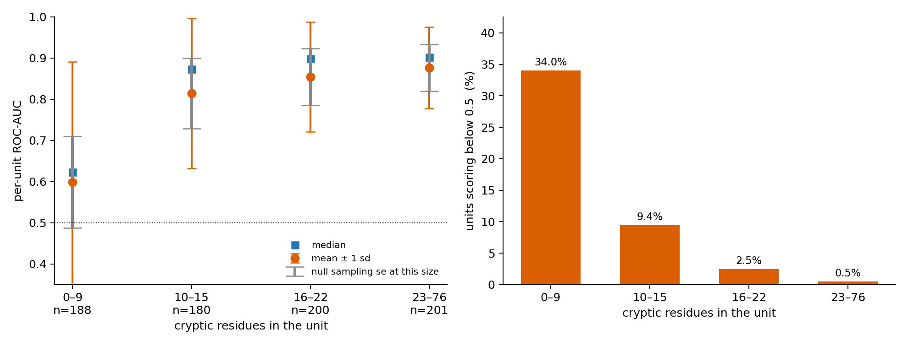

**Architecture figure 1.** Where the detector fails, on 769 training units scored on the pick half of twelve cluster-disjoint splits. Left, per-unit ROC-AUC by the number of cryptic residues the unit contains: mean with one standard deviation in orange, median in blue, and in grey the sampling standard error a within-unit AUC has at that size under the null. The spread is inflated beyond that null at every size and most at the smallest, so part of the width is the metric rather than the detector; the mean is not, because sampling noise is symmetric and the mean falls from 0.8766 to 0.5991 across the strata. Right, the share of units in each stratum scoring below one half, which is worse than a coin toss on their own residues: 87 units do, and they are the population a threshold metric is destroyed by. Every architecture sweep in this repository was scored by a mean over units, which is 0.7884 here against a median of 0.8712.

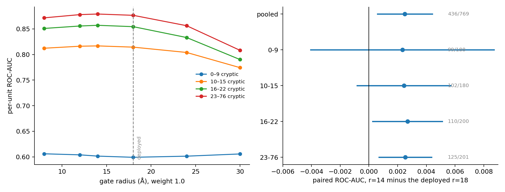

**Architecture figure 2.** The spatial gate swept per pocket size on the training fold, thirteen arms sharing one compile per split. Left, per-unit ROC-AUC against gate radius at weight 1.0, one line per stratum; the deployed radius is marked and is the best for no stratum. Right, the paired difference between r=14 and the deployed r=18 on the same units, with 95% intervals and the count of units improved: +0.00250 pooled, interval [+0.00060, +0.00441], 436 of 769 units better, and the same size in every stratum rather than concentrated in the small pockets the sweep was launched to investigate. Choosing the arm on six splits and scoring it on the other six selects the same arm both ways round and gives margins of +0.00175 and +0.00320, so the choice replicates and the size is uncertain within that range. Nothing is changed on the strength of this: the constant is still r=18 and moving it would spend the external confirmation.

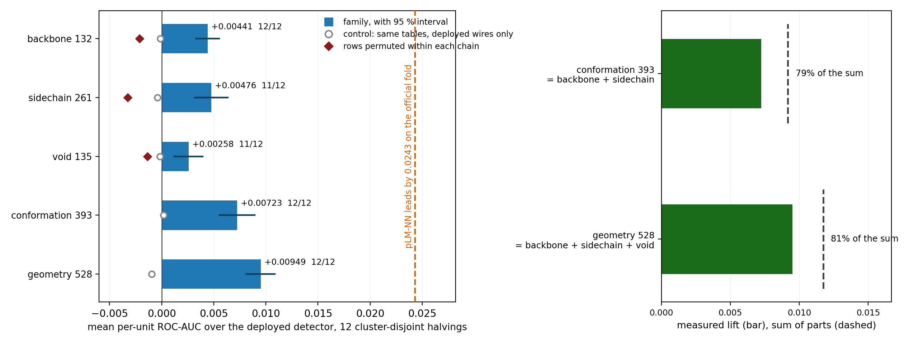

**Architecture figure 3.** The three wire families that are not null, their two control arms, and the two stacks built from them. Left: lift over the deployed detector on twelve cluster-disjoint halvings of the training fold, with the 95 % interval. Every family's control arm — the same number of added tables, drawn from wires already deployed — sits at zero, so added cells are not the mechanism; every permuted arm, which preserves each column's multiset over the chain and destroys only which residue a row describes, is *negative*, so columns of these shapes attached to the wrong residue are worse than adding nothing. Right: each stack against the sum of its parts. backbone and side-chain are computed from overlapping atom sets and share about a fifth of what they carry; void, which reads the connectivity of the empty space rather than the scored residue's own atoms, keeps 88% of its standalone value when stacked on both. The dashed rule on the left is the gap this is aimed at: the largest bar, +0.00949 on 12 of 12 splits, is 39% of the official-fold deficit to pLM-NN. Training fold only; nothing here is deployed and no held-out set was read.

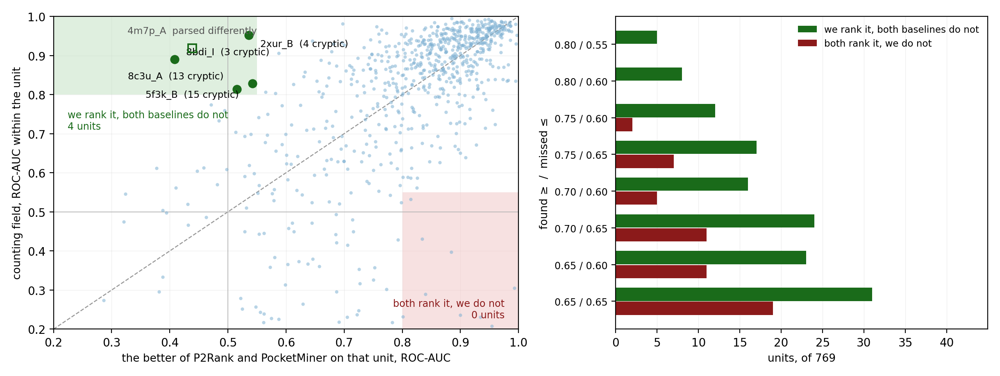

**Architecture figure 4.** Training-fold disagreements between the counting field and the two published baselines it can be compared against there, in both directions. Left: every one of the 769 units as one point, our within-unit ROC-AUC against the better of P2Rank and PocketMiner on that same unit. The green corner is the rule fixed before the counts were read — ours ≥ 0.80 with both baselines ≤ 0.55, chance being 0.50 — and the red corner is its mirror, which holds 0 units. 4 units are named; 4m7p_A is drawn hollow and not counted in that joint rule because its deposit is a twenty-conformer ensemble and not every baseline parses it alike — against P2Rank alone both score the same 390 residues (0.918 vs 0.439), reported separately as a training-fold case study. Right: the same two counts at eight strictness settings, reported whole because one row of a ladder is a choice. pLM-NN is absent and cannot be added here: its published head was fitted on these very chains, where it scores 0.96 against 0.82 on the official fold, and a rule asking whether a baseline sits at chance cannot be applied to a baseline that has memorised the unit. So this compares against two baselines and not three, and the three-baseline version of the question was answered on the official fold under a preregistered plan, where it returned 0 recoveries against 1 mirror. Exploratory, training fold only, no test-fold read.

<!-- END AUTOGENERATED: architecture figures -->

### Units both published baselines rank at chance

<!-- BEGIN AUTOGENERATED: four recoveries figure -->

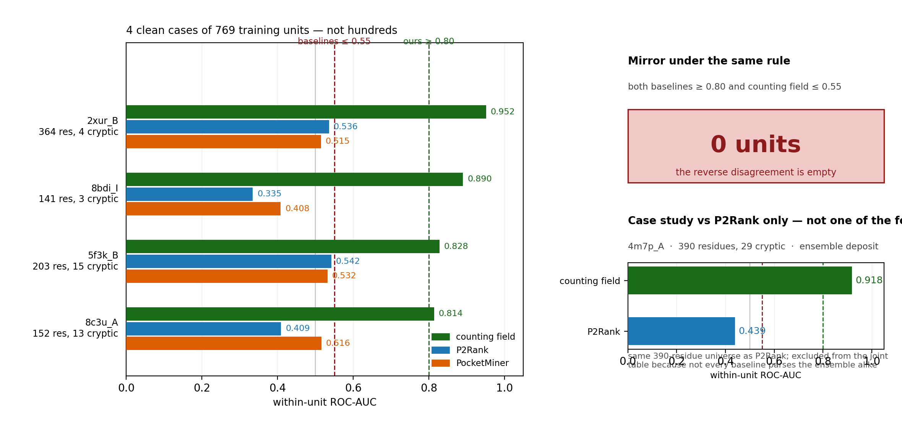

**Four recoveries.** Four clean recoveries on the training fold, not hundreds. Left: the 4 units where the counting field scores within-unit ROC-AUC ≥ 0.80 while both P2Rank and PocketMiner sit ≤ 0.55 (chance 0.50), out of 769 units where all three methods are defined. Each unit shows all three scores; the dashed lines are the two cuts fixed before the counts were read. Right: the mirror under the same rule is empty (0 units), and 4m7p_A is shown only against P2Rank — 0.918 vs 0.439 on the same 390 residues — as a training-fold case study, not one of the four. Exploratory, training fold only; pLM-NN is absent; clinical_grade is false.

<!-- END AUTOGENERATED: four recoveries figure -->

`results/architecture_sweep/RECOVERED_UNITS_TRAIN.json`. On the 769 training
units where all three methods are defined, there are **four chains where the
counting field ranks the cryptic binding residues at ROC-AUC ≥ 0.80 while both
P2Rank and PocketMiner sit at or below 0.55**, with chance being 0.50. The mirror
set — both baselines above 0.80 and the counting field at or below 0.55 — is
**empty**.

| unit | residues | cryptic | counting field | P2Rank | PocketMiner |
|---|---|---|---|---|---|
| `2xur_B` | 364 | 4 | **0.952** | 0.536 | 0.515 |
| `8bdi_I` | 141 | 3 | **0.890** | 0.335 | 0.408 |
| `5f3k_B` | 203 | 15 | **0.828** | 0.542 | 0.532 |
| `8c3u_A` | 152 | 13 | **0.814** | 0.409 | 0.516 |

Four numbers are not the finding. Searching 769 units for a favourable one is the
most reliable way to manufacture evidence, so three things are fixed rather than
chosen: the rule is written into the tool before the counts are read, the mirror
count is reported beside the favourable one, and the whole threshold ladder is
reported rather than the row with the largest number. Across all eight settings
the difference runs from +5 to +13 in the same direction, and the mirror is
exactly zero at the two strictest.

Three limits travel with this and are not optional:

- **pLM-NN is not in it.** It has never been run on the training fold — that is a
  five-hour encoder pass, not a lookup — so these counts are against two
  baselines and not three. The official-fold version, where all four methods'
  per-residue scores are already frozen, is a read of the held-out set and
  requires a preregistration and a ledger index before it is run.
- **`4m7p_A` is excluded from the joint table**, and it is still the largest
  pairwise disagreement with P2Rank. The deposit is an ensemble refinement —
  twenty alternate conformers, 60,040 ATOM lines for 3,002 atoms — so a recovery
  that requires every published baseline to parse that file alike would be a win
  about parsing, not about pocket ranking. **Against P2Rank alone the comparison
  is on the same residues:** both methods score the collapsed 390-residue chain
  (`n_cryptic=29`), and the counting field's within-unit ROC-AUC is **0.918
  against P2Rank's 0.439**. That is a training-fold case study, not one of the
  four clean recoveries above, and it does not licence a held-out claim — the
  three-baseline official read below finds none.
- **Two of the four have very few cryptic residues.** `2xur_B` has four and
  `8bdi_I` three, where the sampling error of a per-unit ROC-AUC under the null
  is about 0.11. `8c3u_A` and `5f3k_B`, at 13 and 15, are the two that do not
  lean on it.

What a row above states is that the cryptic binding residues of that chain are
ranked above its other residues by the counting field and are not ranked above
them by either published method. It is not a claim that a pocket exists which the
baselines cannot see, nor that any site is druggable, and `clinical_grade` is
`false` here as everywhere.

#### The same rule on the held-out fold, and it does not survive

`results/official_fold/RECOVERY_READ.json`, test-fold read 13, exploratory. The
rule above was fixed on the training fold and committed, then preregistered in
`PREREGISTERED_RECOVERY.json` — which hashes the tool and the artifact it came
from and refuses to run if either has moved — and applied unchanged to the 192
official units, this time against **all three** baselines including pLM-NN.

**There are no recoveries. There is one mirror.** The difference is negative at
every one of the eight ladder settings: 0 against 1, 1, 1, 2, 2, 3, 4 and 6 as
the rule loosens. The one mirror unit is `1e6k_A`, where the counting field
scores 0.479 and P2Rank, pLM-NN and PocketMiner score 0.826, 0.951 and 0.865.

Two things have to be said about that, and they cut in opposite directions.

**The fold has almost no power for this question.** Four recoveries in 769
training units is a rate of one per 192, so the expected count on a 192-unit fold
is 1.0. Observing 0 with a mirror of 1 is what that rate produces by chance in
either direction, and the third baseline makes the bar strictly harder: P2Rank
falls below 0.55 on 17 units, pLM-NN on 25 and PocketMiner on 26, but **all three
together on only 6**.

**On those six units we do worse, not better.** That part is not a power problem:

| unit | counting field | P2Rank | pLM-NN | PocketMiner |
|---|---|---|---|---|
| `7e5q_B` | 0.588 | 0.532 | 0.520 | 0.382 |
| `1rtc_A` | 0.522 | 0.532 | 0.434 | 0.469 |
| `4gv9_A` | 0.272 | 0.398 | 0.214 | 0.385 |
| `1vsn_A` | 0.150 | 0.510 | 0.401 | 0.316 |
| `7f2m_B` | 0.137 | 0.349 | 0.095 | 0.424 |
| `3ly8_A` | 0.110 | 0.282 | 0.268 | 0.233 |

Ahead on one of six, mean 0.297 against a best-baseline mean of 0.446. The chains
all three published methods fail on are chains this detector fails on harder.

So the training-fold table above is not evidence that the counting field sees
sites the baselines cannot. It is a statement about 769 training units and two
baselines, it does not replicate on the held-out fold against three, and the
sentence reporting that was written into the plan before the read and is quoted
in the artifact. Both results are shown here because showing only the first is
exactly the selection the preregistration exists to prevent.

## Repository layout

```text
paper/        MAIN_CRYPTOBENCH_GEOAUDIT.tex   primary manuscript
              frozen_numbers.tex              generated: every number the prose
                                              cites, emitted from the JSON
                                              artifacts; `make numbers`. The
                                              manuscript quotes macros, never
                                              literals, so a stale number is a
                                              build failure and not a typo
              appendix_a_wire_definitions.tex generated: the 43 quantities and
                                              the 43x15 = 645 expansion
              appendix_b_gf4_ablation.tex     \input appendix, not standalone
              appendix_c_compile.tex          generated: the table bank and its
                                              seed, the cell rule, the solve,
                                              the gate, the boundary cases
contracts/    GEOAUDIT_PAPER_SCOPE.json       what this paper may and may not
                                              claim
              CANDIDATE_SHOWCASES.json        the registry of admitted candidate
                                              showcases: their paths, caps,
                                              required fields and non-claims
```

**Where the quantities are defined — the dictionary.** Each module below is the
definition of a family of per-residue quantities; the tool beside it expands them
into columns at three aggregations (own value, contact-shell mean, two-step walk)
and caches the matrix.

```text
src/pocket_bench/methods/
  backbone_geometry.py    44 quantities from N, CA, C, O, CB   -> tools/backbone_wires.py
  sidechain_geometry.py   87 quantities of side-chain state    -> tools/sidechain_wires.py
  void_topology.py        45 quantities of the empty space     -> tools/void_wires.py
  residue_chemistry.py    14 chemical quantities per residue   -> tools/chemistry_wires.py
  density_topology.py     contact-graph and shell invariants   -> tools/composition_wires.py
  algebraic_descriptors.py  the 35 local invariants the deployed bank is built from
  expanded_descriptors.py   wide_descriptors.py  operator_descriptors.py
  chain_operator_descriptors.py                   generated invariant banks (S4.6)
  sequence_wires.py         the 645 deployed wires: 43 quantities x 15 statistics
  table_bank.py table_field.py quotient_tables.py cascade_lut.py quaternary_lut.py
                            the counting field itself: bank construction, cell
                            rule, integer fan-out, the solve
  geometric_foundation.py algebraic_field.py      the two other detectors, named
                            separately because they are different programs and
                            get confused for one another
  p2rank_wrap.py fpocket_wrap.py deeppocket_wrap.py    baselines, firewalled
  firewall.py               refuses any input a receptor-only method may not see
native/geoaudit_kernels/    Rust cdylib, 3 kernels (free-grid mask, buriedness,
                            local free-enclosed count), ported operation-for-
                            operation from the NumPy reference so results are
                            bit-identical; loaded by src/pocket_bench/native.py
                            with a NumPy fallback, built by tools/build_native.sh
```

**Where the numbers are.** `results/` holds one JSON per measurement and
`results/ARTIFACT_MANIFEST.json` classifies every one of them; a file under
`results/` that the manifest does not declare fails `make verify`.

```text
results/official_fold/      the held-out fold. Reads are ledgered and capped
results/external/           EXTERNAL_SET.json (frozen, hashed) + EXTERNAL_READ
results/architecture_sweep/ the training fold: every sweep, every wire family,
                            every control arm. Nothing here reads a held-out set
                            and each file declares `reads_test_fold: false`
results/baselines/          P2Rank, PocketMiner and pLM-NN as executed here
results/appendix_esr1/      DECOMPOSABILITY_SHOWCASE.json  <- the candidates
results/pilot/ cryptobench_apo/ cryptobench_official/ gf4_ablation/
```

**Where the candidates are, and what governs them.** Six molecules, in
`results/appendix_esr1/DECOMPOSABILITY_SHOWCASE.json`, with their inputs in
`data/appendix_esr1/SHOWCASE_INPUT.json`. Every record carries isomeric and
canonical SMILES, InChIKey, formula, heavy-atom and bond counts, elements, a
bond-graph SVG, a topological pharmacophore, its stereochemistry, and a
structural audit stating its stability alerts, liability alerts, metabolic soft
spots and unassigned stereocentres. They are admitted by
`contracts/CANDIDATE_SHOWCASES.json` and gated by
`candidate_showcases_are_registered_and_complete`, which fails closed on a
missing field, a record over the cap, a tree over the global cap of 40, or a
missing non-claim declaration. **They demonstrate that a score decomposes
exactly and nothing else** — no affinity, no efficacy, no comparison between
method classes, and `clinical_grade: false` on every one. Any file in the tree
carrying a SMILES value and not in that registry fails the build.

```text
data/cryptobench_apo/    the training partition: manifest, labels, wire caches
data/baselines/          baseline predictions as the published tools emit them
data/external/           the frozen external sets
data/manifests/          provenance, split ledger, companion evidence, cluster
                         ledger — the files that say where every structure came
                         from and which units may share a split
data/appendix_esr1/      SHOWCASE_INPUT.json (registered as a candidate input)
figures/                 every figure in the README and the paper, each with a
                         provenance record binding it to its generator, its
                         source artifact digest and its caption
tools/                   168 files: fold runners, wire builders, every sweep,
                         the emitters, and verify_claims.py which holds the gates
tests/                   863 tests, 613 subtests
docs/AGENT_MEMORY.md     what has been tried, what closed it, and what is open
```

Local-only material (never published) is gitignored (`*.local.*`, `_local/`) and
excluded from scope gates. Hardware-design pipelines, netlist tooling and the
private learning engines developed in the sibling repositories are deliberately
absent; `no_proprietary_engine_names_public` fails any primary document that
names one.
