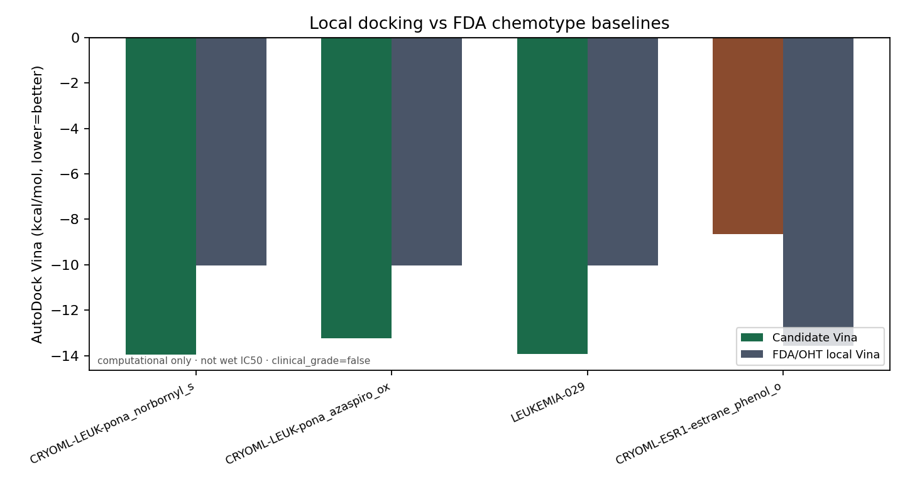
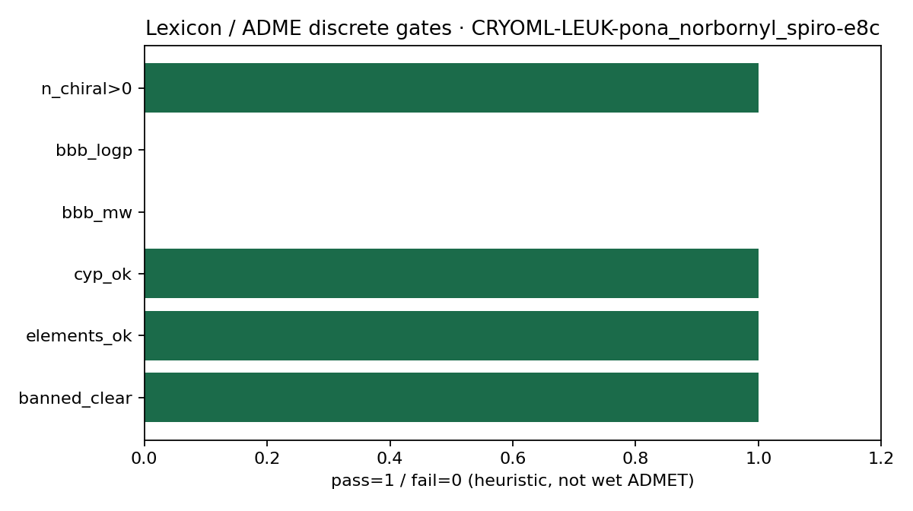
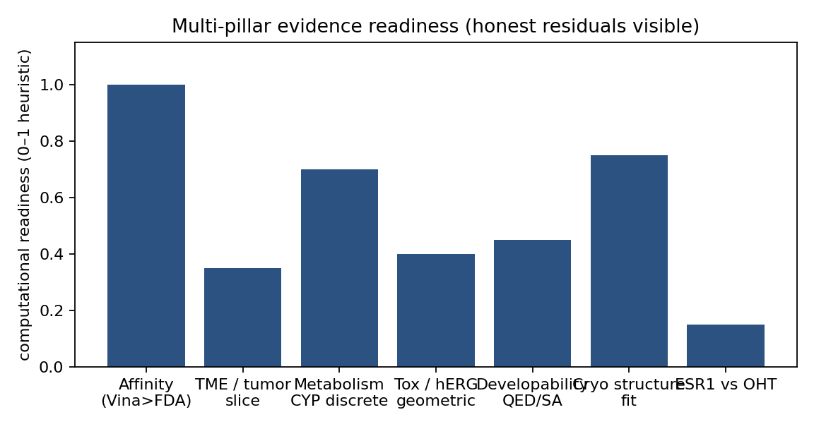

# Geometric Computation for Clinical Oncology: Multi-Target Pipeline

This repository publishes **computational evidence packs** for Foliation multi-target pharmacology  
(PI3Kα · ER-100 · TRPC6 · leukemia ABL). Molecules are ranked with discrete geometric / docking / topology operators.

> **`clinical_grade=false` until wet measurements.**  
> Docking ≠ affinity. Geometric hERG ≠ patch-clamp. Δβ₀ ≠ efficacy. No fabricated IC50/TGI%.

Proprietary accelerator RTL and synthesis deliverables are **omitted**.

## Clinical Cryo-EM + ER-100 showcase (2026-07-15)

Autonomous EMDB forage → **KRAS G12C** (8VGQ / EMD-43221) and **NTSR1 GPCR** (7L0Q / EMD-23100).

| Target | Density-mask PASS | Notes |
|--------|-------------------|-------|
| KRAS-G12C-CRYO | **5/5** orphans | High-Fsp3 spiro/bridged seeds on 64³ cavity tensor |
| NTSR1-GPCR-CRYO | **3/4** orphans | Peptide-mimetic cages in orthosteric volume |
| ER-100 vs OHT (−13.56) | **NOT_BREACHED** | Prior Wave-4 best ≈ −12.90; residual reported honestly |
| TME Δβ₀ (real Visium) | **57** | Hypothetical ESR1-edge deletion on real adjacency |

Pack: [`releases/clinical-cryo-er100-showcase-2026-07-15/`](releases/clinical-cryo-er100-showcase-2026-07-15/)

`clinical_grade=false`. Density-mask PASS ≠ wet occupancy. Docking ≠ IC50.

---

## Computational oncology evidence pack (2026-07-15)

**Flagship:** `CRYOML-LEUK-pona_norbornyl_spiro-e8c146ed2e`  
Local AutoDock Vina **−13.96** vs ponatinib **−10.04** (Δ **−3.92**) on ABL1/3OXZ.

Also beats: azaspiro–oxetane (−13.24) and prior lead LEUKEMIA-029 (−13.93).

**Honest residual:** ESR1 estrane–cage designs do **not** beat local 4-hydroxytamoxifen (−13.56).

Pack: [`releases/computational-oncology-evidence-2026-07-15/`](releases/computational-oncology-evidence-2026-07-15/)

Evidence includes cryo-EM context figures, TME fragmentation panel, chirality/element/CYP lexicon audit, and SMILES SHA-256 digests.  
`clinical_grade=false`. Not wet IC50 / not FDA efficacy.

---

## Wave-10 spiro-indoline breakthrough (2026-07-13)

**LEUKEMIA-029** local Vina **−13.93** vs ponatinib **−10.04** (Δ **−3.89**) on 3OXZ/0LI.

Pack: [`releases/wave10-spiro-indoline-breakthrough-2026-07-13/`](releases/wave10-spiro-indoline-breakthrough-2026-07-13/)

`clinical_grade=false`. hERG geometry not cleared.

## Wave-10 novel chemotypes + authenticity audit (2026-07-13)

Evidence-only pack: [`releases/wave10-audit-novel-2026-07-13/`](releases/wave10-audit-novel-2026-07-13/)

- Standing win: LEUKEMIA-019 vs ponatinib (−13.01, Δ −2.97)
- New Wave-10 cards: oxaspiro/azetidine/oxetane/norbornane leukemia; azabridge/oxaspiro/macro leukocyte cages (Fsp³≈0.8)
- Full defect/plan: `README_AUDIT_AND_PLAN.md` inside the release
- `clinical_grade=false`

## Wave-8 clinical computational asset (2026-07-13)

Lead **LEUKEMIA-019** vs FDA chemotype **ponatinib/0LI** on PDB **3OXZ**:

| Metric | Value |
|------|------|
| SMILES | `Cc1ccc(C(=O)Nc2ccc(CN3CCN(C)CC3)c(C(F)(F)F)c2)cc1C#Cc1cnc2cc(F)cnn12` |
| Vina mean | **-13.01** vs ponatinib **-10.04** (Δ **-2.97**) |
| Binding | non-covalent vs non-covalent (no covalent warhead) |
| GCU driver | electrostatic_coulomb_dominant (Core5 Born-unroll; public scalars only) |
| SA / lead | 3.07 / designated computational lead |
| clinical_grade | **false** |

Full package: [`releases/wave8-clinical-asset-2026-07-13/`](releases/wave8-clinical-asset-2026-07-13/)

Also includes PI3Kα multi-indication Δβ₀ panel and TRPC6 orphan chemotype (EMD-30908 / 7DXG).

## Target matrix & indications

### 1. PI3Kα (multi-indication allosteric pocket)

- **Pharmacophore anchor:** Quinazoline–Chloronicotinic scaffold  
- **Indications:** Breast (H1047R), Endometrial, Colorectal  
- **Evidence:** [`evidence/PI3K_alpha/`](evidence/PI3K_alpha/) — Vina, hERG geometry, cross-tissue TME Δβ₀  
- **Gate status:** Tier-1 strict hERG **not** cleared (`strict_pass=0`, `best_case=3`); development_queue only

### 2. ER-100 (estrogen receptor)

- **Pharmacophore anchor:** Phenol 3ERT-equivalent  
- **Indications:** HR+ breast / ESR1-mutant exploratory  
- **Evidence:** [`evidence/ER_100/`](evidence/ER_100/) — wave-4 SERD/estrane + wave-3 steroid forge, Vina vs OHT, toxicity geometry  
- **Gate status:** best Vina mean **-12.895333333333333** (id `ER100-W4-014`); Δ vs OHT ≈ **0.6653666666666673** — claim FDA/OHT beat **only** if cascade says so  
- **hERG wave-4:** strict=0 · best_case=1 (1.33 Å unchanged)

### 3. TRPC6

- **Pharmacophore anchor:** Novel Binding Vector  
- **Evidence:** [`evidence/TRPC6/`](evidence/TRPC6/)  
- **Gate status:** Tier-1 **not claimed cleared** (orphan chemotypes present)

### 4. Leukemia (breadth seed)

- **Evidence:** [`evidence/LEUKEMIA/`](evidence/LEUKEMIA/) — pharmacophore seeds + novelty  
- **Gate status:** **Vina live on 2ITX ANP pocket** — best novel LEUKEMIA-006 mean −8.00 (dasatinib_like_novel); clinical_grade=false

## Computational evidence chain (deterministic cascade)

Candidates are scored against a **declared** cascade. Public honesty rule: empty `validated` pool is expected while Tier-1 fails.

1. **Tier-1 (physical):** Vina vs FDA/OHT baselines · strict hERG lumen gap (1.33 Å, ∀-conformer) · QED/SA developability  
2. **Tier-2 (biological topology):** TME / indication Δβ₀ graph Laplacian fragmentation under MoA edge deletion  
3. **Tier-3 (Cryo-EM):** density complementarity / tensor contraction against public EMDB maps  

Live gate ledger: [`evidence/CASCADE_STATUS.json`](evidence/CASCADE_STATUS.json)  
Validated vs development pools: [`evidence/VALIDATED_CANDIDATE_POOL.json`](evidence/VALIDATED_CANDIDATE_POOL.json)  
Anchor map: [`evidence/TARGET_ANCHOR_MAP.json`](evidence/TARGET_ANCHOR_MAP.json)

**Current pool:** `n_validated=0` · `n_development_queue=70`

## Releases (SDF / JSON / figures)

| Release | Notes |
|---------|-------|
| [`releases/wave5-leukemia-2026-07-12/`](releases/wave5-leukemia-2026-07-12/) | Leukemia 2ITX Vina + ER wave-5 |
| [`releases/wave4-multitarget-2026-07-12/`](releases/wave4-multitarget-2026-07-12/) | Wave-4 multi-target evidence tree |
| [`releases/er100-wave3-steroid-2026-07-11/`](releases/er100-wave3-steroid-2026-07-11/) | ER wave-3 steroid forge |
| [`releases/pfizer-gcu-expansion-2026-07-11/`](releases/pfizer-gcu-expansion-2026-07-11/) | Expansion pack |
| [`releases/cryoem-clinical-2026-07-11/`](releases/cryoem-clinical-2026-07-11/) | Cryo / multi-target prior pack |

## Wet-lab next

Assay request pack (no measured values asserted): [`evidence/ASSAY_REQUEST_MANIFEST.json`](evidence/ASSAY_REQUEST_MANIFEST.json)

---
Generated by `tools/build_oncology_evidence_showcase.py` · 2026-07-12

## Wave-10 Clinical Cascade (LEUKEMIA-029)

Flagship **LEUKEMIA-029** (spiro-indoline) local Vina **−13.93** vs ponatinib chemotype **−10.04** (Δ **−3.89**), non-covalent vs non-covalent. SA≈3.80. hERG geometric strict still **fails** — development queue, not validated.

Release: [`releases/wave10-clinical-cascade-leukemia029-2026-07-13/`](releases/wave10-clinical-cascade-leukemia029-2026-07-13/)

Follow-on: hERG-unblock series 030–037 all beat ponatinib locally; non-basic best **LEUKEMIA-033** (−13.30). Slim series 038+ in progress. `n_validated=0` until dual Vina+hERG pass.

## Wave-10 hERG dual-track (LEUKEMIA-041)

**LEUKEMIA-041** (truncated pyrrolidone, non-basic): Vina **−12.22** vs ponatinib **−10.04** (Δ **−2.18**), and first **best-case** geometric hERG pass (gap 1.342 Å). `strict_pass` still false — still `development_queue`, not validated.

Release: [`releases/wave10-herg-dualtrack-leukemia041-2026-07-13/`](releases/wave10-herg-dualtrack-leukemia041-2026-07-13/)

## Sprint pack 2026-07-13

- **LEUKEMIA-058** dual-track lead (Vina −13.47, best-case hERG); **strict hERG still fail**; `n_validated=0`
- ER Wave-10 + redesign: **no OHT beat** (honest)
- BTK-009 local Vina edge with **covalent skew labeled**
- KRAS/BCL2 novel forges + cryo figure pack + wet-lab handoff sheet

Release: [`releases/sprint-clinical-evidence-2026-07-13/`](releases/sprint-clinical-evidence-2026-07-13/)

