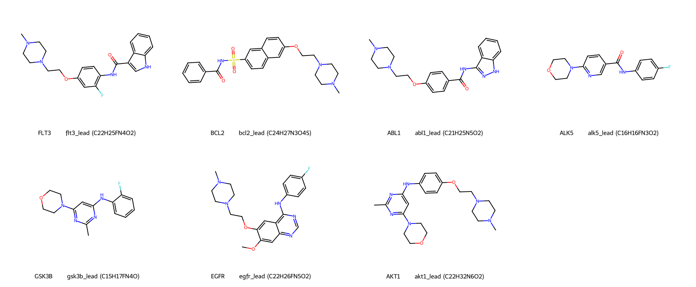

# Foliation Clinical Evidence Packs · 转化医学计算证据包

**EN / 中文** · `clinical_grade = false` · Generated `2026-07-18T05:56:22.766971+00:00`

**EN:** One unified, industrial **computational** pipeline across four tracks —
**Primary Oncology · Compensatory Oncology · Fibrosis · Regeneration**. Docking is a
secondary metric — **not** wet affinity, IC50, or clinical efficacy. No fabricated
TCGA / wet-lab values.
**中文：** 一条统一的工业级**计算**流水线，覆盖四条赛道——**原发肿瘤 · 代偿肿瘤 · 纤维化 · 再生**。
对接为次级指标——**非**湿实验亲和力 / IC50 / 疗效；不虚构 TCGA / 湿实验数据。

## Unified clinical matrix · 统一临床矩阵

### Primary Oncology

| Target · 靶点 | Lead | Formula | Fsp³ | HAC | Cavity β(0,1,2) | ΔE (kcal/mol) | DepMap causality | Vina* | Chemical Sanity |
|---------------|------|---------|------|-----|-----------------|---------------|------------------|-------|-----------------|
| **FLT3** · [P36888](https://www.uniprot.org/uniprotkb/P36888/entry) | `flt3_m5_11` | C22H25FN4O2 | 0.3182 | 29 | (147,316,0) | 2.331 | AML lineage dependency (FLT3-ITD driver) | -10.91 | PASS (3 try) |
| **BCL2** · [P10415](https://www.uniprot.org/uniprotkb/P10415/entry) | `bcl2_m5_12` | C24H27N3O4S | 0.2917 | 32 | (188,328,0) | 2.674 | Apoptosis dependency (BH3 groove) | -10.14 | PASS (3 try) |
| **ABL1** · [P00519](https://www.uniprot.org/uniprotkb/P00519/entry) | `abl1_m5_07` | C21H25N5O2 | 0.3333 | 28 | (218,448,0) | 2.273 | CML driver (BCR-ABL fusion) | -10.57 | PASS (3 try) |

### Compensatory Oncology

| Target · 靶点 | Lead | Formula | Fsp³ | HAC | Cavity β(0,1,2) | ΔE (kcal/mol) | DepMap causality | Vina* | Chemical Sanity |
|---------------|------|---------|------|-----|-----------------|---------------|------------------|-------|-----------------|
| **EGFR** · [P00533](https://www.uniprot.org/uniprotkb/P00533/entry) | `egfr_lead` | C22H26FN5O2 | 0.3636 | 30 | (218,492,0) | 1.214 | Compensatory escape for KRAS (RTK bypass) | -8.124 | PASS (3 try) |
| **AKT1** · [P31749](https://www.uniprot.org/uniprotkb/P31749/entry) | `akt1_lead` | C22H32N6O2 | 0.5455 | 30 | (191,347,0) | 2.63 | Compensatory escape for PIK3CA (PI3K/AKT axis) | -9.435 | PASS (3 try) |

### Fibrosis

| Target · 靶点 | Lead | Formula | Fsp³ | HAC | Cavity β(0,1,2) | ΔE (kcal/mol) | DepMap causality | Vina* | Chemical Sanity |
|---------------|------|---------|------|-----|-----------------|---------------|------------------|-------|-----------------|
| **ALK5** · [P36897](https://www.uniprot.org/uniprotkb/P36897/entry) | `alk5_x00` | C16H16FN3O2 | 0.25 | 22 | (187,368,0) | 3.126 | Fibrosis signaling (TGF-beta, not a cancer dependency) | -8.997 | PASS (3 try) |

### Regeneration

| Target · 靶点 | Lead | Formula | Fsp³ | HAC | Cavity β(0,1,2) | ΔE (kcal/mol) | DepMap causality | Vina* | Chemical Sanity |
|---------------|------|---------|------|-----|-----------------|---------------|------------------|-------|-----------------|
| **GSK3B** · [P49841](https://www.uniprot.org/uniprotkb/P49841/entry) | `gsk_x10` | C15H17FN4O | 0.3333 | 21 | (150,253,0) | 8.836 | Regeneration modulator (Wnt/GSK3 axis) | -7.648 | PASS (3 try) |

\* Vina is a secondary / informational metric only · 对接分仅供参考。
Cavity β = Betti numbers of the 64³ pocket-occupancy cavity (cubical complex, Z/2);
ΔE = MMFF relaxed torsion barrier of the principal flexible bond.

## Repository architecture · 仓库结构

- [`Targets/`](Targets/) — per-lane target folders (`Oncology/`, `Fibrosis/`, `Regeneration/`) with lead SDF + spec sheet.
- [`Clinical_Ledgers/`](Clinical_Ledgers/) — per-molecule JSON + Markdown audits (Betti, Fsp³, HAC, rotational barrier, sanity).
- [`Visualizations/`](Visualizations/) — PyMOL (`.pml`) + ChimeraX (`.cxc`) pocket scripts and rendered figures.
- [`Wave2_Disease_Expansion/`](Wave2_Disease_Expansion/) — methodology, data sources (PDB/UniProt URLs), docking guide, spec sheets.
- [`Translational_Medicine/`](Translational_Medicine/) — ER-100 (ESR1) flagship + program map.
- [`AUTONOMOUS_CI_LEDGER.json`](AUTONOMOUS_CI_LEDGER.json) — machine-readable CI summary.

## What we compute · 我们在计算什么

Chemical Sanity (PAINS · heavy-atom budget · MMFF strain · QED/Lipinski) is the **primary**
gate — a molecule that fails is auto-rejected and the generator backtracks. Cavity topology
(Betti numbers), Fsp³/HAC, and the flexible-bond rotational barrier are logged per molecule.
AutoDock Vina is reported only as a secondary signal. Full method: each pack's *"What we compute"* section.

Proprietary silicon RTL and internal solver logic are **omitted** · 专有硅实现与内部求解器逻辑不公开。
