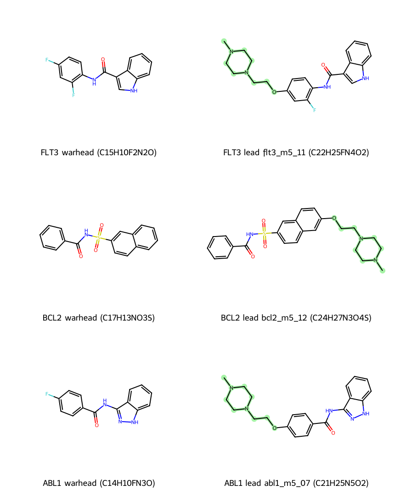

# Translational Medicine · 转化医学证据包

**EN / 中文 bilingual** · Generated: `2026-07-17T16:46:40.850375+00:00`

> **`clinical_grade = false`**
>
> **EN:** Chemical Sanity is primary. Docking affinity is secondary / informational only.
> Computational gates ≠ measured IC50.
>
> **中文：** 化学合理性门控优先；对接亲和力仅作次级参考。计算分数 ≠ 湿实验 IC50 / 临床疗效。

---

## Program map · 项目地图

| Lane · 赛道 | Gene · 靶点 | Indication · 适应症 | Pack · 数据包 |
|-------------|-------------|---------------------|---------------|
| **ER-100** | **ESR1** | ER+ breast · 雌激素受体阳性乳腺癌 | [`Pipeline_Matrix/`](Pipeline_Matrix/) · CRI **4/4** SERMs |
| **Retina regen · 视网膜再造** | **GSK3β** (+ discovery chemotypes) | Stem-cell / Pax6–Rax induction · 视网膜干细胞诱导 | [`../Wave2_Disease_Expansion/`](../Wave2_Disease_Expansion/) |
| **Heme · 血癌/淋巴癌** | **FLT3 / BCL2 / ABL1** | AML · B-cell lymphoma · CML · **M5 leads** | [`../Wave2_Disease_Expansion/`](../Wave2_Disease_Expansion/) · [`wetlab/`](wetlab/) |

---

## 1. ER-100 (ESR1) · 雌激素受体项目

**EN:** ER-100 is the flagship ER+ breast program. Leads are SERM-class graphs that pass the
full Clinical Readiness Index (DepMap · TME pH · liability shields · Chemical Sanity).
**中文：** ER-100 为 ER+ 乳腺癌旗舰项目。候选为 SERM 类分子图，需通过完整临床就绪指数
（DepMap · 肿瘤微环境 pH · 脱靶屏蔽 · 化学合理性）。

| ID | Formula · 分子式 | HA | MW | Vina (secondary) | CRI |
|----|------------------|----|----|------------------|-----|
| `serm_stilbene_amine` | **C18H21NO2** | 21 | 283.37 | -7.045 | 4/4 ACTIVE |
| `serm_biphenyl_amine` | **C16H19NO2** | 19 | 257.33 | -6.823 | 4/4 ACTIVE |

SMILES:
- `serm_stilbene_amine`: `Oc1ccc(/C=C/c2ccc(OCCN(C)C)cc2)cc1`
- `serm_biphenyl_amine`: `Oc1ccc(-c2ccc(OCCN(C)C)cc2)cc1`

---

## 2. Retinal regeneration · 视网膜再造

**EN:** Small-molecule induction chemotypes for retinal reprogramming (Pax6/Rax axis).
GSK3β is treated as a **modulatory** target; discovery SDFs are high-Fsp³ / oxetane–bicyclo motifs.
**中文：** 面向视网膜细胞重编程（Pax6/Rax）的小分子诱导化学型。GSK3β 按**调谐/变构逻辑**筛选；
发现集为高 Fsp³ / 氧杂环丁烷–双环骨架。

| ID | Formula · 分子式 | HA | MW | Vina |
|----|------------------|----|----|------|
| `gsk_x10` | **C15H17FN4O** | 21 | 288.33 | -7.648 |

SMILES: `Cc1nc(N2CCOCC2)cc(Nc2ccccc2F)n1` · SDFs: [`../Wave2_Disease_Expansion/retina_ligands/`](../Wave2_Disease_Expansion/retina_ligands/)

---

## 3. Hematologic oncology · 血液肿瘤 / 淋巴瘤（Sprint M5）

**EN:** Mass-screen warheads (Fsp³ ≈ 0) grown into high-Fsp³ solvent-tailed clinical leads.
Formulas RDKit-verified. Full figures, spec sheets, data sources, and a docking guide live in
the Wave-2 pack.
**中文：** 筛选弹头（Fsp³ ≈ 0）扩展为高 Fsp³ 溶剂尾临床先导。分子式经 RDKit 校验。完整结构图、
分子说明书、数据来源与对接指南见 Wave-2 数据包。

| Gene | Disease | Lead ID | Formula · 分子式 | Fsp³ | cLogP | Vina* |
|------|---------|---------|------------------|------|-------|-------|
| **FLT3** | AML / FLT3-ITD | `flt3_m5_11` | **C22H25FN4O2** | 0.3182 | 3.186 | **-10.91** |
| **BCL2** | B-cell lymphoma | `bcl2_m5_12` | **C24H27N3O4S** | 0.2917 | 2.585 | **-10.14** |
| **ABL1** | CML / Ph+ leukemia | `abl1_m5_07` | **C21H25N5O2** | 0.3333 | 2.441 | **-10.57** |

\* secondary metric only. Details + reproduction: [`../Wave2_Disease_Expansion/README.md`](../Wave2_Disease_Expansion/README.md)
· data sources [`../Wave2_Disease_Expansion/DATA_SOURCES.json`](../Wave2_Disease_Expansion/DATA_SOURCES.json)
· guide [`../Wave2_Disease_Expansion/DOCKING_GUIDE.md`](../Wave2_Disease_Expansion/DOCKING_GUIDE.md)
· ABL1 wet-lab (K562) [`wetlab/`](wetlab/)

---

## 4. Pipeline gates · 管线门控（shared）

1. **DepMap Boolean causality** — [`DEPMAP_KILL_SWITCH_JUSTIFICATION.md`](DEPMAP_KILL_SWITCH_JUSTIFICATION.md)
2. **TCGA TME → ProtonationState lock** — breast milli-pH 680 · BM niche 720
3. **Chemical Sanity** — MAX_HEAVY_ATOMS ≤ 35 (M5 heme growth ≤ 40) · PAINS · strain
4. **Clinical Readiness Index** — Boolean ranking (**not** Vina) — [`UNIFIED_CLINICAL_LEDGER.md`](UNIFIED_CLINICAL_LEDGER.md)

---

## Disclaimer · 免责声明

**EN:** This repository publishes computational evidence only. No fabricated wet IC50 / TGI%.
Proprietary silicon RTL omitted.
**中文：** 本仓库仅发布计算证据包。不虚构湿实验 IC50 / TGI%。专有硅实现细节不公开。
