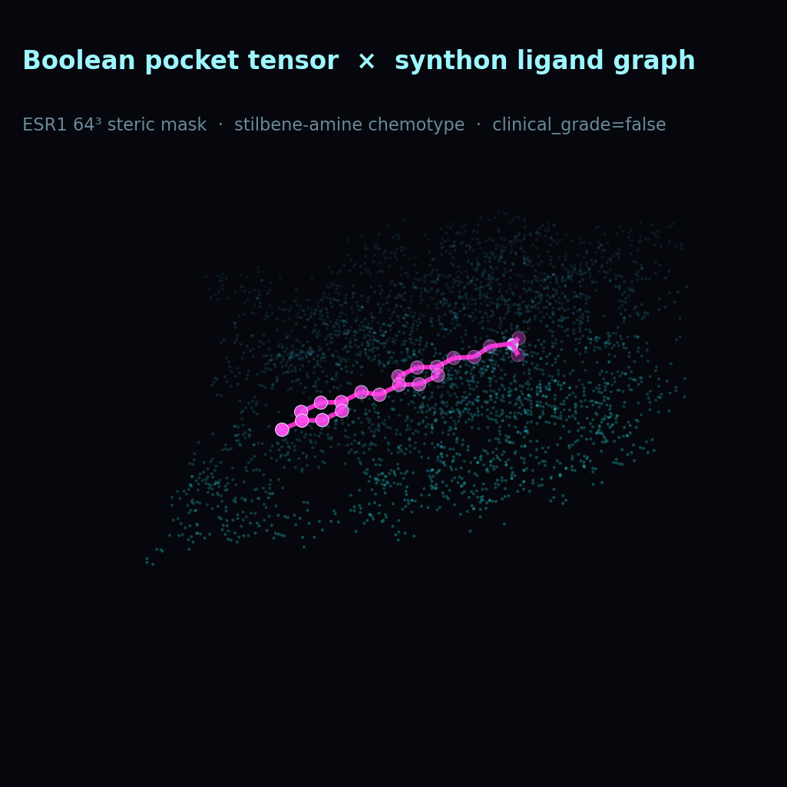

# Translational Medicine · Global Clinical Ground-Truth Pipeline

Generated: `2026-07-16T13:45:36.200076+00:00`

> **`clinical_grade = false`**
> DepMap Chronos kill-switch → TCGA TME pH lock → Chemical Sanity (≤35 heavy atoms) → proteome liability shields → **Clinical Readiness Index** ranking.
> Docking affinity is **secondary / informational only**. Computational gates ≠ measured IC50.

## Paradigm

Isolated docking scores are demoted. Every active target (PI3Kα, ER-100/ESR1, KRAS, Cryo-EM orphans) must survive a unified first-principles clinical reality check before any molecule remains in `VALIDATED_CANDIDATE_POOL`.

## 1. DepMap Boolean causality (Phase 1 veto)

See [`DEPMAP_KILL_SWITCH_JUSTIFICATION.md`](DEPMAP_KILL_SWITCH_JUSTIFICATION.md).

| Program | Gene | Decision | Pipeline | Pan median | Selective? | Lineage median | Wet line |
|---------|------|----------|----------|------------|------------|----------------|----------|
| `leukemia_ABL1` | **ABL1** | **PASS** | **ACTIVE** | 0.04200215621875679 | False | -1.8502399407237715 | K562 |
| `kras_G12C` | **KRAS** | **PASS** | **ACTIVE** | -0.49668749740728335 | True | -1.2710789999573375 | NCI-H358 |
| `pik3ca_H1047R` | **PIK3CA** | **PASS** | **ACTIVE** | -0.4539621313459162 | False | -1.0469504122001227 | T47D |
| `esr1_ER_positive_breast` | **ESR1** | **PASS** | **ACTIVE** | -0.06777620305794746 | False | -1.4622495827007858 | MCF7 |

## 2. TCGA tumor microenvironment → ProtonationState lock

- Co-mutation rule: `PIK3CA_H1047R_AND_PTEN_LOSS` · Boolean **True**
- H1047-like samples: **186** · H1047∩PTEN: **36**
- Dictionary milli-pH priors: `{"breast_ER_pos": 680, "leukemia_BM_niche": 720, "solid_hypoxic_core": 650}`
- Generations lock `ProtonationState` to the disease niche (neutral for acidic breast/hypoxic cores; weak-base allowed in BM niche).

## 3. Chemical Sanity Gate (pre-computation)

- Absolute primary filter: **MAX_HEAVY_ATOMS = 35**, PAINS / reactive motifs, Bredt / strain proxies, Lipinski ceilings.
- Graphs that fail are annihilated before docking metrics are consulted.

## 4. Clinical attrition + proteome liability shields

| Mask | Banned | Failure class |
|------|--------|---------------|
| `anilide_primary_aniline` | True | reactive_metabolite_hepatotox |
| `nitroaromatic` | True | genotox_risk |
| `unsubstituted_michael` | True | covalent_offtarget |
| `catechol` | True | quinone_tox |
| `flat_polyaryl_basic_amine` | False | herg_qt |

Top-50 clinical liabilities (including hERG) are registered as 64³ Boolean clash shields; CYP cleavage and hydration-shell checks are Boolean proxies only (see [`CLINICAL_LIABILITY_TENSOR_INDEX.json`](CLINICAL_LIABILITY_TENSOR_INDEX.json)).

## 5. Unified Clinical Ledger · Clinical Readiness Index

Full ledger: [`UNIFIED_CLINICAL_LEDGER.md`](UNIFIED_CLINICAL_LEDGER.md).

Ranking dimensions (all Boolean — **not** Vina):

1. DepMap Causality
2. TME pH Compliance
3. Off-Target Orthogonality
4. Chemical Sanity / Synthesizability

| Rank | Candidate | CRI | Status |
|------|-----------|-----|--------|
| 1 | `serm_biphenyl_amine` | **4/4** | **ACTIVE** |
| 2 | `serm_stilbene_amine` | **4/4** | **ACTIVE** |
| 3 | `serm_oht_parent` | **4/4** | **ACTIVE** |
| 4 | `serm_oht_fluorophenyl` | **4/4** | **ACTIVE** |
| 5 | `serm_oht_tolyl` | **4/4** | **ACTIVE** |
| 6 | `serm_oht_bcp` | **4/4** | **ACTIVE** |
| 7 | `serm_oht_azaspiro` | **4/4** | **ACTIVE** |
| 8 | `serm_oht_piperidine` | **3/4** | **FROZEN** |
| 9 | `CRYOML-LEUK-pona_azaspiro_oxetane_distal-7840c84c41` | **3/4** | **FROZEN** |
| 10 | `CRYOML-LEUK-pona_norbornyl_spiro-e8c146ed2e` | **3/4** | **FROZEN** |

## 6. ACTIVE VALIDATED_CANDIDATE_POOL (n=7)

- `serm_biphenyl_amine`
- `serm_stilbene_amine`
- `serm_oht_parent`
- `serm_oht_fluorophenyl`
- `serm_oht_tolyl`
- `serm_oht_bcp`
- `serm_oht_azaspiro`

## 7. Wet-Lab Execution Packages (planning only)

### `CRYOML-LEUK-pona_norbornyl_spiro-e8c146ed2e`

- Local docking (secondary): -13.96 vs ponatinib (-10.04)
- Biochem: `KinaseGlo_or_ADPGlo_ABL1`
- DepMap cell line: **K562**
- SOP: [`wetlab/CRYOML-LEUK-pona_norbornyl_spiro-e8c146ed2e_WETLAB_SOP.md`](wetlab/CRYOML-LEUK-pona_norbornyl_spiro-e8c146ed2e_WETLAB_SOP.md)
- Retro: [`wetlab/CRYOML-LEUK-pona_norbornyl_spiro-e8c146ed2e_RETROSYNTHESIS.json`](wetlab/CRYOML-LEUK-pona_norbornyl_spiro-e8c146ed2e_RETROSYNTHESIS.json)

### `CRYOML-LEUK-pona_azaspiro_oxetane_distal-7840c84c41`

- Local docking (secondary): -13.24 vs ponatinib (-10.04)
- Biochem: `KinaseGlo_or_ADPGlo_ABL1`
- DepMap cell line: **K562**
- SOP: [`wetlab/CRYOML-LEUK-pona_azaspiro_oxetane_distal-7840c84c41_WETLAB_SOP.md`](wetlab/CRYOML-LEUK-pona_azaspiro_oxetane_distal-7840c84c41_WETLAB_SOP.md)
- Retro: [`wetlab/CRYOML-LEUK-pona_azaspiro_oxetane_distal-7840c84c41_RETROSYNTHESIS.json`](wetlab/CRYOML-LEUK-pona_azaspiro_oxetane_distal-7840c84c41_RETROSYNTHESIS.json)

## 8. Compensatory Network Atlas (polypharmacology)

Targets that **fail** DepMap Boolean kill-switch are **not deleted**. They are re-indexed as `SECONDARY_BYPASS_NODE` and linked to primary leads via `ESCAPE_ROUTE` edges.

See [`Compensatory_Atlas/README.md`](Compensatory_Atlas/README.md).

## Pipeline Matrix · Multi-Target Conquest

Mass deployment across Compensatory Atlas escape nodes + crystal-tensor primary.
Details: [`Pipeline_Matrix/README.md`](Pipeline_Matrix/README.md).

| Target | Role | Top SMILES | Chem sanity | Docking (secondary) |
|--------|------|------------|-------------|---------------------|
| **EGFR** | `SECONDARY_BYPASS_NODE` | `Fc1ccc(Nc2ncnc3ccccc23)cc1` | Pass | -6.58 |
| **AKT1** | `SECONDARY_BYPASS_NODE` | `Cc1nc(Nc2ccccc2)cc(N3CCOCC3)n1` | Pass | -8.34 |
| **BCL2** | `SECONDARY_BYPASS_NODE` | `O=C(NS(=O)(=O)c1ccc(C)cc1)c1ccccc1` | Pass | -8.06 |
| **ESR1** | `PRIMARY_KILL_SWITCH` | `Oc1ccc(/C=C/c2ccc(OCCN(C)C)cc2)cc1` | Pass | -7.04 |

Ligand SDFs + PyMOL/ChimeraX scripts ship under `Pipeline_Matrix/`.

## Wave-2 disease expansion

See [`../Wave2_Disease_Expansion/`](../Wave2_Disease_Expansion/) for FLT3 / ALK5 / GSK3β mass Chemical Sanity + secondary docking results.
