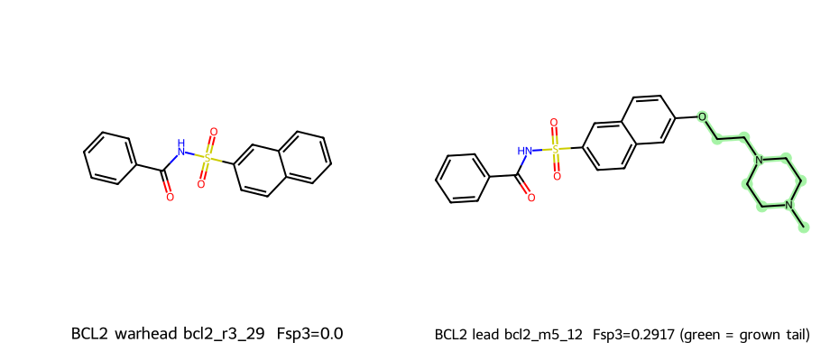

# Wave-2 Disease Expansion · 疾病扩展包（中英双语）

Generated: `2026-07-17T16:46:40.850335+00:00` · **`clinical_grade = false`**

**EN:** Multi-indication expansion pack: ER-100 companion links, retinal regeneration, and
hematologic oncology (AML / lymphoma / CML) — including the **Sprint M5 fragment → clinical
lead** growth for FLT3 / BCL2 / ABL1.
**中文：** 多适应症扩展包：ER-100 关联、视网膜再造、血液肿瘤（AML / 淋巴瘤 / CML），
含 FLT3 / BCL2 / ABL1 的 **Sprint M5 片段→临床先导** 扩展。

---

## What we compute · 我们在计算什么

This repository publishes **computational medicinal-chemistry evidence**, not wet-lab
results. Every molecule is a graph/topology scored by an in-silico pipeline. No IC50,
Ki, or TGI% is measured or fabricated. Docking energy is reported only as a **secondary,
informational** signal.

**What each stage computes:**

1. **Chemical Sanity (primary gate)** — validity, heavy-atom budget (≤ 35; ≤ 40 for M5
   solvent-tail growth), PAINS structural-alert filter, and an MMFF conformer **strain**
   ceiling. A molecule that fails here is never docked.
2. **64³ Boolean pocket occupancy** — the binding pocket is voxelized on a 64×64×64 grid
   (18 Å radius). The ligand pose is checked for geometric clashes against this pocket wall.
3. **Hydration-shell proxy** — a rigid (non-MD) check that the appended polar Fsp³ tail
   presents hydrogen-bond acceptors toward the solvent-exposed channel rather than burying
   them against the pocket lip.
4. **Secondary docking (AutoDock Vina)** — best-of-N over multiple seeds, reported for
   context only. **Ranking is driven by chemistry (Fsp³ gain, sanity, hydration), not by Vina.**

**Fragment → lead (Sprint M5):** the leukemia hits from mass screening are excellent
aromatic *fragments* (Fsp³ ≈ 0, MW < 320) — strong anchors but poor drug-like profiles.
M5 **locks** each aromatic warhead and **grows** a high-Fsp³, polar solubilizing tail
(morpholine / N-methylpiperazine / oxetane / amino-ether) out toward the solvent channel,
lifting Fsp³ and TPSA while keeping cLogP and Lipinski/Veber compliance.

---

本仓库发布的是**计算药物化学证据**，并非湿实验结果。每个分子都是由计算管线打分的分子图/拓扑；
不测量、不虚构 IC50 / Ki / TGI%。对接能量仅作为**次级、参考性**信号。

**各阶段计算内容：**

1. **化学合理性（主门控）** — 合法性、重原子预算（≤ 35；M5 溶剂尾增长放宽至 ≤ 40）、PAINS
   结构警报过滤、以及 MMFF 构象**应变**上限。未通过者不进入对接。
2. **64³ 布尔口袋占据** — 将结合口袋在 64×64×64 网格上体素化（半径 18 Å），检查配体位姿与
   口袋壁的几何冲突。
3. **水化壳层代理** — 刚性（非分子动力学）检查：新增的极性高 Fsp³ 尾链应把氢键受体朝向溶剂
   暴露通道，而非埋入口袋唇缘。
4. **次级对接（AutoDock Vina）** — 多随机种子取最优，仅供参考。**排序由化学性质（Fsp³ 增益、
   合理性、水化）驱动，而非 Vina 分数。**

**片段→先导（Sprint M5）：** 血液肿瘤命中物是优秀的芳香**片段**（Fsp³ ≈ 0，MW < 320）——
锚定力强但成药性差。M5 **锁定**每个芳香弹头，并向溶剂通道**生长**高 Fsp³ 极性增溶尾链
（吗啉 / N-甲基哌嗪 / 氧杂环丁烷 / 氨基醚），提升 Fsp³ 与 TPSA，同时保持 cLogP 与
Lipinski/Veber 合规。

---

## Fragment → lead at a glance · 片段到先导总览

*Left: locked aromatic warhead (fragment). Right: grown clinical lead — the appended
high-Fsp³ polar solvent tail is highlighted in green. · 左：锁定的芳香弹头（片段）；
右：生长后的临床先导，绿色高亮为新增的高 Fsp³ 极性溶剂尾。*

---

## A. ER-100 (ESR1) · 乳腺癌旗舰（关联）

| ID | Formula · 分子式 | Vina | Note |
|----|------------------|------|------|
| `serm_stilbene_amine` | **C18H21NO2** | -7.045 | SERM · CRI 4/4 |
| `serm_biphenyl_amine` | **C16H19NO2** | -6.823 | SERM · CRI 4/4 |

Full ER-100 narrative: [`../Translational_Medicine/README.md`](../Translational_Medicine/README.md) · SDF: [`ligands/ESR1_serm_stilbene_amine.sdf`](ligands/ESR1_serm_stilbene_amine.sdf)

---

## B. Retinal regeneration · 视网膜再造

**EN:** Modulatory GSK3β + high-Fsp³ discovery chemotypes (oxetane / bicyclo) for stem-cell induction.
**中文：** GSK3β 调谐型先导 + 高 Fsp³ 发现化学型（氧杂环丁烷 / 双环），用于干细胞诱导路径。

| ID | Formula · 分子式 | HA | Role · 角色 |
|----|------------------|----|-------------|
| `gsk_x10` | **C15H17FN4O** | 21 | GSK3β modulatory · 调谐先导 (Vina -7.648) |
| `DISC-RETINA_REGEN-emix_bicyclo_F-8a573f6edf` | **C17H24FNO2** | 21 | Discovery · 发现化学型 |
| `DISC-RETINA_REGEN-emix_oxetane_F-4d5df33d4a` | **C13H18FNO3** | 18 | Discovery · 发现化学型 |
| `DISC-RETINA_REGEN-emix_pyridyl_oxetane-899943b081` | **C12H18N2O3** | 17 | Discovery · 发现化学型 |

SMILES (GSK3β): `Cc1nc(N2CCOCC2)cc(Nc2ccccc2F)n1` · Retina SDFs: [`retina_ligands/`](retina_ligands/)

---

## C. Hematologic oncology · 血癌 / 淋巴癌

### C1. Mass-screen warheads · 片段弹头（Fsp³ ≈ 0）

| Gene | Disease · 病种 | Best ID | Formula · 分子式 | Vina |
|------|----------------|---------|------------------|------|
| **FLT3** | AML | `flt3_r3_x10` | **C15H10F2N2O** | **-10.34** |
| **BCL2** | B-cell lymphoma · 淋巴瘤 | `bcl2_r3_29` | **C17H13NO3S** | **-9.372** |
| **ABL1** | CML | `abl1_r3_23` | **C14H10FN3O** | **-10.52** |

### C2. Sprint M5 clinical leads · 片段→先导（高 Fsp³ 溶剂尾）

**EN:** Aromatic warheads locked; polar high-Fsp³ solvent-channel tails appended;
MAX_HEAVY = 40 (M5 only); PAINS + strain retained. Formulas RDKit-verified before publish.
**中文：** 芳香弹头锁定；追加极性高 Fsp³ 溶剂通道尾链；本 sprint 放宽 MAX_HEAVY=40；
保留 PAINS + 应变。上架前分子式经 RDKit 校验。

| Gene | Indication | Warhead → Lead | Formula | Fsp³ | cLogP | Vina* | Spec sheet |
|------|------------|----------------|---------|------|-------|-------|-----------|
| **FLT3** | AML / FLT3-ITD | `flt3_r3_x10` → **`flt3_m5_11`** | **C15H10F2N2O** → **C22H25FN4O2** | 0.0→**0.3182** (Δ+0.3182) | 3.698→**3.186** (Δ-0.512) | **-10.91** | [`FLT3`](spec_sheets/FLT3_flt3_m5_11.md) |
| **BCL2** | B-cell lymphoma | `bcl2_r3_29` → **`bcl2_m5_12`** | **C17H13NO3S** → **C24H27N3O4S** | 0.0→**0.2917** (Δ+0.2917) | 2.959→**2.585** (Δ-0.374) | **-10.14** | [`BCL2`](spec_sheets/BCL2_bcl2_m5_12.md) |
| **ABL1** | CML / Ph+ leukemia | `abl1_r3_23` → **`abl1_m5_07`** | **C14H10FN3O** → **C21H25N5O2** | 0.0→**0.3333** (Δ+0.3333) | 2.954→**2.441** (Δ-0.513) | **-10.57** | [`ABL1`](spec_sheets/ABL1_abl1_m5_07.md) |

\* Vina is a secondary / informational metric only · 对接分仅供参考。

**FLT3 · AML / FLT3-ITD**

**BCL2 · B-cell lymphoma**

**ABL1 · CML / Ph+ leukemia**

**SMILES (M5 leads):**

- FLT3 `flt3_m5_11`: `CN1CCN(CCOc2ccc(NC(=O)c3c[nH]c4ccccc34)c(F)c2)CC1`
- BCL2 `bcl2_m5_12`: `CN1CCN(CCOc2ccc3cc(S(=O)(=O)NC(=O)c4ccccc4)ccc3c2)CC1`
- ABL1 `abl1_m5_07`: `CN1CCN(CCOc2ccc(C(=O)Nc3n[nH]c4ccccc34)cc2)CC1`

**Molecule spec sheets · 分子说明书** (physchem panel, rule compliance, rationale):
[FLT3](spec_sheets/FLT3_flt3_m5_11.md) · [BCL2](spec_sheets/BCL2_bcl2_m5_12.md) · [ABL1](spec_sheets/ABL1_abl1_m5_07.md)

**SDFs:** [`FLT3`](ligands/FLT3_flt3_m5_11.sdf) · [`BCL2`](ligands/BCL2_bcl2_m5_12.sdf) · [`ABL1`](ligands/ABL1_abl1_m5_07.sdf)

### C3. Data sources · 数据来源（structural biology）

| Target | Gene / UniProt | Primary PDB | Cross-dock | Clinical reference |
|--------|----------------|-------------|-----------|--------------------|
| FLT3 | Fms-like tyrosine kinase 3 · [P36888](https://www.uniprot.org/uniprotkb/P36888/entry) | [4RT7](https://www.rcsb.org/structure/4RT7) — FLT3 kinase domain with a small-molecule inhibitor (X-ray) | [6JQR](https://www.rcsb.org/structure/6JQR) | Quizartinib / gilteritinib (approved FLT3 inhibitors) |
| BCL2 | B-cell lymphoma 2 (apoptosis regulator) · [P10415](https://www.uniprot.org/uniprotkb/P10415/entry) | [6O0K](https://www.rcsb.org/structure/6O0K) — BCL-2 in complex with a BH3-mimetic (venetoclax-class groove) | — | Venetoclax (approved BCL-2 BH3-mimetic) |
| ABL1 | ABL proto-oncogene 1, tyrosine kinase · [P00519](https://www.uniprot.org/uniprotkb/P00519/entry) | [3OXZ](https://www.rcsb.org/structure/3OXZ) — ABL kinase domain bound to the DFG-out inhibitor ponatinib (AP24534) | — | Ponatinib (approved pan-BCR-ABL inhibitor, T315I-active) |

Machine-readable provenance + docking boxes: [`DATA_SOURCES.json`](DATA_SOURCES.json)

### C4. Reproduce the docking · 复现对接

Full receptor-prep + box + Vina command protocol: [`DOCKING_GUIDE.md`](DOCKING_GUIDE.md).
Per-candidate results: [`SPRINT_M5_FRAGMENT_TO_LEAD.json`](SPRINT_M5_FRAGMENT_TO_LEAD.json).

---

## Files · 文件

- [`DATA_SOURCES.json`](DATA_SOURCES.json) — PDB / UniProt provenance + docking boxes
- [`DOCKING_GUIDE.md`](DOCKING_GUIDE.md) — reproducible protocol
- [`SPRINT_M5_FRAGMENT_TO_LEAD.json`](SPRINT_M5_FRAGMENT_TO_LEAD.json) · [`SPRINT_M5_FORMULA_VERIFY.json`](SPRINT_M5_FORMULA_VERIFY.json)
- [`spec_sheets/`](spec_sheets/) — per-molecule instruction sheets
- [`images/`](images/) — 2D structure figures
- [`ligands/`](ligands/) · [`retina_ligands/`](retina_ligands/) — SDF 3D conformers

## Method · 方法（summary）

- Chemical Sanity · PAINS · MMFF strain (M5: MAX_HEAVY ≤ 40)
- 64³ Boolean pocket occupancy (18 Å radius)
- Rigid hydration-shell proxy (solvent-tail polar synthons)
- AutoDock Vina — secondary metric only
