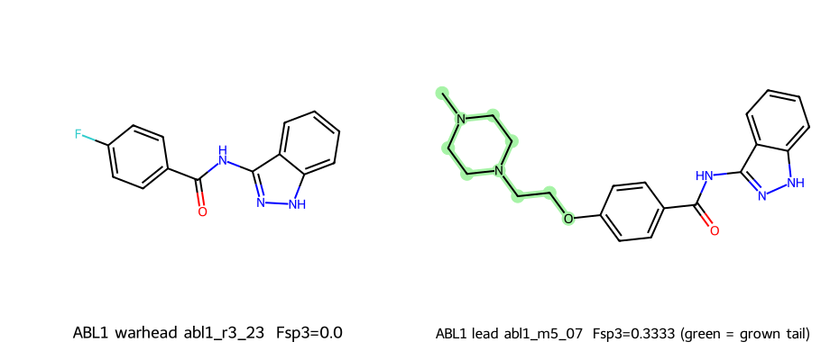

# ABL1 · abl1_m5_07 — molecule spec sheet

> `clinical_grade = false` · Computational topology. Docking is a **secondary**
> metric only; values are **not** measured affinity, IC50, or clinical efficacy.

**Target:** ABL proto-oncogene 1, tyrosine kinase (ABL1, UniProt [P00519](https://www.uniprot.org/uniprotkb/P00519/entry))  
**Indication:** Chronic myeloid leukemia / Ph+ (ATP site, incl. T315I)  
**Design:** aromatic warhead locked; high-Fsp³ polar solvent-channel tail appended (Sprint M5).

## Identity

| Field | Warhead `abl1_r3_23` | Lead `abl1_m5_07` |
|-------|----------------------|-------------------------------|
| SMILES | `O=C(Nc1n[nH]c2ccccc12)c1ccc(F)cc1` | `CN1CCN(CCOc2ccc(C(=O)Nc3n[nH]c4ccccc34)cc2)CC1` |
| Formula | **C14H10FN3O** | **C21H25N5O2** |
| InChIKey | `VXYHESVMQXCZRG-UHFFFAOYSA-N` | `LWOOUBWLLABRNH-UHFFFAOYSA-N` |
| MW (g/mol) | 255.25 | 379.46 |

## Physicochemical panel

| Property | Warhead | Lead | Δ (lead − warhead) |
|----------|---------|------|--------------------|
| Heavy atoms | 19 | 28 | +9 |
| **Fsp³** | 0.0 | **0.3333** | **+0.3333** |
| cLogP | 2.954 | 2.441 | -0.513 |
| TPSA (Ų) | 57.78 | 73.49 | +15.71 |
| H-bond donors | 2 | 2 | +0 |
| H-bond acceptors | 2 | 5 | +3 |
| Rotatable bonds | 2 | 6 | +4 |
| Aromatic rings | 3 | 3 | +0 |
| QED | 0.7392 | 0.6882 | -0.0510 |

## Drug-likeness rule compliance (lead)

| Rule | Result |
|------|--------|
| Lipinski Ro5 (MW≤500, cLogP≤5, HBD≤5, HBA≤10) | **PASS** |
| Veber (RotB≤10, TPSA≤140) | **PASS** |

## Fragment → lead rationale

- **Locked warhead:** the aromatic core (abl1_r3_23) is frozen as the binding anchor.
- **Grown tail:** `benzoyl_para_ethoxy_MePip` — a polar, high-Fsp³ solubilizing group
  directed toward the solvent-exposed channel (highlighted green in the figure).
- **Effect:** Fsp³ **0.0 → 0.3333** and TPSA **57.78 → 73.49 Ų**,
  improving predicted solubility while keeping cLogP in range (2.954 → 2.441).

## Structure & docking box

| Field | Value |
|-------|-------|
| Primary PDB | [3OXZ](https://www.rcsb.org/structure/3OXZ) — ABL kinase domain bound to the DFG-out inhibitor ponatinib (AP24534) |

| Box center (x,y,z Å) | [12.296, 0.003, 14.215] |
| Box size (Å) | [24.0, 24.0, 24.0] |
| Clinical reference | Ponatinib (approved pan-BCR-ABL inhibitor, T315I-active) |

Secondary docking (AutoDock Vina, informational): best **-10.57** kcal/mol
(mean -9.421). See [`../DOCKING_GUIDE.md`](../DOCKING_GUIDE.md) to reproduce.
