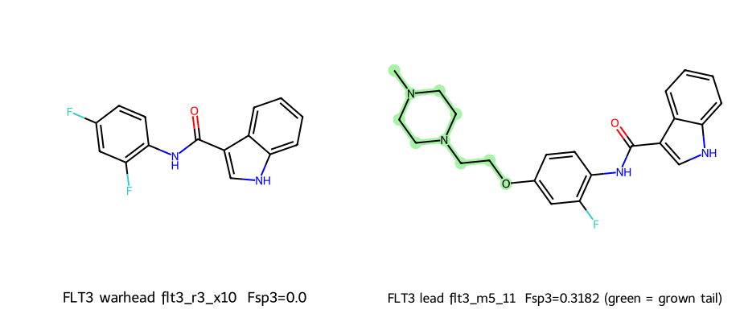

# FLT3 · flt3_m5_11 — molecule spec sheet

> `clinical_grade = false` · Computational topology. Docking is a **secondary**
> metric only; values are **not** measured affinity, IC50, or clinical efficacy.

**Target:** Fms-like tyrosine kinase 3 (FLT3, UniProt [P36888](https://www.uniprot.org/uniprotkb/P36888/entry))  
**Indication:** Acute myeloid leukemia (FLT3-ITD)  
**Design:** aromatic warhead locked; high-Fsp³ polar solvent-channel tail appended (Sprint M5).

## Identity

| Field | Warhead `flt3_r3_x10` | Lead `flt3_m5_11` |
|-------|----------------------|-------------------------------|
| SMILES | `O=C(Nc1ccc(F)cc1F)c1c[nH]c2ccccc12` | `CN1CCN(CCOc2ccc(NC(=O)c3c[nH]c4ccccc34)c(F)c2)CC1` |
| Formula | **C15H10F2N2O** | **C22H25FN4O2** |
| InChIKey | `DJXBCZUWSIFPCA-UHFFFAOYSA-N` | `BLOXIVIZRUDTHK-UHFFFAOYSA-N` |
| MW (g/mol) | 272.25 | 396.47 |

## Physicochemical panel

| Property | Warhead | Lead | Δ (lead − warhead) |
|----------|---------|------|--------------------|
| Heavy atoms | 20 | 29 | +9 |
| **Fsp³** | 0.0 | **0.3182** | **+0.3182** |
| cLogP | 3.698 | 3.186 | -0.512 |
| TPSA (Ų) | 44.89 | 60.6 | +15.71 |
| H-bond donors | 2 | 2 | +0 |
| H-bond acceptors | 1 | 4 | +3 |
| Rotatable bonds | 2 | 6 | +4 |
| Aromatic rings | 3 | 3 | +0 |
| QED | 0.7337 | 0.6719 | -0.0618 |

## Drug-likeness rule compliance (lead)

| Rule | Result |
|------|--------|
| Lipinski Ro5 (MW≤500, cLogP≤5, HBD≤5, HBA≤10) | **PASS** |
| Veber (RotB≤10, TPSA≤140) | **PASS** |

## Fragment → lead rationale

- **Locked warhead:** the aromatic core (flt3_r3_x10) is frozen as the binding anchor.
- **Grown tail:** `anil_para_ethoxy_MePip` — a polar, high-Fsp³ solubilizing group
  directed toward the solvent-exposed channel (highlighted green in the figure).
- **Effect:** Fsp³ **0.0 → 0.3182** and TPSA **44.89 → 60.6 Ų**,
  improving predicted solubility while keeping cLogP in range (3.698 → 3.186).

## Structure & docking box

| Field | Value |
|-------|-------|
| Primary PDB | [4RT7](https://www.rcsb.org/structure/4RT7) — FLT3 kinase domain with a small-molecule inhibitor (X-ray) |
| Cross-dock PDB | [6JQR](https://www.rcsb.org/structure/6JQR) — FLT3 in complex with gilteritinib (X-ray) — cross-dock |
| Box center (x,y,z Å) | [-40.601, 11.24, -13.828] |
| Box size (Å) | [24.0, 24.0, 24.0] |
| Clinical reference | Quizartinib / gilteritinib (approved FLT3 inhibitors) |

Secondary docking (AutoDock Vina, informational): best **-10.91** kcal/mol
(mean -10.313). See [`../DOCKING_GUIDE.md`](../DOCKING_GUIDE.md) to reproduce.
